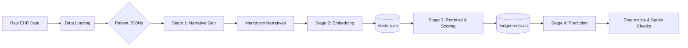
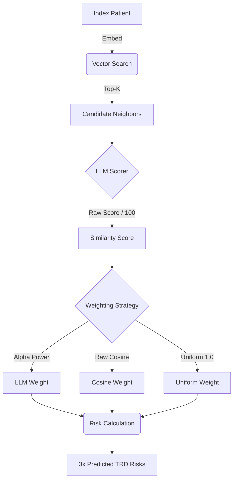

# Digital Twins: Patient Representation & Embedding Pipeline

This repository contains the pipeline for converting Electronic Health Record (EHR) data into "Digital Twins"—vectorized representations of patient narratives capable of semantic search, cohort analysis, and clinical outcome prediction.

The pipeline is divided into **Data Loading**, **Stage 1 (Narrative Generation)**, **Stage 2 (Vector Embedding)**, **Stage 3 (Neighbor Retrieval)**, and **Stage 4 (Prediction)**.



## Project Structure

### 1. Data Loading (`scripts/data_loading`)

The foundation. These scripts ingest raw EHR exports and structure them into usable patient objects.

* **`build_jsons.py`**: The initial ETL step. Converts raw CSVs into per-patient JSON files.
* **`create_cohort.py`**: Filters the total population down to the study cohort (e.g., MDD patients who are not schizophrenic or bipolar).
* **`fit_to_anchor.py`**: Enforces the `YEARS_BACK` chronological window. It truncates encounters, procedures, and medications that cross the boundary and purges ancient history entirely.
* **`load_patient_data.py`**: Orchestrates the timeline slicing and generates `.rejected` marker files for patients who fail the strict MDD or chronological prerequisites to prevent redundant processing.
* **`deterministic_narrative.py`**: The logic that deterministically translates structured JSON features (labs, meds, diagnoses) into a human-readable Markdown narrative. Note that the generated narrative only summarizes the precise `YEARS_BACK` window, not the patient's entire lifetime.
* **`features.py`**: Extractors for specific clinical features.
* **Definitions**: `diagnoses_definitions.py`, `med_definitions.py`, etc., map codes to clinical text.

### 2. Stage 1: Narrative Generation (`scripts/digital_twins/narratives`)

Transforms the structured JSONs into textual narratives.

* **`generator.py`**: Iterates through the cohort, applies the `deterministic_narrative` logic, and saves `.md` files to the `DETERMINISTIC_NARRATIVES_DIR`.
* **`runner.py`**: Orchestrates the generation job via Slurm.

### 3. Stage 2: Vector Embedding (`scripts/digital_twins/embeddings`)

**The Forge.** Converts text narratives into high-dimensional vectors using the `PatientEmbedder`.

* **`forge_vectors.py`**: The main driver.

1. Reads `.md` files from Stage 1.
2. Batches them.
3. Feeds them to the `PatientEmbedder` to generate embeddings.

* **Artifacts**: This stage populates the SQLite database `vectors.db`.

* **`vector_audit.py`**:
  * **The Auditor.** Validates the geometry of the embedding space before expensive scoring.
  * **Checks**:
    1. **Normalization**: Verifies if vector norms are uniform (1.0) or variable.
    2. **Metric Monotonicity**: Tests if Euclidean distance offers distinct ranking signals compared to Cosine similarity.
  * **Output**: `vector_norms.png`, `cos_vs_euclidean.png`.

### 4. Stage 3: Retrieval & Scoring (`scripts/digital_twins/neighbors`)

**The Judge.** Finds and scores patient similarity.

* **`retriever.py`**:
  * Loads the entire `vectors.db` into memory.
  * Performs fast cosine similarity search (Pre-filter) to find candidates using four distinct retrieval modes:
    * **Nearest (`global`)**: Finds the top-K closest vectors by cosine similarity.
    * **Farthest (`farthest`)**: Finds the top-K most distant vectors by cosine similarity to establish a negative baseline.
    * **Random (`random`)**: Blindly samples K neighbors from the database.
    * **Subsampled (`subsampled`)**: Two-stage retrieval that pulls a large random pool (`SUBSAMPLE_POOL_SIZE`) and filters it down to the top-K by cosine similarity to force diversity and bypass geometric hubs.
  * **Self-Exclusion**: Implements logic to exclude specific IDs from search results (essential for backtesting).
  * **Note**: Handles retrieval of raw narratives.

* **`scorer.py`**:
  * The LLM Judge. Takes candidate pairs and evaluates clinical similarity using a rigid JSON schema.
  * **Caching**: Stores expensive LLM outputs in `judgements.db` (Table: `llm_judgements`) to prevent redundant inference.
  * **Logic**: Checks cache -> Formats Prompt -> Calls vLLM -> Parses JSON -> Saves Result.

* **`llm_similarity_audit.py`**:
  * The Auditor. Extracts concrete examples of the LLM's scoring logic for manual review.
  * **Cross-Database Extraction**: Bridges the `judgements.db` (for scores and raw JSON responses) and `vectors.db` (for the original patient narratives).
  * **Extremes Sampling**: Queries the top 5 highest and bottom 5 lowest similarity scores to isolate and demonstrate the model's behavior at the margins.
  * **Reporting**: Generates isolated `.txt` files containing both compared narratives alongside the formatted JSON output for readable human analysis.

### 5. Stage 4: Prediction & Evaluation (`scripts/digital_twins/predictions`)

**The Oracle.** Uses the retrieved neighbors to predict clinical outcomes.



* **`trd_prediction_computation.py`**:
  * **Prediction & Calibration.**
  * **Digital Twin Matcher Logic**:
      1. Retrieves top-K neighbors via `retriever.py` (excluding the query patient).
      2. Scores neighbors via weighting strategies (Uniform, Cosine, LLM, Combined (Harmonic Mean of Cosine and LLM)).
      3. Computes weighted probability of TRD risk ($P(TRD)=\frac{w\bullet f}{\sum_w w_i}$).
  * **Multi-Stream Evaluation**: Automatically processes the retrieved neighbor data across all four retrieval schemes (**Nearest**, **Farthest**, **Random**, and **Subsampled**) to isolate the true predictive lift of the semantic vector space against varied baselines.
  * **Analysis & Metrics**:
    * **Discrimination**: ROC AUC (with bootstrapped 95% CI bands), AUPRC.
    * **Calibration**: Brier Score, **Weighted ECE**, **Calibration Slope & Intercept**.
    * **Confidence**: Effective Sample Size (ESS) and **Risk Extremity Index** (fraction of predictions <0.1 or >0.9).
    * **Optimal Confusion Matrix**: Identifies peak threshold via Youden's J-statistic and calculates Sensitivity, Specificity, F-Score, PLR, and NLR.
  * **Output**: Mode-prefixed output plots (e.g., `Semantic_COSINE_roc_curve.png`), `summary.csv` (Metrics), and `predictions.csv` (Row-level logs).

* **`trd_ranking_analysis.py`**:
  * **Ranking & Homophily Analysis.** Investigates whether the LLM retrieves neighbors that are clinically more congruent with the anchor than Cosine alone ("Label Homophily").
  * **Agreement Curves**: Computes and plots the "Agreement Score" (homophily) for Top-$k$ neighbors ($k \in \{5, 10, 25, 50\}$) comparing **Cosine Strategy** vs. **LLM Strategy**.
  * **Diagnostics**:
    * **Spearman Correlation**: Quantifies the correlation between Cosine Similarity and LLM Similarity to check for signal redundancy.
    * **Separation AUC**: (Proxy) Evaluates the LLM's ability to distinguish between "Close" neighbors (Rank $\le 5$) and "Far" neighbors (Rank $\ge 45$).
  * **Density**: Computes **kNN Radius** and **LLM Effective Sample Size (ESS=$\frac{(\sum_{i=1}^kw_i)^2}{\sum_{i=1}^k(w_i^2)}$)** to profile the density of patient neighborhoods.
  * **Output**: Generates `agreement_curve.png`, `agreement_summary.csv`, and `correlation_results.json`.

* **`trd_sanity_checks.py`**:
  * **Battle 3: Deep Diagnostics & Validity.**
  * **Embedding Validity**: Validates that retrieved neighbors are statistically distinct from random noise. Computes the $N \times N$ similarity matrix of the anchor cohort to generate a "Random Pair" distribution and overlays it against the "Neighbor" distribution.
  * **Chronology Confounding**: Tests if the model is cheating by using "Data Richness" as a proxy for risk. Merges prediction errors with patient history lengths ($L_i$) and calculates the **Spearman Correlation** ($\rho$) for each weighting strategy.
  * **Output**: Generates `cosine_score_random_vs_neighbor.png` (Visual Validity), `chronology_check.csv` (Confounding Metrics + Scatter Plots), `summary.csv` (Metrics), `predictions.csv` (Row-level logs), and comparative calibration/ROC plots.

* **`trd_binning_analysis.py`**:
  * **Battle 4: Environmental Diagnostics (Density & Chronology).** Investigates how the structural environment of the embedding space and data richness impact model reliability.
  * **Density Stratification**: Bins patients into quintiles based on their **kNN Radius** (mean distance of top-$k$ neighbors - e.g. 1 - mean(cos_sims)) to evaluate if sparse neighborhoods degrade model discrimination (AUC) or calibration (Brier Score).
  * **Chronology Confounding**: Bins patients into quintiles based on their **Chronological Length** (days of patient history) to test if the model is inappropriately leveraging data volume as a proxy for clinical risk.
  * **Metrics**: Calculates AUC, Brier Score, and Patient Count per bin across all weighting strategies (Uniform, Cosine, LLM, Combined). Computes Spearman Rank Correlation ($\rho$) and p-values to evaluate the statistical significance of monotonic performance trends across bins.
  * **Output**: Generates dual-axis performance plots (`scores_by_{bin_type}_{strategy}.png`) with statistical correlation metrics embedded in the titles to visualize degradation trends.

### 6. Models (`scripts/models`)

Interfaces for the neural networks.

* **`patient_embedder.py`**:
* Wraps `SentenceTransformer` (e.g., Qwen).
* **Storage**: Manages a SQLite connection to `vectors.db`.
* **Logic**: Checks the DB for existing IDs. If missing, computes the embedding and inserts it as a binary BLOB.
* **Scrubbing**: Respects `SCRUB_VECTORS` env var to force re-computation.
* **`vllm_client.py`**: Client for interacting with the vLLM inference server (for LLM-based narrative generation or scoring).

### 7. Shared Utilities (`scripts/shared`)

* **`utils.py`**: Core helpers (loading in results .csv files `load_neighborhood_data`, etc.).
* **`plots.py`**: **The Visualizer.**
  * Wraps `matplotlib` and `sklearn` to generate diagnostic visualizations.
  * **Outputs**: Computes and saves ROC curves (with bootstrapped error bands), Precision-Recall curves, Calibration curves, Decision Curve Analyses (DCA), Effective Sample Size distributions, and Optimal Confusion Matrices.
* **`prompts.py`**: **The Template Manager.**
  * Strict loader for the LLM system and user prompt templates located in the `./prompts` directory.
  * **Logic**: Formats and injects patient narratives into the structured evaluation prompts for the vLLM server.

---

## The Vault: Databases

### Vector Storage (`vectors.db`)

Located at `ARTIFACTS_DIR/vectors.db`.

**Table: `vectors**`
Stores the raw embeddings.

| Column | Type | Description |
| --- | --- | --- |
| `patient_id` | `TEXT (PK)` | Patient ID of the corresponding narrative. |
| `vector` | `BLOB` | The numpy array (`float32`) serialized to bytes. |
| `text` | `TEXT` | The raw narrative text (for audit/retrieval). |
| `chronological_length` | `INTEGER` | Chronological length in days of the patient's pre-anchor history. |

### Judgement Storage (`judgements.db`)

Located at `JUDGEMENTS_DIR`.

**Table: `llm_judgements**`
Caches the expensive qualitative evaluations from the LLM.

| Column | Type | Description |
| --- | --- | --- |
| `patient_id_a` | `TEXT (PK)` | First Patient ID. |
| `patient_id_b` | `TEXT (PK)` | Second Patient ID. |
| `overall_score` | `INTEGER` | Numeric Similarity Score |
| `full_response` | `TEXT` | Full Response from LLM Including Justification |

---

## Configuration

The pipeline requires a `.env` file. Below are the standard configurations:

### General & Reproducibility

* `SEED`: 42 (Random seed for reproducibility).
* `YEARS_BACK`: 2 (Defines the strict historical window prior to the anchor date. Patients with less history are discarded).
* `SCRUB_PATIENT_JSON`: 0 (Flag to force recreation of patient JSONs).
* `SCRUB_NARRATIVES`: 0 (Flag to force recreation of narratives).
* `SCRUB_VECTORS`: 0 (Flag to force re-computation of vectors).

### Data Paths

* `PREP_DATA_DIR`: Raw data directory (e.g., `/media/studies/ehr_study/data-EHR-prepped/DV250901v1-PV251208v1/PrepData`).
* `OUTPUT_DATA_DIR`: Directory for output lists (`/media/studies/ehr_study/data-EHR-prepped/DV250901v1-PV251208v1/OutputData`).
* `ANALYSIS_DIR`: Root directory for analysis outputs (`/media/studies/ehr_study/analysis/mferguson`).
* `PROCEDURE_CSV_PATH`, `MEDICATION_CSV_PATH`, `DIAGNOSIS_CSV_PATH`, `ENCOUNTER_CSV_PATH`, `VITALS_CSV_PATH`, `PERSON_CSV_PATH`: Paths to respective raw data tables.
* `TRD_LIST_PATH`: Path to the text file containing IDs of TRD-positive patients.
* `MDD_MED_DATE_CSV_PATH`: Path to the anchor dates CSV.
* `PATIENT_JSON_DIR`: Directory for raw patient JSONs.
* `SLICED_PATIENT_JSON_DIR`: Directory for timeline-sliced patient JSONs.
* `COHORT_PATH`: Path to the filtered study cohort CSV.

### Models & Inference

#### Embedding Model

* `HF_HOME`: HuggingFace cache directory.
* `EMBEDDER_MODEL_NAME`: `Qwen-Qwen3-Embedding-8B`
* `EMBEDDER_MODEL_PATH`: Local path to the embedder model.
* `EMBEDDER_DEVICE`: `cuda` (Use `cpu` for large strings to prevent OOM).
* `EMBEDDER_BATCH_SIZE`: 32

#### Generative Model (vLLM)

* `VLLM_MODEL_NAME`: `google_medgemma-27b-text-it`
* `VLLM_MODEL_PATH`: Local path to the vLLM model.
* `VLLM_URL`: `http://compute306:8000`
* `MAX_MODEL_LEN`: 32768
* `PATIENT_JSON_CHUNK_SIZE`: 32768
* `MAX_TOKENS`: 8192

### Storage & Artifacts

* `ARTIFACTS_DIR`: Root directory for computed artifacts.
* `DETERMINISTIC_NARRATIVES_DIR`: Storage for generated Markdown narratives.
* `VECTORS_DIR`: Storage for embedding vectors.
* `JUDGEMENTS_DIR`: Storage for LLM judgements.
* `RESULTS_DIR`: Storage for analysis results and logs.

### Hyperparameters & Concurrency

* `NUM_WORKERS_NON_LLM_TASK`: 16
* `NUM_WORKERS_LLM_TASK`: 16
* `NUM_NEIGHBOR_PATIENTS`: 50 (Total number of neighbors evaluated for density analysis).
* `SUBSAMPLE_POOL_SIZE`: 500 (Size of the initial random net cast during the two-stage subsampled retrieval mode).
* `HIGH_SIM_THRESHOLD`: 0.95
* `WEIGHTING_EXPONENT`: 5.0 (Alpha value for weighting similarity scores).
* `TRD_TEST_COUNT`: 1000 (Number of patients to sample for evaluation).
* `LOW_CONFIDENCE_ESS_THRESHOLD`: 20
* `NUM_PAIRS_SANITY_CHECK`: 1000

## Usage

**To Launch the Pipeline:**

```bash
sbatch slurm_jobs/digital_twins/run_trd_prediction_orchestrator.sbatch

```

## Downloading Models

```bash
conda activate ehr_env
export HF_HOME=/media/studies/ehr_study/analysis/mferguson/models/hf_cache
cd /media/studies/ehr_study/analysis/mferguson/models/
hf download BAAI/bge-en-icl --local-dir bge-en-icl
```
