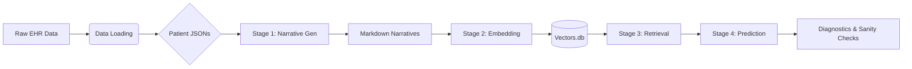
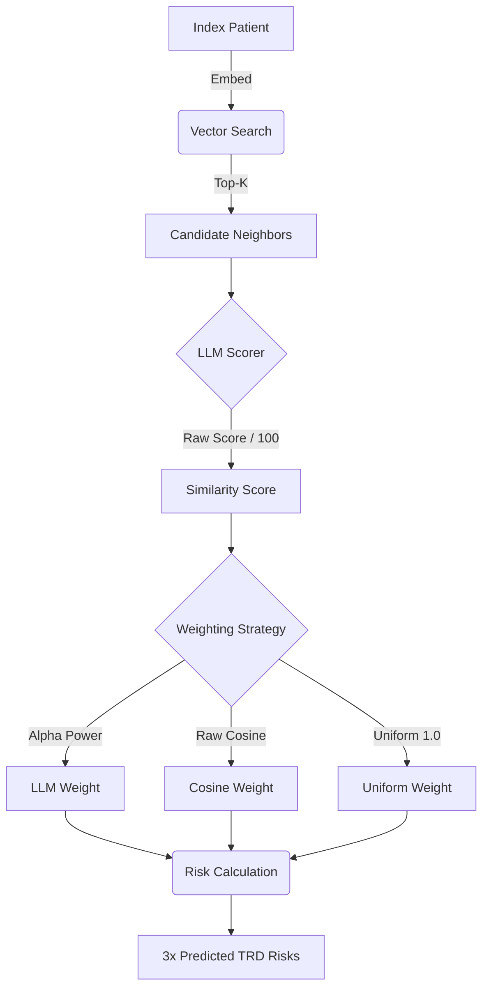

# Digital Twins: Patient Representation & Embedding Pipeline

This repository contains the pipeline for converting Electronic Health Record (EHR) data into "Digital Twins"—vectorized representations of patient narratives capable of semantic search, cohort analysis, and clinical outcome prediction.

The pipeline is divided into **Data Loading**, **Stage 1 (Narrative Generation)**, **Stage 2 (Vector Embedding)**, **Stage 3 (Neighbor Retrieval)**, and **Stage 4 (Prediction)**.



## Project Structure

### 1. Data Loading (`scripts/data_loading`)

The foundation. These scripts ingest raw EHR exports and structure them into usable patient objects.

* **`build_jsons.py`**: The initial ETL step. Converts raw CSVs into per-patient JSON files.
* **`create_cohort.py`**: Filters the total population down to the study cohort (e.g., MDD patients who are not schizophrenic or bipolar).
* **`deterministic_narrative.py`**: The logic that deterministically translates structured JSON features (labs, meds, diagnoses) into a human-readable Markdown narrative.
* **`features.py`**: Extractors for specific clinical features.
* **Definitions**: `diagnoses_definitions.py`, `med_definitions.py`, etc., map codes to clinical text.

### 2. Stage 1: Narrative Generation (`scripts/digital_twins/narratives`)

Transforms the structured JSONs into textual narratives.

* **`generator.py`**: Iterates through the cohort, applies the `deterministic_narrative` logic, and saves `.md` files to the `DETERMINISTIC_NARRATIVES_DIR`.
* **`runner.py`**: Orchestrates the generation job via Slurm.

### 3. Stage 2: Vector Embedding (`scripts/digital_twins/embeddings`)

**The Forge.** Converts text narratives into high-dimensional vectors using the `PatientEmbedder`.

* **`forge_vectors.py`**: The main driver.

1. Reads `.md` files from Stage 1.
2. Batches them.
3. Feeds them to the `PatientEmbedder` to generate embeddings.

* **Artifacts**: This stage populates the SQLite database `vectors.db`.

### 4. Stage 3: Retrieval & Scoring (`scripts/digital_twins/neighbors`)

**The Judge.** Finds and scores patient similarity.

* **`retriever.py`**:
  * Loads the entire `vectors.db` into memory.
  * Performs fast cosine similarity search (Pre-filter) to find top-K candidates.
  * **Self-Exclusion**: Implements logic to exclude specific IDs from search results (essential for backtesting).
  * **Note**: Handles retrieval of raw narratives and mapping of hashed IDs back to Patient IDs.

* **`vector_audit.py`**:
  * **The Auditor.** Validates the geometry of the embedding space before expensive scoring.
  * **Checks**:
    1. **Normalization**: Verifies if vector norms are uniform (1.0) or variable.
    2. **Anisotropy (The Cone)**: Measures embedding collapse by comparing the distribution of Random Pair similarities vs. Neighbor similarities.
    3. **Metric Monotonicity**: Tests if Euclidean distance offers distinct ranking signals compared to Cosine similarity.
  * **Output**: `vector_norms.png`, `cos_random_vs_neighbor.png`, `cos_vs_euclidean.png`.

* **`scorer.py`**:
  * The LLM Judge. Takes candidate pairs and evaluates clinical similarity using a rigid JSON schema.
  * **Caching**: Stores expensive LLM outputs in `judgements.db` (Table: `llm_judgements`) to prevent redundant inference.
  * **Logic**: Checks cache -> Formats Prompt -> Calls vLLM -> Parses JSON -> Saves Result.

### 5. Stage 4: Prediction & Evaluation (`scripts/digital_twins/predictions`)

**The Oracle.** Uses the retrieved neighbors to predict clinical outcomes.



* **`trd_prediction_analysis.py`**:
  * **Battle 1: Prediction & Calibration.**
  * **Digital Twin Matcher Logic**:
      1. Retrieves top-K neighbors via `retriever.py` (excluding the query patient).
      2. Scores neighbors via weighting strategies (Uniform, Cosine, LLM, Combined (Harmonic Mean of Cosine and LLM)).
      3. Computes weighted probability of TRD risk ($P(TRD)=\frac{w\bullet f}{\sum_w w_i}$).
  * **Analysis & Metrics**:
    * **Discrimination**: ROC AUC, AUPRC.
    * **Calibration**: Brier Score, **Weighted ECE**, **Calibration Slope & Intercept**.
    * **Confidence**: Effective Sample Size (ESS) and **Risk Extremity Index** (fraction of predictions <0.1 or >0.9).
  * **Output**: `battle_1_summary.csv` (Metrics), `battle_1_predictions.csv` (Row-level logs), and comparative calibration/ROC plots.

* **`trd_ranking_analysis.py`**:
  * **Battle 2: Ranking & Homophily Analysis.** Investigates whether the LLM retrieves neighbors that are clinically more congruent with the anchor than Cosine alone ("Label Homophily").
  * **Agreement Curves**: Computes and plots the "Agreement Score" (homophily) for Top-$k$ neighbors ($k \in \{5, 10, 25, 50\}$) comparing **Cosine Strategy** vs. **LLM Strategy**.
  * **Diagnostics**:
    * **Spearman Correlation**: Quantifies the correlation between Cosine Similarity and LLM Similarity to check for signal redundancy.
    * **Separation AUC**: (Proxy) Evaluates the LLM's ability to distinguish between "Close" neighbors (Rank $\le 5$) and "Far" neighbors (Rank $\ge 45$).
  * **Density**: Computes **kNN Radius** and **LLM Effective Sample Size (ESS=$\frac{(\sum_{i=1}^kw_i)^2}{\sum_{i=1}^k(w_i^2)}$)** to profile the density of patient neighborhoods.
  * **Output**: Generates `battle_2_agreement_curve.png`, `battle_2_agreement_summary.csv`, and `battle_2_correlation_results.json`.

* **`trd_sanity_checks.py`**:
  * **Battle 3: Deep Diagnostics & Validity.**
  * **Embedding Validity**: Validates that retrieved neighbors are statistically distinct from random noise. Computes the $N \times N$ similarity matrix of the anchor cohort to generate a "Random Pair" distribution and overlays it against the "Neighbor" distribution.
  * **Chronology Confounding**: Tests if the model is cheating by using "Data Richness" as a proxy for risk. Merges prediction errors with patient history lengths ($L_i$) and calculates the **Spearman Correlation** ($\rho$) for each weighting strategy.
  * **Output**: Generates `cosine_score_random_vs_neighbor.png` (Visual Validity) and `battle_1_chronology_check.csv` (Confounding Metrics + Scatter Plots).
  * **Output**: `battle_1_summary.csv` (Metrics), `battle_1_predictions.csv` (Row-level logs), and comparative calibration/ROC plots.

* **`trd_binning_analysis.py`**:
  * **Battle 3: Environmental Diagnostics (Density & Chronology).** Investigates how the structural environment of the embedding space and data richness impact model reliability.
  * **Density Stratification**: Bins patients into quintiles based on their **kNN Radius** (mean distance of top-$k$ neighbors - e.g. 1 - mean(cos_sims)) to evaluate if sparse neighborhoods degrade model discrimination (AUC) or calibration (Brier Score).
  * **Chronology Confounding**: Bins patients into quintiles based on their **Chronological Length** (days of patient history) to test if the model is inappropriately leveraging data volume as a proxy for clinical risk.
  * **Metrics**: Calculates AUC, Brier Score, and Patient Count per bin across all weighting strategies (Uniform, Cosine, LLM, Combined).
  * **Output**: Generates dual-axis performance plots (`scores_by_density_{strategy}.png` and `scores_by_chronological_length_{strategy}.png`) to visualize degradation trends.

### 6. Models (`scripts/models`)

Interfaces for the neural networks.

* **`patient_embedder.py`**:
* Wraps `SentenceTransformer` (e.g., Qwen).
* **Storage**: Manages a SQLite connection to `vectors.db`.
* **Logic**: Checks the DB for existing IDs (MD5 hash of text). If missing, computes the embedding and inserts it as a binary BLOB.
* **Scrubbing**: Respects `SCRUB_VECTORS` env var to force re-computation.
* **`vllm_client.py`**: Client for interacting with the vLLM inference server (for LLM-based narrative generation or scoring).

### 7. Shared Utilities (`scripts/shared`)

* **`similarity.py`**: **The Search Engine.**
* Computes Cosine Similarity between patient IDs.
* **Caching**: Uses the `similarities` table in `vectors.db`.
* **`utils.py`**: Core helpers (hashing logic `generate_string_id`, etc.).
* **`io.py`**: Standardized file handling.

---

## The Vault: Databases

### Vector Storage (`vectors.db`)

Located at `ARTIFACTS_DIR/vectors.db`.

**Table: `vectors**`
Stores the raw embeddings.

| Column | Type | Description |
| --- | --- | --- |
| `id` | `TEXT (PK)` | MD5 Hash of the narrative text. |
| `patient_id` | `TEXT` | Patient ID of the corresponding narrative. |
| `vector` | `BLOB` | The numpy array (`float32`) serialized to bytes. |
| `text` | `TEXT` | The raw narrative text (for audit/retrieval). |
| `chronological_length` | `INTEGER` | Chronological length in days of the patient's history window. |

**Table: `similarities**`
Stores the cosine similarity of the embeddings associated with the string hash ids.

| Column | Type | Description |
| --- | --- | --- |
| `id_a` | `TEXT (PK)` | MD5 Hash (alphabetically first) of one of the narrative texts. |
| `id_b` | `TEXT (PK)` | MD5 Hash (alphabetically second) of the other narrative text. |
| `score` | `REAL` | The cosine similarity between the two embeddings. |

### Judgement Storage (`judgements.db`)

Located at `JUDGEMENTS_DIR`.

**Table: `llm_judgements**`
Caches the expensive qualitative evaluations from the LLM.

| Column | Type | Description |
| --- | --- | --- |
| `id_a` | `TEXT (PK)` | First Patient ID. |
| `id_b` | `TEXT (PK)` | Second Patient ID. |
| `overall_score` | `INTEGER` | Numeric Similarity Score |
| `full_response` | `TEXT` | Full Response from LLM Including Justification |

---

## Configuration

The pipeline requires a `.env` file. Below are the standard configurations:

### General & Reproducibility

* `SEED`: 42 (Ensures deterministic behavior).
* `WEIGHTING_EXPONENT`: 4.0 (Alpha value for weighting similarity scores in TRD prediction).
* `TRD_TEST_COUNT`: 200 (Number of patients to sample for evaluation).

### Data Paths (Input)

* `TRD_LIST_PATH`: Path to the text file containing IDs of TRD-positive patients.
* `PREP_DATA_DIR`: Raw data directory.
* `COHORT_PATH`: `${ANALYSIS_DIR}/mdd_only_patients.csv`

### Models

#### Embedding Model

* `EMBEDDER_MODEL_NAME`: `Qwen-Qwen3-Embedding-8B`
* `EMBEDDER_MODEL_PATH`: `${ANALYSIS_DIR}/models/${EMBEDDER_MODEL_NAME}`
* `EMBEDDER_DEVICE`: `cuda` (Use `cpu` for large strings to prevent OOM).
* `EMBEDDER_BATCH_SIZE`: 32

#### Generative Model (vLLM)

* `VLLM_MODEL_NAME`: `google_medgemma-27b-text-it`
* `VLLM_URL`: `http://compute306:8000`
* `MAX_TOKENS`: 8192

### Artifacts & Output

* `ARTIFACTS_DIR`: `${ANALYSIS_DIR}/artifacts/`
* `VECTORS_DIR`: `${ARTIFACTS_DIR}/${EMBEDDER_MODEL_NAME}/`
* `JUDGEMENTS_DIR`: `${ARTIFACTS_DIR}/${VLLM_MODEL_NAME}/`
* `RESULTS_DIR`: `${ARTIFACTS_DIR}/${EMBEDDER_MODEL_NAME}/${VLLM_MODEL_NAME}/`

### Retrieval & Search

* `NUM_NEIGHBOR_PATIENTS`: 200 (Number of candidates to retrieve before LLM scoring).

## Usage

**To Launch the Pipeline:**

```bash
sbatch slurm_jobs/digital_twins/run_trd_prediction_orchestrator.sbatch

```

## Downloading Models

```bash
conda activate ehr_env
export HF_HOME=/media/studies/ehr_study/analysis/mferguson/models/hf_cache
cd /media/studies/ehr_study/analysis/mferguson/models/
hf download BAAI/bge-en-icl --local-dir bge-en-icl
```
