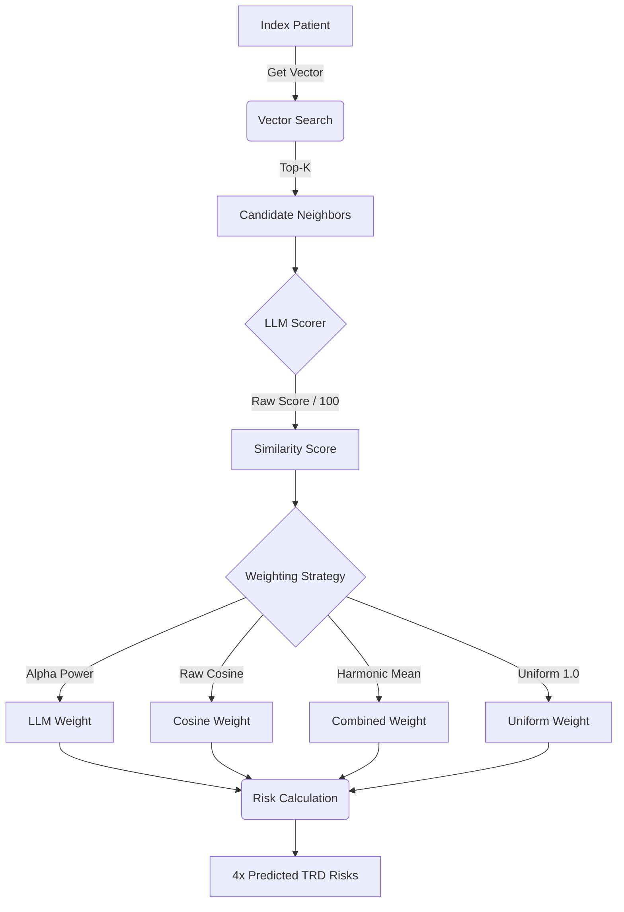

# Digital Twins: Patient Representation & Embedding Pipeline

This repository contains the pipeline for converting Electronic Health Record (EHR) data into "Digital Twins"---vectorized representations of patient narratives capable of semantic search, cohort analysis, and clinical outcome prediction.

The pipeline produces two independent patient vector representations (deterministic feature vectors and neural embeddings) and evaluates TRD risk prediction across an asymmetric evaluation matrix:

| Method | Deterministic Vectors | Embedding Vectors |
| --- | --- | --- |
| **Classical ML** | LR, GaussianNB (numerics-only), BernoulliNB (bools+one-hot), SVM, RF, GB, XGBoost | Same classifiers on high-dimensional embeddings |
| **Neighbor-Weighted KNN** | *Not applicable — cosine distance is ill-defined on mixed categorical/numeric features* | KNN retrieval + LLM scoring on embedding vectors |

The pipeline is divided into **Data Loading**, **Stage 1 (Narrative & Vector Generation)**, **Stage 2 (Vector Embedding)**, **Stage 3 (Neighbor Retrieval)**, and **Stage 4 (Prediction & Classical ML)**.


---

## Evaluation Design

All evaluation pipelines share a single stratified 80/20 train/test split (`create_train_test_split.py`) to ensure fair comparison across the full evaluation matrix. The split preserves the natural class imbalance and persists test patient IDs to `test_patient_ids.txt` for reproducibility.

**Test Set Isolation**: In the neighbor-weighted pipeline, test patients are excluded from each other's neighbor pools at retrieval time. The `Retriever` filters out all test patient IDs from its in-memory search arrays during initialization, preventing data leakage while still allowing test patients to serve as query anchors. Narrative and chronological length lookups remain available for all patients via direct SQLite queries.

**Dual Vector Source (classical ML only)**: The `VectorSource` enum (`EMBEDDING`, `DETERMINISTIC`) parameterizes the classical ML pipeline, which runs the full classifier lineup against both vector representations. The neighbor-weighted KNN pipeline runs on `EMBEDDING` only — cosine similarity is not defined over mixed quantitative/categorical features, so `Retriever`, `TRDPredictor`, the neighborhood constructor, and the four neighbor-based analysis scripts accept only embedding vectors.

---

## Project Structure

### 1. Data Loading (`scripts/data_loading`)

The foundation. These scripts ingest raw EHR exports and structure them into usable patient objects.

* **`build_jsons.py`**: The initial ETL step. Converts raw CSVs into per-patient JSON files.
* **`create_cohort.py`**: Filters the total population down to the study cohort (e.g., MDD patients who are not schizophrenic or bipolar).
* **`fit_to_anchor.py`**: Enforces both the `YEARS_BACK` pre-anchor chronological window and the `YEARS_AHEAD` post-anchor follow-up requirement. It truncates encounters, procedures, and medications that cross the backward boundary and purges ancient history entirely. Patients without sufficient post-anchor observation time (to reliably determine TRD outcome) are rejected.
* **`load_patient_data.py`**: Orchestrates the timeline slicing and generates `.rejected` marker files for patients who fail the strict MDD, chronological, or follow-up prerequisites to prevent redundant processing.
* **`deterministic_narrative.py`**: The logic that deterministically translates structured JSON features (labs, meds, diagnoses) into a human-readable Markdown narrative. Note that the generated narrative only summarizes the precise `YEARS_BACK` window, not the patient's entire lifetime.
* **`deterministic_vector.py`**: Constructs a typed `pandas.Series` of features for each patient from the sliced JSON, with explicit dtypes that drive downstream preprocessing:
  * `float64` — quantitative features (vitals, counts, days, age, adequate-trial counts). Missing vitals remain `NaN` and are imputed inside the sklearn pipeline (train-only, no leakage).
  * `bool` — single-valued binary flags (`suicide_flag`, `somatic_flag`, `augmentation_occured`, `mdd_within_window`) and multi-label set indicators (`psych_*`, `medical_*`, `safety_*`, `sud_*`, `sdoh_*`) where a patient can carry several members simultaneously.
  * `category` — single-valued nominal fields: `Sex`, `PreferredLanguage`, `MaritalStatus`, `Religion`, `SmokingStatus`, `Race_Ethnicity`, `mdd_recurrence`, `mdd_severity`. Each is a single column (not one-hot at the storage layer), compressed via standardized maps (ACS language/marital, BRFSS smoking, GSS religion) where applicable. `Sex` is a single binary category, not two redundant columns.
  Category levels are discovered in a one-shot cohort-wide JSON scan and cached to `categorical_levels.json`. Per-patient Series are assembled into a single cohort-wide parquet file keyed by `patient_id`.
* **`features.py`**: Extractors for specific clinical features.
* **Definitions**: `diagnoses_definitions.py` (includes `get_mdd_components()` for extracting MDD recurrence and severity as separate fields), `med_definitions.py`, etc., map codes to clinical text.

### 2a. Stage 1a: Narrative Generation (`scripts/digital_twins/narratives`)

Transforms the structured JSONs into textual narratives.

* **`generator.py`**: Iterates through the cohort, applies the `deterministic_narrative` logic, and saves `.md` files to the `DETERMINISTIC_NARRATIVES_DIR`.
* **`runner.py`**: Orchestrates the generation job via Slurm.

### 2b. Stage 1b: Deterministic Vector Generation (`scripts/digital_twins/vectors`)

Constructs a typed, cohort-wide pandas DataFrame of features directly from the structured patient JSONs, bypassing the narrative/embedding pipeline entirely. This DataFrame serves as a classical ML baseline to compare against the high-dimensional embedding vectors.

* **`generator.py`**: First performs a single cohort-wide JSON scan to discover all categorical levels and cache them to `categorical_levels.json` (replaces the former `patient_attributes.json`). Then uses multiprocessing to iterate the cohort and call `generate_deterministic_vector` for each patient, collecting per-patient Series into a single DataFrame and persisting it to parquet. Produces a sanity check report sampling 10 random rows alongside their narratives and the column dtype schema.
* **`runner.py`**: Thin orchestrator that invokes the generator.

### 3. Stage 2: Vector Embedding (`scripts/digital_twins/embeddings`)

Converts text narratives into high-dimensional vectors using the `PatientEmbedder`.

* **`forge_embeddings.py`**: The main driver.

1. Reads `.md` files from Stage 1.
2. Batches them.
3. Feeds them to the `PatientEmbedder` to generate embeddings.

* **Artifacts**: This stage populates the SQLite database `embeddings.db`.

* **`embedding_audit.py`**:
  * Validates the geometry of the embedding space before expensive scoring.
  * **Checks**:
    1. **Normalization**: Verifies if vector norms are uniform (1.0) or variable.
    2. **Metric Monotonicity**: Tests if Euclidean distance offers distinct ranking signals compared to Cosine similarity.
  * **Output**: `vector_norms.png`, `cos_vs_euclidean.png`.

### 4. Stage 3: Retrieval & Scoring (`scripts/digital_twins/neighbors`)

Finds and scores patient similarity on the embedding vectors.

* **`retriever.py`**:
  * Accepts an `exclude_ids` set at initialization. Embedding-only — cosine similarity is not defined over mixed categorical/numeric features, so the deterministic retrieval path has been removed.
  * Loads patient IDs, embeddings, and chronological lengths from `embeddings.db`.
  * Patients in `exclude_ids` are filtered out of the in-memory search arrays during initialization, ensuring test patients never appear as neighbors.
  * Performs fast cosine similarity search to find candidates using four distinct retrieval modes:
    * **Nearest**: Finds the top-K closest vectors by cosine similarity.
    * **Farthest**: Finds the top-K most distant vectors by cosine similarity to establish a negative baseline.
    * **Random**: Blindly samples K neighbors.
    * **Subsampled**: Two-stage retrieval that pulls a large random pool (`SUBSAMPLE_POOL_SIZE`) and filters it down to the top-K by cosine similarity to force diversity and bypass geometric hubs.
  * Narrative lookups for LLM scoring query `embeddings.db`.

* **`scorer.py`**:
  * The LLM Judge. Takes candidate pairs and evaluates clinical similarity using a rigid JSON schema.
  * **Caching**: Stores expensive LLM outputs in `judgements.db` (Table: `llm_judgements`) to prevent redundant inference.
  * **Logic**: Checks cache -> Formats Prompt -> Calls vLLM -> Parses JSON -> Saves Result.

* **`llm_similarity_audit.py`**:
  * Extracts concrete examples of the LLM's scoring logic for manual review.
  * **Cross-Database Extraction**: Bridges the `judgements.db` (for scores and raw JSON responses) and `embeddings.db` (for the original patient narratives).
  * **Extremes Sampling**: Queries the top 5 highest and bottom 5 lowest similarity scores to isolate and demonstrate the model's behavior at the margins.
  * **Reporting**: Generates isolated `.txt` files containing both compared narratives alongside the formatted JSON output for readable human analysis.

### 5. Stage 4: Prediction & Evaluation (`scripts/digital_twins/predictions`)

#### 5a. Neighbor-Weighted KNN Prediction



* **`create_train_test_split.py`**:
  * Creates a stratified 80/20 train/test split of the full cohort, preserving natural class imbalance.
  * Persists test patient IDs to `test_patient_ids.txt` in `ANALYSIS_DIR` for reproducibility.
  * Both the classical ML pipeline and the neighbor-weighted pipeline use the same test set.

* **`trd_predictor.py`**:
  * Orchestrates neighborhood construction for a single patient. Accepts `exclude_ids`, forwarding it to the `Retriever`.
  * For each anchor patient: retrieves the query vector, finds top-K neighbors via `Retriever.search()`, scores each pair via the LLM `Scorer`, and returns structured neighborhood data including cosine similarity, LLM similarity, and neighbor TRD labels.

* **`run_neighborhood_constructor.py`**:
  * Slurm-parallelized driver that constructs neighborhoods for all test patients on the embedding vectors.
  * Chunks the sorted test set across Slurm array tasks.
  * Each worker process initializes its own `TRDPredictor` with the test set as `exclude_ids`.
  * **Output**: CSV files (`neighbor_results_{task_id}.csv`).

* **`trd_prediction_computation.py`**:
  * Loads neighborhood CSV data (embedding source only) and computes weighted TRD risk predictions.
  * **Digital Twin Matcher Logic**:
      1. Groups neighbors by anchor patient.
      2. Scores neighbors via weighting strategies (Uniform, Cosine, LLM, Combined (Harmonic Mean of Cosine and LLM)).
      3. Computes weighted probability of TRD risk ($P(TRD)=\frac{w\bullet f}{\sum_w w_i}$).
  * **Multi-Stream Evaluation**: Processes across all four retrieval schemes (**Nearest**, **Farthest**, **Random**, and **Subsampled**) to isolate the true predictive lift of the vector space against varied baselines.
  * **Analysis & Metrics**:
    * **Discrimination**: ROC AUC (with bootstrapped 95% CI bands), AUPRC.
    * **Calibration**: Brier Score, **Weighted ECE**, **Calibration Slope & Intercept**.
    * **Confidence**: Effective Sample Size (ESS) and **Risk Extremity Index** (fraction of predictions <0.1 or >0.9).
    * **Optimal Confusion Matrix**: Identifies peak threshold via Youden's J-statistic and calculates Sensitivity, Specificity, F-Score, PLR, and NLR.
  * **Output**: Mode-prefixed output plots (e.g., `NEAREST_COSINE_roc_curve.png`), `summary.csv` (Metrics), and `summary_predictions.csv` (Row-level logs).

* **`trd_ranking_analysis.py`**:
  * **Ranking & Homophily Analysis.** Investigates whether the LLM retrieves neighbors that are clinically more congruent with the anchor than Cosine alone ("Label Homophily").
  * **Agreement Curves**: Computes and plots the "Agreement Score" (homophily) for Top-$k$ neighbors ($k \in \{5, 10, 25, 50\}$) comparing **Cosine Strategy** vs. **LLM Strategy**.
  * **Diagnostics**:
    * **Spearman Correlation**: Quantifies the correlation between Cosine Similarity and LLM Similarity to check for signal redundancy.
    * **Separation AUC**: (Proxy) Evaluates the LLM's ability to distinguish between "Close" neighbors (Rank $\le 5$) and "Far" neighbors (Rank $\ge 45$).
  * **Density**: Computes **kNN Radius** and **LLM Effective Sample Size (ESS=$\frac{(\sum_{i=1}^kw_i)^2}{\sum_{i=1}^k(w_i^2)}$)** to profile the density of patient neighborhoods.
  * **Output**: `agreement_curve_{scheme}.png`, `agreement_summary_{scheme}.csv`, and `correlation_results_cos_vs_llm_{scheme}.json`.

* **`trd_sanity_checks.py`**:
  * **Deep Diagnostics & Validity.**
  * **Embedding Validity**: Validates that retrieved neighbors are statistically distinct from random noise. Computes the $N \times N$ similarity matrix of the anchor cohort to generate a "Random Pair" distribution and overlays it against the "Neighbor" distribution.
  * **Chronology Confounding**: Tests if the model is cheating by using "Data Richness" as a proxy for risk. Merges prediction errors with patient history lengths ($L_i$) and calculates the **Spearman Correlation** ($\rho$) for each weighting strategy.
  * **Output**: `cosine_score_random_vs_neighbor.png`, `chronology_check.csv`, and per-strategy scatter plots.

* **`trd_binning_analysis.py`**:
  * **Environmental Diagnostics (Density & Chronology).** Investigates how the structural environment of the vector space and data richness impact model reliability.
  * **Density Stratification**: Bins patients into quintiles based on their **kNN Radius** (mean distance of top-$k$ neighbors, i.e. $1 - \text{mean}(\text{cos\_sims})$) to evaluate if sparse neighborhoods degrade model discrimination (AUC) or calibration (Brier Score).
  * **Chronology Confounding**: Bins patients into quintiles based on their **Chronological Length** (days of patient history) to test if the model is inappropriately leveraging data volume as a proxy for clinical risk.
  * **Metrics**: Calculates AUC, Brier Score, and Patient Count per bin across all weighting strategies (Uniform, Cosine, LLM, Combined). Computes Spearman Rank Correlation ($\rho$) and p-values to evaluate the statistical significance of monotonic performance trends across bins.
  * **Output**: Dual-axis performance plots (`scores_by_{bin_type}_{scheme}_{strategy}.png`) with statistical correlation metrics embedded in the titles.

* **`analyze_trd_prediction.py`**: Top-level orchestrator that invokes `run_trd_prediction_computation`, `run_trd_ranking_analysis`, `run_trd_bin_analysis`, and `run_trd_sanity_checks` on the embedding-source neighborhood data.

#### 5b. Classical ML Prediction

* **`classical_ml.py`**:
  * Trains and evaluates standard classifiers on both deterministic and embedding vector representations.
  * **Pipeline**: Each classifier is wrapped in a `sklearn.pipeline.Pipeline` with a dtype-routed `ColumnTransformer`:
    * Numeric branch (`make_column_selector(dtype_include='number')`): `SimpleImputer(median)` → `StandardScaler`.
    * Category branch (`make_column_selector(dtype_include='category')`): `OneHotEncoder(drop='if_binary', handle_unknown='ignore')`.
    * Bool branch (`make_column_selector(dtype_include='bool')`): passthrough, cast to `int8`.
  * Embedding vectors are a single all-numeric block and flow straight through the numeric branch; the categorical and bool branches are active only on the deterministic DataFrame.
  * **Classifiers** (7 total):
    * Logistic Regression (`max_iter=1000`)
    * GaussianNB — restricted to the **numeric subset only** via a dedicated `ColumnTransformer` with `dtype_include='number'`, respecting the Gaussian-likelihood assumption.
    * BernoulliNB — restricted to the **bool + one-hot-category subset** via `dtype_include=['bool', 'category']`, respecting the Bernoulli-likelihood assumption.
    * SVM (`probability=True`)
    * Random Forest
    * Gradient Boosting
    * XGBoost (`eval_metric='logloss'`)
  * **Hyperparameter Tuning**: Every classifier is wrapped in `GridSearchCV(pipeline, param_grid, scoring='roc_auc', cv=5, n_jobs=-1)` before fitting; `predict_proba` delegates to the refit best estimator. Parameter grids are declared at module level in `HYPERPARAMETERS`.
    * **Logistic Regression** uses a list-of-dicts `param_grid` partitioned by `penalty` to respect solver compatibility: a pure `l2` sub-grid spanning all five solvers, an `l1` sub-grid restricted to `liblinear` and `saga`, an `elasticnet` sub-grid pinned to `saga` with a `model__l1_ratio` sweep, and a `None` sub-grid spanning `lbfgs`/`newton-cg`/`sag`/`saga` (with `C` omitted since regularization is disabled).
    * **SVM** uses a list-of-dicts partitioned by `kernel`: a `linear` sub-grid tuning only `C` (gamma is meaningless for the linear kernel), and a nonlinear sub-grid covering `rbf` and `poly` with a joint `C` and `gamma` sweep.
    * **Naive Bayes, Random Forest, Gradient Boosting, XGBoost** use flat single-dict grids over their standard hyperparameters.
    * Per-classifier `best_params_` and `best_score_` are persisted to `grid_search_ml_results_{source}.json` in `RESULTS_DIR` (one file per `VectorSource`).
  * **Dual-Source Evaluation**: `main()` loops over both `VectorSource` values. For each source, it loads training and test data, fits all classifiers under grid search, and generates ROC, Precision-Recall, and Calibration plots with source-prefixed filenames.
  * **Data Loading**: `load_data_set()` accepts a `VectorSource` parameter. Deterministic mode loads the cohort parquet file at `DETERMINISTIC_DATAFRAME_PATH` and slices rows by train/test ID. Embedding mode queries `embeddings.db` with a batched `SELECT ... WHERE patient_id IN (...)` query, ordered by patient ID to maintain alignment with labels, returning a DataFrame whose columns are all `float64`.
  * **Feature Importance / SHAP Interpretability** *(planned — not yet implemented)*: For the deterministic source only, each fitted classifier emits a feature-importance ranking aligned to the post-`ColumnTransformer` feature names (`ColumnTransformer.get_feature_names_out()`). Tree-based models (Random Forest, Gradient Boosting, XGBoost) use their native `feature_importances_`; linear models (Logistic Regression, linear-kernel SVM) use coefficient magnitudes. SHAP values via the `shap` library provide a unified ranking across all seven classifiers on a held-out sample. The embedding source is skipped — its 4096-dim axes are unnamed latents, so per-feature rankings are not interpretable. Output: `feature_importance_{classifier}_DETERMINISTIC.png` per classifier and a consolidated `feature_importance_summary_DETERMINISTIC.json` in `RESULTS_DIR`.

### 6. Models (`scripts/models`)

Interfaces for the neural networks.

* **`patient_embedder.py`**:
* Wraps `SentenceTransformer` (e.g., Qwen).
* **Storage**: Manages a SQLite connection to `embeddings.db`.
* **Logic**: Checks the DB for existing IDs. If missing, computes the embedding and inserts it as a binary BLOB.
* **Scrubbing**: Respects `SCRUB_EMBEDDINGS` env var to force re-computation.
* **`vllm_client.py`**: Client for interacting with the vLLM inference server (for LLM-based narrative generation or scoring).

### 7. Shared Utilities (`scripts/shared`)

* **`utils.py`**: Core helpers including `VectorSource` enum (`EMBEDDING`, `DETERMINISTIC`) consumed by the classical ML pipeline, and `load_neighborhood_data()` for loading neighborhood CSVs (embedding source only).
* **`plots.py`**: Wraps `matplotlib` and `sklearn` to generate diagnostic visualizations. Computes and saves ROC curves (with bootstrapped error bands), Precision-Recall curves, Calibration curves, Decision Curve Analyses (DCA), Effective Sample Size distributions, and Optimal Confusion Matrices.
* **`prompts.py`**: Strict loader for the LLM system and user prompt templates located in the `./prompts` directory. Formats and injects patient narratives into the structured evaluation prompts for the vLLM server.

### 8. Tests (`tests/`)

Unit tests for the data loading layer, run via `pytest`.

* **`conftest.py`**: Provides a `MockPatientBuilder` fixture---a fluent builder that constructs synthetic patient JSON dicts with chainable methods (`add_active_med`, `add_diagnosis`, `add_procedure`, `add_explicit_encounter`). Encounters are auto-created when a diagnosis or procedure is added at a date with no existing encounter.

* **`test_features.py`**: Validates clinical feature extractors from `scripts/data_loading/features.py`:
  * **Adequate Trials**: Boundary tests for the 42-day (6-week) minimum medication duration threshold, including ongoing prescriptions.
  * **Benzodiazepine Days**: Overlap merging logic (no double-counting of concurrent prescriptions).
  * **Augmentation Flag**: 14-day minimum overlap between antidepressants and lithium/antipsychotics.
  * **Polypharmacy**: Distinct ingredient counting (same drug at different strengths counts once).
  * **Suicidality Flag**: One-year recency window enforcement.
  * **Psychiatric Utilization**: Inpatient day summation and emergency encounter counting.
  * **Somatic Treatment**: Case-insensitive detection of electroconvulsive therapy.
  * **Psychotherapy Count**: Case-insensitive procedure matching.
  * **NSAID Burden**: Duration-based filtering across multiple NSAIDs.
  * **Psychiatric Comorbidity**: ICD code to comorbidity category mapping (PTSD, Anxiety, MDD).

* **`test_diagnoses.py`**: Validates diagnosis code parsing from `scripts/data_loading/diagnoses_definitions.py`:
  * **Diagnosis Arm Classification**: Regex matching for MDD, SUD, Dysthymia, Suicide Attempt, and Suicide Ideation across both ICD-10-CM and ICD-9 code formats.
  * **SUD Substance Extraction**: Correct substance identification (Alcohol, Cannabis) from SUD codes.
  * **MDD Component Parsing**: Recurrence (Single Episode vs. Recurrent) and severity (Mild, Moderate, Severe, Psychotic, Remission, Unspecified) extraction from MDD codes across both ICD versions.

```bash
# Run tests
pytest tests/
```

---

## Planned Extensions

Work outside the current pipeline surface, tracked in `TODO.txt`:

* **Feature Importance / SHAP Interpretability** — Adds per-classifier feature rankings to `classical_ml.py` for the deterministic source (native `feature_importances_` for tree models, coefficients for linear models, SHAP values for a unified cross-classifier view). Embedding source is deliberately skipped because its dimensions are unnamed latents.
* **Causal Random Forest + Treatment Heterogeneity Notebook** — A separate notebook (NOT part of the main pipeline) that estimates conditional average treatment effects (CATE) via `CausalForestDML` for each candidate treatment (augmentation, polypharmacy, somatic/ECT, adequate trial ≥ 1). Unlike the classification pipeline, which predicts TRD risk, this asks *for whom does each treatment actually help?* Evaluation surface: Qini coefficient, uplift curves, doubly-robust CATE calibration, CATE distribution plots, and subgroup ATE tables stratified by the top SHAP-ranked moderators. CATE metrics are incompatible with the ROC/PR/Calibration harness of the main pipeline, which is why this lives in its own notebook.

---

## The Vault: Databases

### Embedding Storage (`embeddings.db`)

Located at `EMBEDDINGS_DIR/embeddings.db`.

**Table: `embeddings`**
Stores the raw embeddings and associated patient data.

| Column | Type | Description |
| --- | --- | --- |
| `patient_id` | `TEXT (PK)` | Patient ID of the corresponding narrative. |
| `embedding` | `BLOB` | The numpy array (`float32`) serialized to bytes. |
| `text` | `TEXT` | The raw narrative text (for audit/retrieval). |
| `chronological_length` | `INTEGER` | Chronological length in days of the patient's pre-anchor history. |

### Judgement Storage (`judgements.db`)

Located at `JUDGEMENTS_DIR`.

**Table: `llm_judgements`**
Caches the expensive qualitative evaluations from the LLM.

| Column | Type | Description |
| --- | --- | --- |
| `patient_id_a` | `TEXT (PK)` | First Patient ID. |
| `patient_id_b` | `TEXT (PK)` | Second Patient ID. |
| `overall_score` | `INTEGER` | Numeric Similarity Score |
| `full_response` | `TEXT` | Full Response from LLM Including Justification |

---

## Configuration

The pipeline requires a `.env` file. Below are the standard configurations:

### General & Reproducibility

* `SEED`: 42 (Random seed for reproducibility).
* `YEARS_BACK`: 2 (Defines the strict historical window prior to the anchor date. Patients with less history are discarded).
* `YEARS_AHEAD`: 1 (Minimum post-anchor follow-up in years. Patients without sufficient observation time to determine TRD outcome are discarded).
* `SCRUB_PATIENT_JSON`: 0 (Flag to force recreation of patient JSONs).
* `SCRUB_NARRATIVES`: 0 (Flag to force recreation of narratives).
* `SCRUB_DETERMINISTIC_VECTORS`: 0 (Flag to force recreation of the deterministic DataFrame and `categorical_levels.json`).
* `SCRUB_EMBEDDINGS`: 0 (Flag to force re-computation of embedding vectors).

### Data Paths

* `PREP_DATA_DIR`: Raw data directory (e.g., `/media/studies/ehr_study/data-EHR-prepped/DV250901v1-PV251208v1/PrepData`).
* `OUTPUT_DATA_DIR`: Directory for output lists (`/media/studies/ehr_study/data-EHR-prepped/DV250901v1-PV251208v1/OutputData`).
* `ANALYSIS_DIR`: Root directory for analysis outputs (`/media/studies/ehr_study/analysis/mferguson`).
* `PROCEDURE_CSV_PATH`, `MEDICATION_CSV_PATH`, `DIAGNOSIS_CSV_PATH`, `ENCOUNTER_CSV_PATH`, `VITALS_CSV_PATH`, `PERSON_CSV_PATH`: Paths to respective raw data tables.
* `TRD_LIST_PATH`: Path to the text file containing IDs of TRD-positive patients.
* `MDD_MED_DATE_CSV_PATH`: Path to the anchor dates CSV.
* `PATIENT_JSON_DIR`: Directory for raw patient JSONs.
* `SLICED_PATIENT_JSON_DIR`: Directory for timeline-sliced patient JSONs.
* `COHORT_PATH`: Path to the filtered study cohort CSV.

### Models & Inference

#### Embedding Model

* `HF_HOME`: HuggingFace cache directory.
* `EMBEDDER_MODEL_NAME`: `Qwen-Qwen3-Embedding-8B`
* `EMBEDDER_MODEL_PATH`: Local path to the embedder model.
* `EMBEDDER_DEVICE`: `cuda` (Use `cpu` for large strings to prevent OOM).
* `EMBEDDER_BATCH_SIZE`: 32

#### Generative Model (vLLM)

* `VLLM_MODEL_NAME`: `google_medgemma-27b-text-it`
* `VLLM_MODEL_PATH`: Local path to the vLLM model.
* `VLLM_URL`: `http://compute306:8000`
* `MAX_MODEL_LEN`: 32768
* `PATIENT_JSON_CHUNK_SIZE`: 32768
* `MAX_TOKENS`: 8192

### Storage & Artifacts

* `ARTIFACTS_DIR`: Root directory for computed artifacts.
* `DETERMINISTIC_NARRATIVES_DIR`: Storage for generated Markdown narratives.
* `DETERMINISTIC_DATAFRAME_PATH`: Path to the cohort-wide deterministic feature DataFrame (parquet).
* `EMBEDDINGS_DIR`: Storage for embedding vectors and `embeddings.db`.
* `JUDGEMENTS_DIR`: Storage for LLM judgements.
* `RESULTS_DIR`: Storage for analysis results and logs.

### Hyperparameters & Concurrency

* `NUM_WORKERS_NON_LLM_TASK`: 16
* `NUM_WORKERS_LLM_TASK`: 16
* `NUM_NEIGHBOR_PATIENTS`: 50 (Total number of neighbors evaluated for density analysis).
* `SUBSAMPLE_POOL_SIZE`: 500 (Size of the initial random net cast during the two-stage subsampled retrieval mode).
* `HIGH_SIM_THRESHOLD`: 0.95
* `WEIGHTING_EXPONENT`: 5.0 (Alpha value for weighting similarity scores).
* `LOW_CONFIDENCE_ESS_THRESHOLD`: 20
* `NUM_PAIRS_SANITY_CHECK`: 1000

## Usage

**To Launch the Full Pipeline:**

```bash
sbatch slurm_jobs/pipeline/trd_prediction_orchestrator.sbatch
```

The orchestrator sequentially submits: JSON loading, embedding pipeline (narratives + deterministic DataFrame + embeddings), vLLM server startup, neighborhood construction (Slurm array on embedding vectors), and analysis (neighbor-weighted evaluation + classical ML on both sources). All results are rsynced to `results/` upon completion.

## Downloading Models

```bash
conda activate ehr_env
export HF_HOME=/media/studies/ehr_study/analysis/mferguson/models/hf_cache
cd /media/studies/ehr_study/analysis/mferguson/models/
hf download BAAI/bge-en-icl --local-dir bge-en-icl
```
