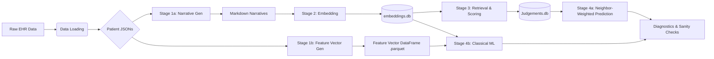
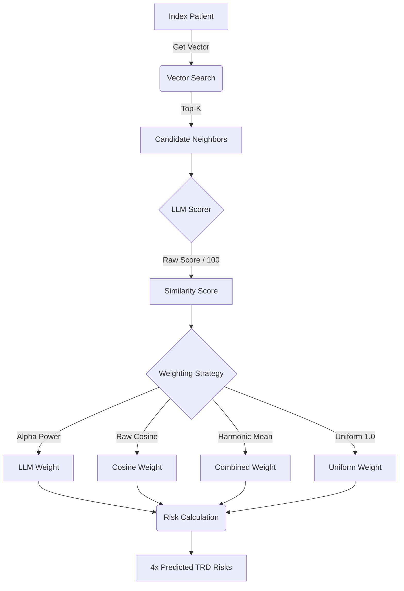

# TRD-EHR: Patient Representation & Treatment-Resistant Depression Prediction

This repository contains the pipeline for converting Electronic Health Record (EHR) data into vectorized patient representations---embedded and rule-based feature vectors of patient narratives capable of semantic search, cohort analysis, and clinical outcome prediction.

The pipeline produces two independent patient vector representations (rule-based feature vectors and neural embedded vectors) and evaluates TRD risk prediction across an asymmetric evaluation matrix:

| Method | Feature Vectors | Embedded Vectors |
| --- | --- | --- |
| **Classical ML** | LR, RF, GB, XGBoost | Same classifiers on high-dimensional embedded vectors |
| **Neighbor-Weighted KNN** | *Not applicable — cosine distance is ill-defined on mixed categorical/numeric features* | KNN retrieval + LLM scoring on embedded vectors |

The pipeline is divided into **Data Loading**, **Stage 1 (Narrative & Vector Generation)**, **Stage 2 (Vector Embedding)**, **Stage 3 (Neighbor Retrieval)**, and **Stage 4 (Prediction & Classical ML)**.



---

## Evaluation Design

All evaluation pipelines share a single stratified 80/20 train/test split (`create_train_test_split.py`) to ensure fair comparison across the full evaluation matrix. The split preserves the natural class imbalance and persists test patient IDs to `test_patient_ids.txt` for reproducibility.

**Test Set Isolation**: In the neighbor-weighted pipeline, test patients are excluded from each other's neighbor pools at retrieval time. The `Retriever` filters out all test patient IDs from its in-memory search arrays during initialization, preventing data leakage while still allowing test patients to serve as query anchors. Narrative and pre-anchor history length lookups remain available for all patients via direct SQLite queries.

**Dual Vector Source (classical ML only)**: The `VectorSource` enum (`EMBEDDED`, `FEATURE`) parameterizes the classical ML pipeline, which runs the full classifier lineup against both vector representations. The neighbor-weighted KNN pipeline runs on `EMBEDDED` only — cosine similarity is not defined over mixed quantitative/categorical features, so `Retriever`, `TRDPredictor`, the neighborhood constructor, and the four neighbor-based analysis scripts accept only embedded vectors.

---

## Project Structure

### 1. Data Loading (`scripts/data_loading`)

The foundation. These scripts ingest raw EHR exports and structure them into usable patient objects.

* **`build_jsons.py`**: The initial ETL step. Converts raw CSVs into per-patient JSON files.
* **`create_cohort.py`**: Filters the total population down to the study cohort (e.g., MDD patients who are not schizophrenic or bipolar). The three source ID lists at `PREP_DATA_DIR/{MDD,BD,SCH}_IDs.csv` are headerless single-column files; `extract_ids` reads them with `header=None` so the first row is treated as data rather than silently consumed as a column name.
* **`fit_to_anchor.py`**: Enforces both the `YEARS_BACK` pre-anchor chronological window and the `YEARS_AHEAD` post-anchor follow-up requirement. It truncates encounters, procedures, and medications that cross the backward boundary and purges ancient history entirely. Patients without sufficient post-anchor observation time (to reliably determine TRD outcome) are rejected. Rejection paths return a `{"reason": ...}` dict rather than a sliced record; the reason string is one of three module-level constants — `NO_MDD`, `PRE_ANCHOR`, or `POST_ANCHOR` — and is persisted to disk in the corresponding `.rejected` marker file by `load_patient_data.py`.
* **`load_patient_data.py`**: Orchestrates the timeline slicing and generates `.rejected` marker files for patients who fail the strict MDD, chronological, or follow-up prerequisites to prevent redundant processing. Each marker's body is a JSON object with a `reason` key naming the specific failure mode, surfacing the rejection reason for downstream cohort-attrition analysis (see `notebooks/cohort_investigation.ipynb` and `notebooks/figures/attrition_table.csv`) without requiring a pipeline rerun. When a patient that was previously sliced becomes rejected on a re-run (e.g., a cohort-definition change flips a borderline case), the stale sliced `.json` is deleted as the `.rejected` marker is written, so an accepted→rejected transition cannot leave an orphaned sliced record behind.
* **`deterministic_narrative.py`**: The logic that deterministically translates structured JSON features (labs, meds, diagnoses) into a human-readable Markdown narrative. Note that the generated narrative only summarizes the precise `YEARS_BACK` window, not the patient's entire lifetime.
* **`feature_vector.py`**: Constructs a typed `pandas.Series` of features for each patient from the sliced JSON, with explicit dtypes that drive downstream preprocessing:
  * `float64` — quantitative features (counts, days, age, adequate-trial counts). The three cohort-averaged vital columns (`bmi`, `bp_sys`, `bp_dias`) are present in the parquet but **dropped from the FEATURE classical-ML matrix at `load_data_set` time**. The three-tier diagnostic in `notebooks/cohort_investigation.ipynb` shows the cohort still has ~50% missing BMI under the maximum legitimately usable time filter (all pre-anchor history) and a 7-11pp TRD-stratified missingness delta at every time filter — MAR violation is structural, not an artifact of the YEARS_BACK window, and imputation is not defensible. EMBEDDED-side narratives encode the missingness independently via the deterministic narrative's `"Missing"` sentinel, so the FEATURE-side drop has no bearing on existing embeddings or embedded classifier fits.
  * `bool` — single-valued binary flags (`suicide_flag`, `augmentation_occured`, `mdd_within_window`) and multi-label set indicators (`psych_*`, `medical_*`, `safety_*`, `sud_*`, `sdoh_*`) where a patient can carry several members simultaneously.
  * `category` — single-valued nominal fields: `Sex`, `PreferredLanguage`, `MaritalStatus`, `Religion`, `SmokingStatus`, `Race_Ethnicity`, `mdd_recurrence`, `mdd_severity`. Each is a single column (not one-hot at the storage layer), compressed via standardized maps (ACS language/marital, BRFSS smoking, GSS religion) where applicable. `Sex` is a single binary category, not two redundant columns.
  Category levels are discovered in a one-shot cohort-wide JSON scan and cached to `categorical_levels.json`. Per-patient Series are assembled into a single cohort-wide parquet file keyed by `patient_id`.
* **`features.py`**: Extractors for specific clinical features.
* **Definitions**: `diagnoses_definitions.py` (includes `get_mdd_components()` for extracting MDD recurrence and severity as separate fields), `med_definitions.py`, etc., map codes to clinical text.

### 2a. Stage 1a: Narrative Generation (`scripts/embedder_investigation/narratives`)

Transforms the structured JSONs into textual narratives.

* **`generator.py`**: Iterates through the cohort, applies the `deterministic_narrative` logic, and saves `.md` files to the `NARRATIVES_DIR`. Reconciliation runs **before** generation, not after: once the cohort is established it deletes any top-level `.md` whose patient is no longer in the cohort (per-spec ablation subdirectories are reconciled separately, at embed time by `forge_embeddings` — see Stage 2), then writes the pre-anchor history-length CSV (`narrative_pre_anchor_history_days.csv` in `ARTIFACTS_DIR`) directly from the cohort's sliced JSONs — both steps complete before the multiprocessing pool writes a single narrative. Ordering it this way keeps the on-disk narrative set a subset of the cohort and the length CSV a full cover of the cohort at all times, so even an interrupted generation run cannot leave the downstream embedding pass an orphaned narrative or one missing its length row (the `KeyError` source in `patient_embedder.embed`). The pool loop now only drives `.md` generation and progress logging; the CSV no longer depends on its return values.
* **`runner.py`**: Orchestrates the generation job via Slurm.

### 2b. Stage 1b: Feature Vector Generation (`scripts/embedder_investigation/vectors`)

Constructs a typed, cohort-wide pandas DataFrame of features directly from the structured patient JSONs, bypassing the narrative/embedding pipeline entirely. This DataFrame serves as a classical ML baseline to compare against the high-dimensional embedded vectors.

* **`generator.py`**: First performs a single cohort-wide JSON scan to discover all categorical levels and cache them to `categorical_levels.json` (replaces the former `patient_attributes.json`). Then uses multiprocessing to iterate the cohort and call `generate_feature_vector` for each patient, collecting per-patient Series into a single DataFrame and persisting it to parquet. Produces a sanity check report sampling 10 random rows alongside their narratives and the column dtype schema.
* **`runner.py`**: Thin orchestrator that invokes the generator.

### 3. Stage 2: Vector Embedding (`scripts/embedder_investigation/embeddings`)

Converts text narratives into high-dimensional vectors using the `PatientEmbedder`.

* **`forge_embeddings.py`**: The main driver.

1. Reads `.md` files from the current `NARRATIVES_DIR` and reconciles them against the cohort: `PatientEmbedder` loads the per-cohort length map from `narrative_pre_anchor_history_days.csv` at construction, and `forge` deletes any `.md` whose stem is absent from that map, then embeds only the survivors. Because `NARRATIVES_DIR` is whatever the caller points it at, this cleans the baseline directory on a normal run and each `{spec_id}/` subdir on the ablation runs — the on-disk half the generator's top-level-only prune cannot reach, and the source of the `KeyError` in `patient_embedder.embed` when a stale ablation narrative outlived its cohort.
2. Reconciles `embeddings.db` against the surviving stems via `PatientEmbedder.purge_orphans` **before** embedding, deleting any row whose patient is no longer a current narrative and logging each purged ID. This closes the accepted→rejected orphan that `INSERT OR REPLACE` alone (with `SCRUB_EMBEDDINGS=0`) would otherwise preserve — the row that put a non-cohort patient into the qwen-8b neighbor pool. Runs unconditionally, including on an all-cached pass.
3. Batches the narratives.
4. Feeds them to the `PatientEmbedder` to generate embeddings.

* **`forge_ablated_embeddings.py`**: Per-spec embedding regen for the Semantic-Feature Ablation Study (see Planned Extensions). Invoked in `run_embedding_pipeline.sbatch` immediately after `forge_embeddings`. Captures the baseline `NARRATIVES_DIR` and `EMBEDDINGS_DIR` once, then iterates `ABLATIONS`: per spec it env-mutates both to per-spec subdirs (`{NARRATIVES_DIR,EMBEDDINGS_DIR}/{spec_id}/`) and fires `forge_embeddings` as a fresh subprocess. A new interpreter per spec is required because `PatientEmbedder.__init__` snapshots `EMBEDDINGS_DIR` at construction time; the resulting per-spec `embeddings.db` files are what `ablation_runner.py` consumes downstream in `ml_only.sbatch`.

* **Artifacts**: This stage populates the SQLite database `embeddings.db` (baseline) plus one `embeddings.db` per ablation spec under `EMBEDDINGS_DIR/{spec_id}/`.

* **`embedding_audit.py`**:
  * Validates the geometry of the embedding space before expensive scoring.
  * **Checks**:
    1. **Normalization**: Verifies if vector norms are uniform (1.0) or variable.
    2. **Metric Monotonicity**: Tests if Euclidean distance offers distinct ranking signals compared to Cosine similarity.
  * **Output**: `vector_norms.png`, `cos_vs_euclidean.png`.

### 4. Stage 3: Retrieval & Scoring (`scripts/embedder_investigation/neighbors`)

Finds and scores patient similarity on the embedded vectors.

* **`retriever.py`**:
  * Accepts an `exclude_ids` set at initialization. Embedded-only — cosine similarity is not defined over mixed categorical/numeric features, so the feature-vector retrieval path has been removed.
  * Loads patient IDs, embeddings, and pre-anchor history lengths from `embeddings.db`.
  * Asserts at load that every `embeddings.db` `patient_id` is a current narrative stem under `NARRATIVES_DIR`; a row with no live narrative raises `ValueError` naming the offender rather than being silently skipped — the analysis-boundary half of the orphan guard. The check runs over the full DB before the `exclude_ids` filter, so legitimately-excluded test patients do not trip it.
  * Patients in `exclude_ids` are filtered out of the in-memory search arrays during initialization, ensuring test patients never appear as neighbors.
  * Performs fast cosine similarity search to find candidates using four distinct retrieval modes:
    * **Nearest**: Finds the top-K closest vectors by cosine similarity.
    * **Farthest**: Finds the top-K most distant vectors by cosine similarity to establish a negative baseline.
    * **Random**: Blindly samples K neighbors.
    * **Subsampled**: Two-stage retrieval that pulls a large random pool (`SUBSAMPLE_POOL_SIZE`) and filters it down to the top-K by cosine similarity to force diversity and bypass geometric hubs.
  * Narrative lookups for LLM scoring query `embeddings.db`.

* **`scorer.py`**:
  * The LLM Judge. Takes candidate pairs and evaluates clinical similarity using a rigid JSON schema.
  * **Caching**: Stores expensive LLM outputs in `judgements.db` (Table: `llm_judgements`) to prevent redundant inference.
  * **Logic**: Checks cache -> Formats Prompt -> Calls vLLM -> Parses JSON -> Saves Result.

* **`llm_similarity_audit.py`**:
  * Extracts concrete examples of the LLM's scoring logic for manual review.
  * **Cross-Database Extraction**: Bridges the `judgements.db` (for scores and raw JSON responses) and `embeddings.db` (for the original patient narratives).
  * **Extremes Sampling**: Queries the top 5 highest and bottom 5 lowest similarity scores to isolate and demonstrate the model's behavior at the margins.
  * **Reporting**: Generates isolated `.txt` files containing both compared narratives alongside the formatted JSON output for readable human analysis.

### 5. Stage 4: Prediction & Evaluation (`scripts/embedder_investigation/predictions`)

#### 5a. Neighbor-Weighted KNN Prediction



* **`create_train_test_split.py`**:
  * Creates a stratified 80/20 train/test split of the full cohort, preserving natural class imbalance.
  * Persists test patient IDs to `test_patient_ids.txt` in `ANALYSIS_DIR` for reproducibility.
  * Both the classical ML pipeline and the neighbor-weighted pipeline use the same test set.
  * Stratification labels come from membership in the shared `load_trd_set()`; the split no longer instantiates `TRDPredictor`, so building it constructs no `Retriever` or LLM `Scorer` — which also makes the function importable and callable inside `causal_forest_env`.

* **`trd_predictor.py`**:
  * Orchestrates neighborhood construction for a single patient. Accepts `exclude_ids`, forwarding it to the `Retriever`.
  * For each anchor patient: retrieves the query vector, finds top-K neighbors via `Retriever.search()`, scores each pair via the LLM `Scorer`, and returns structured neighborhood data including cosine similarity, LLM similarity, and neighbor TRD labels.

* **`run_neighborhood_constructor.py`**:
  * Slurm-parallelized driver that constructs neighborhoods for all test patients on the embedded vectors.
  * Chunks the sorted test set across Slurm array tasks.
  * Each worker process initializes its own `TRDPredictor` with the test set as `exclude_ids`.
  * **Output**: CSV files (`neighbor_results_{task_id}.csv`).

* **`trd_prediction_computation.py`**:
  * Loads neighborhood CSV data (embedding source only) and computes weighted TRD risk predictions.
  * **Neighbor-Weighted Matcher Logic**:
      1. Groups neighbors by anchor patient.
      2. Scores neighbors via the weighting strategies in `RELEVANT_WEIGHTING_STRATS` (Uniform, Cosine, and — only when `COMPUTE_LLM_SIMILARITY=1` — LLM and Combined (Harmonic Mean of Cosine and LLM)).
      3. Computes weighted probability of TRD risk ($P(TRD)=\frac{w\bullet f}{\sum_w w_i}$).
  * **Multi-Stream Evaluation**: Processes across the retrieval schemes in `RELEVANT_NEIGHBOR_SCHEMES` (**Nearest** and **Random** always; **Farthest** and **Subsampled** gated by `NEIGHBOR_FARTHEST` / `NEIGHBOR_SUBSAMPLE`) to isolate the true predictive lift of the vector space against varied baselines.
  * **Analysis & Metrics**:
    * **Discrimination**: ROC AUC (with bootstrapped 95% CI bands; numeric CI bounds emitted as `roc_score_ci_low` / `roc_score_ci_high` alongside the point estimate in `knn_results.json` and `summary.csv`), AUPRC.
    * **Calibration**: Brier Score, **Weighted ECE**, **Calibration Slope & Intercept**.
    * **Confidence**: Effective Sample Size (ESS) and **Risk Extremity Index** (fraction of predictions <0.1 or >0.9).
    * **Optimal Confusion Matrix**: Identifies peak threshold via Youden's J-statistic and calculates Sensitivity, Specificity, F-Score, PLR, and NLR.
  * **Output**: Mode-prefixed output plots (e.g., `NEAREST_COSINE_roc_curve.png`), `summary.csv` (Metrics), and `summary_predictions.csv` (Row-level logs).

* **`trd_ranking_analysis.py`**:
  * **Ranking & Homophily Analysis.** Investigates whether the LLM retrieves neighbors that are clinically more congruent with the anchor than Cosine alone ("Label Homophily").
  * **Agreement Curves**: Computes and plots the "Agreement Score" (homophily) for Top-$k$ neighbors ($k \in \{5, 10, 25, 50\}$) comparing **Cosine Strategy** vs. **LLM Strategy**.
  * **Diagnostics**:
    * **Spearman Correlation**: Quantifies the correlation between Cosine Similarity and LLM Similarity to check for signal redundancy.
    * **Separation AUC**: (Proxy) Evaluates the LLM's ability to distinguish between "Close" neighbors (Rank $\le 5$) and "Far" neighbors (Rank $\ge 45$).
  * **Density**: Computes **kNN Radius** and **LLM Effective Sample Size (ESS=$\frac{(\sum_{i=1}^kw_i)^2}{\sum_{i=1}^k(w_i^2)}$)** to profile the density of patient neighborhoods.
  * **Output**: `agreement_curve_{scheme}.png`, `agreement_summary_{scheme}.csv`, and `correlation_results_cos_vs_llm_{scheme}.json`.

* **`trd_sanity_checks.py`**:
  * **Deep Diagnostics & Validity.**
  * **Embedding Validity**: Validates that retrieved neighbors are statistically distinct from random noise. Computes the $N \times N$ similarity matrix of the anchor cohort to generate a "Random Pair" distribution and overlays it against the "Neighbor" distribution.
  * **Chronology Confounding**: Tests if the model is cheating by using "Data Richness" as a proxy for risk. Merges prediction errors with patient pre-anchor history lengths ($L_i$) and calculates the **Spearman Correlation** ($\rho$) for each weighting strategy.
  * **Output**: `cosine_score_random_vs_neighbor.png`, `chronology_check.csv`, and per-strategy scatter plots.

* **`trd_binning_analysis.py`**:
  * **Environmental Diagnostics (Density & Chronology).** Investigates how the structural environment of the vector space and data richness impact model reliability.
  * **Density Stratification**: Bins patients into quintiles based on their **kNN Radius** (mean distance of top-$k$ neighbors, i.e. $1 - \text{mean}(\text{cos\_sims})$) to evaluate if sparse neighborhoods degrade model discrimination (AUC) or calibration (Brier Score).
  * **Chronology Confounding**: Bins patients into quintiles based on their **Pre-Anchor History Length** (days) to test if the model is inappropriately leveraging data volume as a proxy for clinical risk.
  * **Metrics**: Calculates AUC, Brier Score, and Patient Count per bin across all weighting strategies (Uniform, Cosine, LLM, Combined). Computes Spearman Rank Correlation ($\rho$) and p-values to evaluate the statistical significance of monotonic performance trends across bins.
  * **Output**: Dual-axis performance plots (`scores_by_{bin_type}_{scheme}_{strategy}.png`) with statistical correlation metrics embedded in the titles.

* **`analyze_trd_prediction.py`**: Top-level orchestrator that invokes `run_trd_prediction_computation`, `run_trd_ranking_analysis`, `run_trd_bin_analysis`, and `run_trd_sanity_checks` on the embedding-source neighborhood data.

#### 5b. Classical ML Prediction

* **`classical_ml.py`**:
  * Trains and evaluates standard classifiers on both feature and embedded vector representations.
  * **Pipeline**: Each classifier is wrapped in a `sklearn.pipeline.Pipeline` with a dtype-routed `ColumnTransformer`:
    * Numeric branch: `StandardScaler` over the vital-free numeric block. `VITAL_COLUMNS` (`bmi`, `bp_sys`, `bp_dias`) are stripped at `load_data_set` time on the FEATURE side — no NaN cells reach the transformer, no imputation anywhere.
    * Category branch (`make_column_selector(dtype_include='category')`): `OneHotEncoder(drop='if_binary', handle_unknown='ignore')`.
    * Bool branch (`make_column_selector(dtype_include='bool')`): passthrough, cast to `int8`.
  * Embedded vectors are a single all-numeric block and flow straight through the numeric branch; the categorical and bool branches are active only on the feature vector DataFrame.
  * **Classifiers** (4 total):
    * Logistic Regression (`max_iter=1000`)
    * Random Forest
    * Gradient Boosting (`GradientBoostingClassifier`)
    * XGBoost (`eval_metric='logloss'`)
  * **Hyperparameter Tuning**: Every classifier is wrapped in `GridSearchCV(pipeline, param_grid, scoring='roc_auc', cv=5, n_jobs=-1)` before fitting; `predict_proba` delegates to the refit best estimator. Parameter grids are declared at module level in `HYPERPARAMETERS`.
    * **Logistic Regression** uses a list-of-dicts `param_grid` partitioned by `penalty` to respect solver compatibility: a pure `l2` sub-grid spanning all five solvers, an `l1` sub-grid restricted to `liblinear` and `saga`, an `elasticnet` sub-grid pinned to `saga` with a pruned `model__l1_ratio` sweep (`[0.25, 0.5, 0.75]`) and `max_iter=5000`, and a `None` sub-grid spanning `lbfgs`/`newton-cg`/`sag`/`saga` (with `C` omitted since regularization is disabled).
    * **Random Forest, Gradient Boosting, XGBoost** use flat single-dict grids over their standard hyperparameters.
    * Per-classifier `best_params_` and `best_score_` are persisted to `grid_search_ml_results_{source}.json` in `RESULTS_DIR` (one file per `VectorSource`).
  * **Dual-Source Evaluation**: `main()` runs an EMBEDDED pass followed by a FEATURE pass — each pass is a single load over the four classifiers, no strategy axis. 8 total fits per run (4 EMBEDDED + 4 FEATURE). All ROC, Precision-Recall, Calibration, Decision Curve Analysis, and Optimal Confusion Matrix plots carry source-prefixed filenames — full parity with the KNN diagnostic suite except for the Effective Sample Size distribution (KNN-exclusive; no neighbor-weight analogue exists for a fitted classifier).
  * **Fitted-Model Caching**: After each `GridSearchCV.fit`, the entire fitted searcher is `joblib.dump`-ed to `RESULTS_DIR/trained_models/{model_name}_{source.name}.joblib`. On subsequent runs, if the cache file exists and `SCRUB_TRAINED_MODELS != 1`, the searcher is loaded from disk and the grid search is skipped — `predict_proba`, `best_params_`, `best_score_`, and `cv_results_` all come back intact. This makes the analysis pipeline robust to mid-`ml_only.sbatch` crashes: re-runs skip past the cached classifiers and resume at whatever blew up. `feature_importance.py::refit_best_model` consumes the same cache (returns `joblib.load(cache_path).best_estimator_`) and falls back to its original rebuild-and-refit path on cache miss for standalone runs. The PCA-K sweep in `plot_pca_k_vs_roc` caches each `(model_name, K)` pipeline to a sibling directory `RESULTS_DIR/trained_models_pca/` under the same `SCRUB_TRAINED_MODELS` flag (EMBEDDED-only).
  * **Metrics Reporting**: For each `(classifier, VectorSource)` pair, the shared `compute_metrics` from `trd_prediction_computation.py` is invoked on the held-out test labels and `predict_proba` output. The resulting eight metric values per classifier are accumulated into a structured dict and `json.dump`-ed to `classical_ml_results_{source.name}.json` in `RESULTS_DIR` — one file per `VectorSource`, top-level keyed by lowercase classifier name (matching `evaluate_models`' internal naming), values are eight-key inner dicts. Eight keys per inner dict: `roc_score`, `roc_score_ci_low`, `roc_score_ci_high`, `auprc`, `brier_score`, `weighted_calibration_error`, `calibration_slope`, `calibration_intercept`. The CI bounds (2.5 / 97.5 percentiles of the per-bootstrap-sample AUC distribution, derived in the same bootstrap pass that draws the ROC band) ALSO appear in the KNN JSON — they are not exclusive to classical ML. The KNN JSON (`knn_results.json`) is a strict **superset** of the classical-ML inner dict: it carries the same eight metric keys plus a ninth `mean_ess` (lowercase) key — the mean effective sample size of the LLM-weighted neighborhood. The earlier convention of treating `calibration_slope` / `calibration_intercept` as classical-ML-exclusive was an artifact of the retired text-report writer's hand-curated key list, not a measurement-side constraint: both calibration diagnostics are well-defined for any `(y_true, y_prob)` pair, including KNN weighted-risk predictions. Including them in the KNN JSON is an enrichment, not a schema error. **Architectural note (2026-05-14)**: the prior convention of appending a free-form text block to a shared `results.txt` was retired across the pipeline. The text format required regex-based re-parsing downstream (in the ablation summary emitter) — silly when the writer owns the dict it just stringified. Switching to per-pipeline JSON eliminates the parse step and dissolves the prior ordering coupling between KNN and classical ML (which previously required KNN to run first because `results.txt` was opened `'w'`+`'a'` across two writers).
  * **Data Loading**: `load_data_set()` accepts `(patient_ids, source)`. Feature mode delegates to the shared `load_feature_matrix()` (loads the cohort parquet at `FEATURE_DATAFRAME_PATH`, slices rows by train/test ID, and strips `VITAL_COLUMNS` at parquet-load time). Labels (`y`) come from membership in the shared `load_trd_set()` rather than a `TRDPredictor` instance, so no `Retriever`/neighbor machinery is constructed merely to read TRD flags. Embedded mode queries `embeddings.db` with a batched `SELECT ... WHERE patient_id IN (...)` query, ordered by patient ID to maintain alignment with labels, returning a DataFrame whose columns are all `float64`.
  * **Feature Importance**: Scoped to sibling module `feature_importance.py` covering both sources; runs after `classical_ml.py` inside `ml_only.sbatch` and consumes the same cache. Single FEATURE pass over the four classifiers — no strategy axis. Outputs land in `RESULTS_DIR/feature_importance/`: 4 `feature_importance_{classifier}.png` bar charts on the FEATURE side and a consolidated `feature_importance_summary.json`. EMBEDDED side emits cumulative correlation + cumulative importance overlays, the PCA-K sweep, and the sparsity diagnostic. See the Planned Extensions section below.

* **`plot_cross_embedder.py`**: Standalone, run-by-hand manuscript-figure generator (no Slurm wiring) for Figure 6, the cross-embedder robustness panel. Run it once **after all four embedders have been backfilled through `ml_only.sbatch`** — it reads each encoder's results directly from the live `ARTIFACTS_DIR/{embedder}/{VLLM_MODEL_NAME}/` tree (NOT the rsync'd repo `results/` mirror), iterating the four dash-sanitized encoder dir names verbatim and failing loud with `FileNotFoundError` if any encoder's `classical_ml_results_EMBEDDED.json` or `ablation_summary.csv` is absent. Both panels are fixed on logistic regression and drawn as horizontal point-plus-interval `errorbar`s with the four encoders stacked down the y-axis (reading top-to-bottom via an inverted y-axis): **(A) Discrimination** plots each encoder's embedded-LR `roc_score` with an asymmetric CI from `roc_score_ci_low` / `roc_score_ci_high` (vertical chance reference at 0.5); **(B) Semantic-feature ablation** plots `delta_roc_score` for `permute_psych_history` and `permute_med_burden` per encoder, the two ablations offset vertically around each encoder's row, with the paired-bootstrap CI read straight from the `delta_roc_score_ci_low` / `delta_roc_score_ci_high` columns of `ablation_summary.csv` (vertical zero reference line) — no bootstrap is recomputed in the plotter. Saves to `ARTIFACTS_DIR/cross_embedder_robustness_EMBEDDED.png`; the post-job rsync carries it into the repo `results/` so the `../results/cross_embedder_robustness_EMBEDDED.png` manuscript link resolves.

### 6. Models (`scripts/models`)

Interfaces for the neural networks.

* **`patient_embedder.py`**:
* Wraps `SentenceTransformer` (e.g., Qwen).
* **Storage**: Manages a SQLite connection to `embeddings.db`.
* **Logic**: Checks the DB for existing IDs. If missing, computes the embedding and inserts it as a binary BLOB.
* **Scrubbing**: Respects `SCRUB_EMBEDDINGS` env var to force re-computation.
* **Orphan purge**: `purge_orphans(valid_ids)` deletes every `embeddings.db` row whose `patient_id` is absent from the supplied valid-ID set (the current narrative stems), commits, and returns the deleted IDs. Called by `forge_embeddings` before each embedding pass so a patient embedded under an older cohort and later rejected cannot survive as a stale row — the source-side half of the orphan guard.
* **`vllm_client.py`**: Client for interacting with the vLLM inference server (for LLM-based narrative generation or scoring).

### 7. Shared Utilities (`scripts/shared`)

* **`utils.py`**: Core helpers including `VectorSource` enum (`EMBEDDED`, `FEATURE`) consumed by the classical ML pipeline, `VITAL_COLUMNS` (the three vital column names stripped at `load_data_set` time on the FEATURE side), `cast_to_int8` (used as the `bool__` branch's `FunctionTransformer` in the classical-ML `ColumnTransformer`), `load_neighborhood_data()` for loading neighborhood CSVs (embedded source only), `load_trd_set()` (reads `TRD_LIST_PATH` and returns the TRD-positive patient-ID set — the single source of truth for the binary TRD label, consumed by `TRDPredictor`, `create_train_test_split`, `classical_ml`, and the causal notebook), and `load_feature_matrix(patient_ids)` (loads the FEATURE parquet, casts object columns to category, slices by sorted IDs, and drops `VITAL_COLUMNS` — the neighbor-free FEATURE loader shared by `classical_ml.load_data_set` and the causal notebook). The latter two were extracted so the FEATURE-loading and TRD-labeling logic can be reused outside the prediction pipeline — notably in `causal_forest_env`, where importing the neighbor/vLLM stack is impossible — without instantiating a `Retriever` just to read a label.
* **`plots.py`**: Wraps `matplotlib` and `sklearn` to generate diagnostic visualizations. Computes and saves ROC curves (with bootstrapped error bands), Precision-Recall curves, Calibration curves, Decision Curve Analyses (DCA), Effective Sample Size distributions, and Optimal Confusion Matrices.
* **`prompts.py`**: Strict loader for the LLM system and user prompt templates located in the `./prompts` directory. Formats and injects patient narratives into the structured evaluation prompts for the vLLM server.
* **`feature_display_names.py`**: Display-name mapper consumed at the matplotlib boundary of `feature_importance.py::plot_feature_importance`. Exports `RAW_TO_DISPLAY` (a single source-of-truth dict keyed on post-`ColumnTransformer.get_feature_names_out()` strings with the `num__` / `cat__` / `bool__` branch prefix stripped) and `humanize_feature_names(raw_names)` which prefix-strips and dict-looks-up each entry, falling back to the stripped raw name on miss. The display values are clean human-readable labels with no inline type tag; each entry's `numeric` / `boolean` / `one-hot` branch is recorded as a trailing source comment beside it for maintainers, not surfaced in the rendered figure. Lives in the shared package so ablation summary plots and future manuscript figures can reuse the same labels without duplicating the table.

### 8. Tests (`tests/`)

Unit tests for the data loading layer, run via `pytest`.

* **`conftest.py`**: Provides a `MockPatientBuilder` fixture---a fluent builder that constructs synthetic patient JSON dicts with chainable methods (`add_active_med`, `add_diagnosis`, `add_procedure`, `add_explicit_encounter`). Encounters are auto-created when a diagnosis or procedure is added at a date with no existing encounter.

* **`test_features.py`**: Validates clinical feature extractors from `scripts/data_loading/features.py`:
  * **Adequate Trials**: Boundary tests for the 42-day (6-week) minimum medication duration threshold, including ongoing prescriptions.
  * **Benzodiazepine Days**: Overlap merging logic (no double-counting of concurrent prescriptions).
  * **Augmentation Flag**: 14-day minimum overlap between antidepressants and lithium/antipsychotics.
  * **Polypharmacy**: Distinct ingredient counting (same drug at different strengths counts once).
  * **Suicidality Flag**: One-year recency window enforcement.
  * **Psychiatric Utilization**: Inpatient day summation and emergency encounter counting.
  * **NSAID Burden**: Duration-based filtering across multiple NSAIDs.
  * **Psychiatric Comorbidity**: ICD code to comorbidity category mapping (PTSD, Anxiety, MDD).

* **`test_diagnoses.py`**: Validates diagnosis code parsing from `scripts/data_loading/diagnoses_definitions.py`:
  * **Diagnosis Arm Classification**: Regex matching for MDD, SUD, Dysthymia, Suicide Attempt, and Suicide Ideation across both ICD-10-CM and ICD-9 code formats.
  * **SUD Substance Extraction**: Correct substance identification (Alcohol, Cannabis) from SUD codes.
  * **MDD Component Parsing**: Recurrence (Single Episode vs. Recurrent) and severity (Mild, Moderate, Severe, Psychotic, Remission, Unspecified) extraction from MDD codes across both ICD versions.

```bash
# Run tests
pytest tests/
```

---

## Planned Extensions

Work outside the current pipeline surface, tracked in `TODO.txt`:

* **Feature Importance** — Sibling module `scripts/embedder_investigation/predictions/feature_importance.py`, consumed by `classical_ml.py` (or runnable standalone against persisted fits). The module loops over both `VectorSource` values but answers a different question per source. The two paths share `load_best_params` / `refit_best_model` plumbing and a shared univariate-correlation helper, but produce different outputs because feature-level interpretability does not exist on the embedded side. **Status:** all primitives, `main()` orchestrator, and sbatch integration (both `run_trd_prediction_analysis.sbatch` and `ml_only.sbatch`) landed. Module runs after `classical_ml.py` and reads `grid_search_ml_results_{source}.json`. The EMBEDDED LR sparsity diagnostic is emitted as `feature_importance_sparsity.json` (keys: `nonzero_coefficients`, `total_coefficients`); the predictions package is fully JSON-only, no `results.txt` writers remain. The cumulative-overlay helper `plot_cumulative_magnitude_overlay` takes any per-dim magnitude array paired with caller-supplied xlabel/ylabel/title/filename. EMBEDDED pass emits two cumulative-overlay PNGs: `feature_correlation_cumulative_EMBEDDED.png` (5 curves: model-agnostic baseline ranking dims by `|ρ(dim, y_true)|` plus four per-classifier curves ranking dims by `|ρ(dim, risk_score)|`) and `feature_importance_cumulative_EMBEDDED.png` (4 curves: per-classifier built-in importance, populated from an `importances_by_label` dict built during the classifier loop — LR via `coef_[0]`, tree models via `feature_importances_`). FEATURE pass runs a single loop over the four classifiers — no strategy axis. Outputs: 4 `feature_importance_{classifier}.png` and a single `feature_importance_summary.json`.
  * **FEATURE — per-feature interpretability.** Each fitted classifier emits a feature-importance ranking aligned to the post-`ColumnTransformer` feature names (`ColumnTransformer.get_feature_names_out()`). Magnitude comes from the model's native attribute: tree models (Random Forest, Gradient Boosting, XGBoost) use `feature_importances_`; Logistic Regression uses *signed* `coef_[0]` (sign preserved so direction is recoverable). Direction-of-effect for tree models is recovered separately via univariate Spearman correlation between each post-encode feature column and the outcome `y` — sign of the correlation = direction. SHAP is no longer required and is treated as an optional gold-standard pass; the correlation overlay sidesteps the `shap` env-availability question entirely. Caveat: univariate correlation is interaction-blind, but the model's native importance still drives magnitude — correlation only informs sign. Output: top-K horizontal bar chart at `feature_importance/feature_importance_{classifier}.png` in `RESULTS_DIR`, color-coded by direction (steelblue = raises TRD, firebrick = lowers TRD), plus a consolidated `feature_importance_summary.json`.
  * **EMBEDDED — effective-rank interpretability.** Per-dim importance on 4096 unnamed latents is uninterpretable (no clinical meaning attaches to a single latent dim), so the module instead estimates *how many* dims carry predictive signal: (a) **L1 sparsity count** — nonzero coefficient count from the best elasticnet/L1 LR fit (free; falls out of the existing grid search); (b1) **cumulative correlation curve** — overlay of five cumulative |Spearman ρ| curves: one model-agnostic baseline (dims ranked by `|ρ(dim, y_true)|`) plus one per fitted classifier (dims ranked by `|ρ(dim, risk_score)|`). Each curve plots cumulative fraction of total |ρ| mass vs rank, with K₈₀ / K₉₀ knees reported in the legend. The baseline answers "how much intrinsic signal does the embedding carry per dim?"; the per-classifier curves answer "what dims does each trained classifier read?"; divergence between baseline and any classifier exposes that the classifier is redistributing weight via regularization or interactions the univariate ranking can't see (caveat: interaction-blind, undercounts dims that contribute purely through interactions); (b2) **cumulative built-in importance curve** — overlay of four cumulative |importance| curves, one per fitted classifier, ranked by each model's native attribute (`|coef_[0]|` for Logistic Regression, `feature_importances_` for tree models). Plots cumulative fraction of total |importance| mass vs rank, with K₈₀ / K₉₀ knees reported in the legend. No model-agnostic baseline exists for this variant — built-in importance is by definition a model-specific quantity. Answers "what dims does each trained classifier weigh by its own internal accounting?"; cross-checking against (b1) flags dims the classifier weighs heavily but that lack standalone univariate signal — a regularization/interaction redistribution flag; (c) **PCA-K-vs-ROC sweep** — classifier retrained on K ∈ {1, 2, 4, 8, 16, 32, 64, 128, 256, 512, 1024} truncated principal components, plotting ROC AUC vs K to locate the geometric plateau. Sign of the correlation is meaningless on unnamed latents — only `|correlation|` is used here. Output: `feature_correlation_cumulative_EMBEDDED.png` (overlay of 5 correlation curves), `feature_importance_cumulative_EMBEDDED.png` (overlay of 4 built-in-importance curves), `feature_importance_pca_sweep_EMBEDDED.png`, and `feature_importance_summary_EMBEDDED.json` (sparsity count, knee K, plateau K) in `RESULTS_DIR`.
  * **Concept-probe work** (correlating surviving embedded dims with named clinical features from the feature vector) is **out of scope** for this module — deferred to a sibling notebook if/when interest arises.
  * **Per-concept attribution on the EMBEDDED side** is answered by the Semantic-Feature Ablation Study below, *not* by `feature_importance.py`. The two answer different questions: this module asks "what does the trained classifier weigh"; the ablation study asks "what does the embedder encode".
  * The module lives outside `classical_ml.py` to keep training lean, avoid pulling `shap` into every training run, and allow standalone re-runs against cached fits.
* **Semantic-Feature Ablation Study** *(end-to-end orchestrator code complete 2026-05-14; frozen-baseline refactor landed 2026-05-17. Per-spec wall-clock collapses from ~16h (the prior retrain-per-spec implementation, which answered the wrong question) to <1min (predict-only against four pre-baked baseline GridSearchCV searchers loaded once above the spec loop). Inlined EMBEDDED-only inference pass and ablation_summary.csv emission live inside `ablation_runner.py`. Paired-bootstrap delta-AUC CI columns (`delta_roc_score_ci_low` / `delta_roc_score_ci_high`) and the four per-classifier ROC overlay PNGs were wired into the runner 2026-05-27; the `roc_score` grouped-bar chart's whiskers (since removed — the delta bars are now bars-only) had their source switched from the ablated-AUC CI columns to the paired-delta columns at the same time. Smoke test of `ml_only.sbatch` (which now bundles the baseline `classical_ml.py` + `feature_importance.py` + `ablation_runner.py` sequence into a single submission — the prior `ablation_only.sbatch` was merged in 2026-05-18) against the frozen-baseline pipeline pending.)* — Perturbs a named clinical concept in the deterministic narrative, re-embeds the cohort, and re-runs the EMBEDDED-only classical ML pipeline inlined inside `ablation_runner.py` to measure the ROC / AUPRC / Brier / calibration delta vs baseline. The ML pass is **inlined**, not shelled out to `classical_ml.py` via `subprocess.run`: a subprocess call would force `classical_ml.main()`'s full `for source in VectorSource` loop and re-fit the unchanged FEATURE branch once per spec, wasting five full GridSearchCV passes per ablation run. An `ABLATION_MODE` env-var gate on `classical_ml.py` was also rejected as polluting the baseline pipeline for one caller's edge case. Instead, `ablation_runner.py` imports a *narrower* slice of the EMBEDDED primitives (`load_data_set`, `compute_metrics`, plot helpers — explicitly NOT `evaluate_models`) and `joblib.load`s the four baseline `GridSearchCV` searchers from `baseline_results_dir/trained_models/{model}_EMBEDDED.joblib` once, above the spec loop — EMBEDDED-only by construction, no flag, no FEATURE waste, no retraining. **Frozen baseline, not retrained baseline**: per-spec retraining (the original implementation) lets the classifier discover compensating signal that routes around the perturbed concept and under-reports importance, answering the *wrong* question — "could the model route around the ablation?" The frozen baseline answers the input-perturbation attribution question the study actually asks: "does the embedder's encoding of concept X drive predictions?" Per-spec wall-clock collapses from ~16h (44 LR + 12 RF + 9 GB + 18 XGB GridSearchCV fits at 5-fold CV) to <1min (four `predict_proba` calls against pre-baked searchers). **Why ablation is EMBEDDED-only**: the perturbation surface is the deterministic narrative, and FEATURE vectors are built from the structured JSON (Stage 1b), so ablating a narrative field has zero effect on the FEATURE branch's parquet rows. KNN and LLM judging are also out of scope — they consume embedded vectors but neither has a natural metric-delta surface for per-concept attribution. This is the only path to *per-concept* attribution on the embedded side, since the embedding classifier sees 4096 entangled latents rather than named columns. **Architecture: registry-driven Python-level call; no env-var bridge.** `scripts/data_loading/ablation_registry.py` exports `ABLATIONS`, a Python list of bundle-domain spec dicts. Each spec carries a `bundle` slug (always), an optional `key` (field-level swaps only), an explicit `strategy`, and a filesystem-safe `id`. Field-level form: `{"id": "permute_race", "bundle": "sociodemographics", "key": "Race_Ethnicity", "strategy": "permute_field"}`. Section-level form: `{"id": "permute_psych_history", "bundle": "psych_history", "strategy": "permute_section"}`. **Narrative-generation pipeline.** `deterministic_narrative.py` is factored into three pure primitives plus a per-patient driver: `extract_fields(sliced_json)` returns a nine-key bundle dict (one per narrative section) holding raw field values; `render_narrative(bundles)` is the pure inverse that stamps a bundle into the markdown; `apply_ablation(anchor, donor, spec)` deep-copies anchor bundles and dispatches on `spec["strategy"]` — `permute_section` overwrites the inner dict at `spec["bundle"]`, `permute_field` overwrites `perturbed[bundle][key]`. The driver runs `extract_fields` once per patient, writes baseline to `NARRATIVES_DIR/{patient_id}.md`, then loops `ABLATIONS` and writes each ablation to `NARRATIVES_DIR/{spec_id}/{patient_id}.md` — no env var, no orchestrator subprocess fanout, no per-spec sbatch resubmission. Adding a 6th, 50th, 500th ablation = one new dict entry in `ABLATIONS` with **zero chokepoint edits**; only inventing a brand-new strategy requires a new dispatch branch. **Donor selection: cohort-wide pairing via plain random permutation.** Earlier per-anchor random draw allowed donor *repeats* across the cohort, which biased the marginal distribution of the perturbed field; replaced with `build_pairings(patient_ids)`, which iterates `ABLATIONS` and, per spec, seeds a `random.Random` instance on `(spec_id, SEED)` and calls `rng.shuffle` on a copy of the cohort ID list. The result is `{spec_id: {anchor_id: donor_id}}` — every patient appears as a donor exactly once per spec, so the multiset of donor-supplied values for the perturbed field across the cohort exactly equals the cohort's original multiset of that field, just permuted to different anchors. Self-pairs (one patient occasionally mapped to themselves) are accepted; Sattolo's no-fixed-point guarantee was dropped because the marginal-distribution benefit is negligible at cohort scale and the plain permutation is simpler. Earlier neutralization-with-placeholders (`"Missing"`, `"Absent"`, `"0"`) was rejected on mentor recommendation: writing `"Missing"` into a populated field is *false missing information*, planting a signal the embedder may have learned distinct semantics for and confounding the ablation delta with a missingness signal we did not intend to measure. Section-level permutation copies one donor's entire bundle for that section, preserving intra-section clinical coherence. Length and positional encoding stay stable because section headers and field labels are preserved; only values move. The remaining confound — co-correlation between clinically related features — is irreducible and requires multi-field ablations for joint concepts. **Module-level registration hooks.** `_DONOR_POOL: Dict[str, Dict[str, Dict]]` (patient_id → bundles) and `_PAIRINGS: Dict[str, Dict[str, str]]` (spec_id → {anchor_id → donor_id}) are module-level globals registered via `set_donor_pool(pool)` and `set_pairings(pairings)` in the narratives runner's parent process *before* the multiprocessing pool forks — workers inherit both globals via copy-on-write, zero pickle cost. Cold workers fail loud on missing registration; partial-rerun caching means failures bite only on cold patients. **Run order.** Three stages, split across two sbatches. (1) Narrative regen: `forge_narratives` runs the single pool fan-out that writes baseline + every ablation under `NARRATIVES_DIR/{spec_id}/{patient_id}.md`. (2) Per-spec embedding regen: `forge_ablated_embeddings.py` (invoked in `run_embedding_pipeline.sbatch` immediately after the baseline `forge_embeddings`) captures the baseline `NARRATIVES_DIR` and `EMBEDDINGS_DIR` once, then iterates `ABLATIONS` and env-mutates both to per-spec subdirs before firing `forge_embeddings` as a subprocess per spec (fresh interpreter required because `PatientEmbedder.__init__` snapshots `EMBEDDINGS_DIR` on instantiation), producing one `embeddings.db` per spec under `EMBEDDINGS_DIR/{spec_id}/`. (3) Frozen-baseline scoring: `ablation_runner.main()` (invoked in `ml_only.sbatch` after baseline `classical_ml.py` + `feature_importance.py`) first captures both the baseline `EMBEDDINGS_DIR` and `RESULTS_DIR` Paths *before* any env mutation, then `joblib.load`s the four baseline searchers from `baseline_results_dir/trained_models/{model}_EMBEDDED.joblib` into a `baseline_searchers` dict keyed by lowercase classifier name. Capturing the Paths before env mutation is load-bearing — reading `os.environ` later would resolve to the per-spec subdir and load the wrong (or absent) artifacts. Then iterates the spec list: per spec it env-mutates `EMBEDDINGS_DIR` / `RESULTS_DIR` to per-spec subdirs (no subprocess and no `NARRATIVES_DIR` mutation — embedding regen already happened in stage 2) and runs the frozen-baseline inference pass (`load_data_set(test_ids, source=EMBEDDED)` against the ablated `EMBEDDINGS_DIR` → `searcher.predict_proba(X=test_X)[:, 1]` per frozen searcher → `compute_metrics` → ROC / PR / calibration / DCA / optimal-CM plots → `classical_ml_results_EMBEDDED.json` emit) directly in the same process. **Prerequisites**: (a) baseline `trained_models/{logistic_regression, random_forest, gradient_boosting, xgboost}_EMBEDDED.joblib` + `classical_ml_results_EMBEDDED.json` must exist in baseline `RESULTS_DIR` before `ablation_runner.py` is invoked — they are produced by a one-shot baseline `classical_ml.py` run inside `ml_only.sbatch` against the unablated embeddings (without these artifacts the `joblib.load` block above the spec loop fails fast with `FileNotFoundError`); (b) per-spec `embeddings.db` files must exist under `EMBEDDINGS_DIR/{spec_id}/` from stage 2 — without them the per-spec `load_data_set` call comes up empty and the inference pass crashes on a `KeyError`/empty-frame downstream. Output: `ablation_summary.csv` tabulating metric deltas vs baseline per classifier per ablation, plus six grouped-bar delta PNGs (`ablation_delta_{roc_score, auprc, brier_score, weighted_calibration_error, calibration_slope, calibration_intercept}.png`) emitted by `plot_ablation_deltas`, called from `emit_ablation_summary` after the CSV write so both artifacts share the same in-memory `rows` list (no CSV re-parse). Layout per PNG: x-axis = 5 ablation specs, hue = 4 classifiers, y-axis centered at 0 via a dashed `axhline`; all six are bars-only. (The `roc_score` PNG previously carried asymmetric Δ-AUC whiskers; these were removed deliberately. The `delta_roc_score_ci_low` / `delta_roc_score_ci_high` columns are still written to `ablation_summary.csv`, and the paired bootstrap that produces them still feeds the ROC overlay band below — only the delta-bar whisker rendering was dropped.) Alongside the six grouped-bar PNGs, the ablation runner emits four per-classifier ROC overlay PNGs (`ROC_ablated_vs_baseline_{classifier}_EMBEDDED.png` at the baseline `RESULTS_DIR` root, one per classifier: logistic_regression, random_forest, gradient_boosting, xgboost). Each is a five-panel grid (one panel per ablation spec) showing the baseline ROC curve, the ablated ROC curve, and a paired delta-TPR(FPR) CI band on a twin axis. A complementary absolute-performance figure, `ablation_roc_ci_EMBEDDED.png`, presents each run's raw ROC AUC as a horizontal confidence-interval band rather than a delta: one row per run (the unablated baseline on top, then the five ablation specs ordered by descending logistic-regression AUC drop, with that ordering reused across every panel), one panel per classifier, on a shared absolute-AUC axis with a light reference line at the baseline AUC. Unlike the delta figures, this view requires no paired bootstrap — each band is drawn directly from the per-run `roc_score` / `roc_score_ci_low` / `roc_score_ci_high` columns already present in `ablation_summary.csv` (the baseline band is sourced from `classical_ml_results_EMBEDDED.json`). It is additive to and does not replace the delta grouped-bar PNGs or the ROC overlay grids. The CI band and the `delta_roc_score_ci_*` columns share a single bootstrap loop: per draw, one shared `sample_indices` array is applied to both baseline and ablated `predict_proba` vectors, yielding paired delta_TPR(FPR) and delta_AUC distributions; 2.5 / 97.5 percentiles of each give the band and the column values respectively. Paired (not independent) bootstrap is mandatory because the same patients are scored by both models — the AUCs are positively correlated, and independent-CI propagation inflates the delta interval. Bootstrap math factors through a pure helper in `scripts/shared/plots.py` (module-level constants `N_BOOTSTRAP=1000`, `FPR_GRID=np.linspace(0,1,100)`) consumed by both `plot_receiving_operator_characteristic` (single-curve case) and the new ablation overlay function (paired case). **Locked slate (5 ablations, 2026-05-13 reshape):** `permute_race` (sociodemographics / Race_Ethnicity / permute_field), `permute_psych_history` (psych_history / permute_section), `permute_med_burden` (medication_burden / permute_section), `permute_treatment_contraindications` (treatment_contraindications / permute_section), `permute_sdoh` (sociodemographics / SDOH / permute_field). SDOH no longer needs special-case handling — it lives as a regular list-valued key inside the `sociodemographics` bundle and the renderer joins with `' | '`. `### TREATMENT EXPOSURE` intentionally excluded because prior adequate AD trials are part of how TRD is *defined* in the cohort — the delta would be enormous, predictable, and uninformative. `suicide_flag` not ablated standalone — already covered under `permute_psych_history`. Note: the `treatment_contraindications` bundle renders under the heading `### SAFETY` in the deterministic narrative — the rendered string was kept stable to preserve embedding cache validity; only the Python-side bundle key was renamed for clinical accuracy (EPILEPSY + UNCONTROLLED_HTN are prescribing constraints, not safety in the suicide-risk sense). Lives outside `feature_importance.py` because ablation is pipeline orchestration (re-run upstream stages, diff downstream metrics), not classifier introspection.
* **Causal Random Forest — Treatment-Effect Supplement to TRD Prediction** — An optional causal companion to the prediction pipeline, living in its own notebook (`notebooks/causal_random_forest.ipynb`). Where the classification pipeline asks *who will become TRD?*, this asks the causal question over the **same TRD outcome**: *which treatment behaviors causally change a patient's probability of becoming TRD, and for whom?* It estimates conditional average treatment effects (CATE) via `CausalForestDML` for each candidate treatment that clears an overlap/positivity check — a prevalence band of [5%, 95%]. On the current 9,724-patient cohort, augmentation (~0.9% prevalence) fails that band and is dropped; polypharmacy (thresholded; `>= 2` ≈ 63%) and adequate-trial-≥1 (~6.4%, thin — ~623 treated, so expect noisy CATE) survive. Evaluation surface: Qini coefficient, uplift curves, doubly-robust CATE calibration, CATE distribution plots, and subgroup ATE tables stratified by the top SHAP-ranked moderators. CATE metrics are incompatible with the ROC/PR/Calibration harness of the main pipeline, which is why this lives in its own notebook. **Implementation status:** data loading (via the shared `create_train_test_split`, `load_feature_matrix`, and `load_trd_set` helpers), the `get_treatment_indicator` treatment dispatcher, one-hot encoding of the eight categorical moderators, and the per-treatment `CausalForestDML` fit loop are implemented; test-set CATE estimates for the two surviving treatments are persisted to `notebooks/figures/cate_test.parquet` (keyed by `patient_id`; polypharmacy ATE ≈ +0.023, adequate-trial ATE ≈ +0.037, both small positive effects on TRD probability). Remaining: the evaluation surface (Qini, uplift, doubly-robust CATE calibration, CATE histograms, SHAP-moderator subgroup tables) and treatment-tagged plot export. **Inclusion in the manuscript is pending mentor decision — it may or may not be needed.** Its dedicated `causal_forest_env` (econml + scikit-learn 1.6.1, isolated from the main env because econml caps scikit-learn below 1.7) is already provisioned by `setup_envs.sh` — see Environment Setup.

---

## The Vault: Databases

### Embedding Storage (`embeddings.db`)

Located at `EMBEDDINGS_DIR/embeddings.db`.

**Table: `embeddings`**
Stores the raw embeddings and associated patient data.

| Column | Type | Description |
| --- | --- | --- |
| `patient_id` | `TEXT (PK)` | Patient ID of the corresponding narrative. |
| `embedding` | `BLOB` | The numpy array (`float32`) serialized to bytes. |
| `text` | `TEXT` | The raw narrative text (for audit/retrieval). |
| `chronological_length` | `INTEGER` | Pre-anchor history length in days. |

### Judgement Storage (`judgements.db`)

Located at `JUDGEMENTS_DIR`.

**Table: `llm_judgements`**
Caches the expensive qualitative evaluations from the LLM.

| Column | Type | Description |
| --- | --- | --- |
| `patient_id_a` | `TEXT (PK)` | First Patient ID. |
| `patient_id_b` | `TEXT (PK)` | Second Patient ID. |
| `overall_score` | `INTEGER` | Numeric Similarity Score |
| `full_response` | `TEXT` | Full Response from LLM Including Justification |

---

## Configuration

The pipeline requires a `.env` file. Below are the standard configurations:

### General & Reproducibility

* `SEED`: 42 (Random seed for reproducibility).
* `YEARS_BACK`: 2 (Defines the strict historical window prior to the anchor date. Patients with less history are discarded).
* `YEARS_AHEAD`: 1 (Minimum post-anchor follow-up in years. Patients without sufficient observation time to determine TRD outcome are discarded).
* `SCRUB_PATIENT_JSON`: 0 (Flag to force recreation of patient JSONs).
* `SCRUB_NARRATIVES`: 0 (Flag to force recreation of narratives).
* `SCRUB_FEATURE_VECTORS`: 0 (Flag to force recreation of the feature vector DataFrame and `categorical_levels.json`).
* `SCRUB_EMBEDDINGS`: 0 (Flag to force re-computation of embedded vectors).
* `SCRUB_TRAINED_MODELS`: 0 (Flag to force retraining of the classical-ML grid searches and PCA-K sweep pipelines. When `0`, cached fitted estimators under `RESULTS_DIR/trained_models/` and `RESULTS_DIR/trained_models_pca/` are reused; when `1`, they are ignored and overwritten on the next fit. Makes `ml_only.sbatch` re-runs cheap when an unrelated bug downstream of training kills the job).

### Neighbor-Weighted Pipeline Scope

These three `0`/`1` flags scope what the neighbor-weighted KNN pipeline computes. All three read with the `int(os.environ[...]) == 1` idiom; any value other than the on-value means off. They are independent of the classical-ML pipeline, which never touches retrieval schemes or LLM judgement.

* `COMPUTE_LLM_SIMILARITY`: 0 (Gate for the expensive LLM neighbor judgement. When `1`, the vLLM server is launched, each neighbor pair is scored by the LLM judge, and the **LLM** and **Combined** weighting strategies plus the ranking/homophily analysis (`trd_ranking_analysis`) are computed. When `0`, no vLLM server is started — `trd_prediction_orchestrator.sbatch` skips the server submission, both reachability loops, and the kill stub, and `run_trd_prediction_analysis.sbatch` skips `llm_similarity_audit` — neighbors are retained with a placeholder LLM similarity, and only the **Uniform** and **Cosine** strategies are evaluated. The single source of truth for the strategy trim is `RELEVANT_WEIGHTING_STRATS` in `weighting_strategy.py`).
* `NEIGHBOR_FARTHEST`: 0 (When `0`, the **Farthest** retrieval scheme is dropped from neighborhood construction (`run_neighborhood_constructor.py`) and every downstream analysis).
* `NEIGHBOR_SUBSAMPLE`: 0 (When `0`, the **Subsampled** retrieval scheme is dropped from neighborhood construction and every downstream analysis. The single source of truth for the scheme trim is `RELEVANT_NEIGHBOR_SCHEMES` in `neighbor_scheme.py`, consumed by the constructor and every downstream analysis script).

### Data Paths

* `PREP_DATA_DIR`: Raw data directory (e.g., `/media/studies/ehr_study/data-EHR-prepped/DV250901v1-PV251208v1/PrepData`).
* `OUTPUT_DATA_DIR`: Directory for output lists (`/media/studies/ehr_study/data-EHR-prepped/DV250901v1-PV251208v1/OutputData`).
* `ANALYSIS_DIR`: Root directory for analysis outputs (`/media/studies/ehr_study/analysis/mferguson`).
* `PROCEDURE_CSV_PATH`, `MEDICATION_CSV_PATH`, `DIAGNOSIS_CSV_PATH`, `ENCOUNTER_CSV_PATH`, `VITALS_CSV_PATH`, `PERSON_CSV_PATH`: Paths to respective raw data tables.
* `TRD_LIST_PATH`: Path to the text file containing IDs of TRD-positive patients.
* `MDD_MED_DATE_CSV_PATH`: Path to the anchor dates CSV.
* `PATIENT_JSON_DIR`: Directory for raw patient JSONs.
* `SLICED_PATIENT_JSON_DIR`: Directory for timeline-sliced patient JSONs.
* `COHORT_PATH`: Path to the filtered study cohort CSV.

### Models & Inference

#### Embedding Model

* `HF_HOME`: HuggingFace cache directory.
* `EMBEDDER_MODEL_NAME`: `Qwen-Qwen3-Embedding-8B` (set per pipeline run; four embedders are under evaluation in this project: `bge-en-icl`, `bge-small-en-v1.5`, `Qwen-Qwen3-Embedding-4B`, `Qwen-Qwen3-Embedding-8B`. Update this variable between sequential `ml_only.sbatch` runs to backfill each — do not parallelize, the orchestrator log paths are shared).
* `EMBEDDER_MODEL_PATH`: Local path to the embedder model.
* `EMBEDDER_DEVICE`: `cuda` (Use `cpu` for large strings to prevent OOM).
* `EMBEDDER_BATCH_SIZE`: 32

#### Generative Model (vLLM)

* `VLLM_MODEL_NAME`: `google_medgemma-27b-text-it`
* `VLLM_MODEL_PATH`: Local path to the vLLM model.
* `VLLM_URL`: `http://compute306:8000`
* `MAX_MODEL_LEN`: 32768
* `PATIENT_JSON_CHUNK_SIZE`: 32768
* `MAX_TOKENS`: 8192

### Storage & Artifacts

* `ARTIFACTS_DIR`: Root directory for computed artifacts.
* `NARRATIVES_DIR`: Storage for generated Markdown narratives.
* `FEATURE_DATAFRAME_PATH`: Path to the cohort-wide feature vector DataFrame (parquet).
* `EMBEDDINGS_DIR`: Storage for embedded vectors and `embeddings.db`.
* `JUDGEMENTS_DIR`: Storage for LLM judgements.
* `RESULTS_DIR`: Storage for analysis results and logs.

### Hyperparameters & Concurrency

* `NUM_WORKERS_NON_LLM_TASK`: 16
* `NUM_WORKERS_LLM_TASK`: 16
* `NUM_NEIGHBOR_PATIENTS`: 50 (Total number of neighbors evaluated for density analysis).
* `SUBSAMPLE_POOL_SIZE`: 500 (Size of the initial random net cast during the two-stage subsampled retrieval mode).
* `HIGH_SIM_THRESHOLD`: 0.95
* `WEIGHTING_EXPONENT`: 5.0 (Alpha value for weighting similarity scores).
* `LOW_CONFIDENCE_ESS_THRESHOLD`: 20
* `NUM_PAIRS_SANITY_CHECK`: 1000

## Environment Setup

The pipeline runs in two **separate** conda environments, both built from scratch by the `setup_envs.sh` script (run it once from the repository root on an allocated compute node; it creates the env prefixes under `/media/studies/ehr_study/analysis/mferguson/venvs/`, installs into each prefix, and ends with an import smoke check so a green run proves the env works):

* **`embedder_pipeline`** — the main pipeline environment. Hard-pinned to **scikit-learn 1.7.1** (the version the cached `trained_models/*.joblib` transformers were pickled under) and carrying the heavy stack: torch, vLLM, transformers, sentence-transformers, xgboost, pandas, pyarrow, and the rest. Every Slurm job and the `cohort_investigation` notebook run under this env.
* **`causal_forest_env`** — a lean, separate environment for the causal random forest work (`econml` with **scikit-learn 1.6.1**, plus shap, lightgbm, statsmodels). It is isolated on purpose: econml hard-caps scikit-learn below 1.7, which is incompatible with the main env's 1.7.1, and forcing them into one env corrupts the joblib caches. No torch/vLLM here.

The two environments cannot share one interpreter — keep them distinct.

## Usage

**To Launch the Full Pipeline:**

```bash
sbatch slurm_jobs/pipeline/trd_prediction_orchestrator.sbatch
```

The orchestrator sequentially submits: JSON loading, embedding pipeline (narratives + feature vector DataFrame + embedded vectors), vLLM server startup, neighborhood construction (Slurm array on embedded vectors), and analysis (neighbor-weighted evaluation + classical ML on both sources). All results are rsynced to `results/` upon completion.

## Cohort Investigation Notebook

`notebooks/cohort_investigation.ipynb` is the population-characterization surface backing the TRIPOD-AI reporting checklist; its outputs feed Table 1 and the supporting tables/figures at manuscript time. A roadmap table at the top of the notebook maps each TRIPOD-AI item to the cell that produces it. All artifacts land in `notebooks/figures/`:

* **Participant flow (20a)** — `attrition_table.csv`: raw population down to the final analysis set, one row per filter stage. Underwrites every denominator below.
* **Data span & follow-up (5b)** — anchor-date range and the post-anchor follow-up-length distribution. The TRD outcome itself is a pre-defined external label consumed as-is; the formal outcome definition (8a) is deferred to manuscript prose, not built here.
* **Vitals missingness diagnostic (7, 11)** — three-tier check (in-window / all pre-anchor history / any date) establishing the structural MAR violation that justifies dropping `VITAL_COLUMNS` at `load_data_set` time.
* **By-dtype descriptive summary** — `numeric_summary.csv` (per-group `describe()`), `boolean_summary.csv` (True-rate + TRD delta), `categorical_summary.csv` (per-level share + TRD delta). Exploratory companion to Table 1.
* **Table 1 (20b)** — `table_one.csv`: median (IQR) for continuous, n (%) for boolean / multi-label / categorical levels, with standardized mean differences (SMD) across TRD strata. Age band is derived from the float `AgeInYears` column.
* **Subgroup outcome prevalence (3c, 14)** — `subgroup_trd_prevalence.csv`: TRD rate by Sex / Race_Ethnicity / PreferredLanguage / age band / each SDOH indicator, with cells of n < 20 flagged as the small-cell ceiling on the eventual subgroup performance analysis (23a).
* **Subgroup missingness audit (7)** — `subgroup_missingness.csv`: per-subgroup missingness for any column still carrying NaNs after the vital-dropped load. The block is **not** fully clean: `Religion` carries 15–33% missingness with a steep age gradient (30.5% in 18–29 down to 9.5% in 65+, a MAR pattern) that reaches the FEATURE `OneHotEncoder` as an implicit "Missing" level, while `MaritalStatus` and `SmokingStatus` are effectively clean (<0.5%). The pending missing-indicator / drop decision for `Religion` is tracked in `TODO.txt`.
* **Train/test comparability (20c, 21)** — `train_test_smd.csv`: split sizes and TRD-positive counts plus a per-predictor SMD across train vs test, sourced from `create_train_test_split()` so it matches the classical-ML and KNN pipelines.
* **Events-per-variable (10)** — training TRD-positive count divided by the post-`ColumnTransformer` feature count, computed for both vector sources from the cached `{model}_{EMBEDDED,FEATURE}.joblib` transformers (no refit) and reported against the >= 10 threshold. The shared TRD-positive numerator is divided by each source's expanded feature width, so the high-dimensional EMBEDDED block fails the threshold while the much narrower FEATURE block is reported on its own terms.
* **TRD-stratified density figures** — `density_{mdd_to_anchor_days,num_encounters,pre_anchor_history_days}.png` (truncated at a per-column percentile bound for low-value resolution; presentation only) plus `density_correlation.csv` (Pearson + Spearman vs the TRD label, on the full untruncated data). `mdd_to_anchor_days` is a near point-mass at 0–1 days (the index AD prescription nearly always coincides with the most recent pre-anchor MDD diagnosis), so its continuous density histogram is mostly empty whitespace and uninformative; it therefore additionally gets a same-day-vs-delayed recode bar chart, `trd_rate_by_delayed_mdd_to_anchor_days.png`, plotting per-group TRD rate against a cohort-base-rate reference line (same-day patients run ~1.6x the delayed-group TRD rate). The continuous histogram is still emitted alongside it.

Feature and categorical-level labels in every table and figure are routed through `humanize_feature_names` from `scripts/shared/feature_display_names.py`, so the notebook, ablation summary plots, and `feature_importance.py` share one display-name source of truth.

## Running the Notebooks on a Compute Node

The analysis notebooks (e.g. `notebooks/cohort_investigation.ipynb`) sweep the full cohort and read the per-patient JSONs directly, so they crawl when the kernel runs on a shared login node. Run the kernel on an allocated compute node instead — the speed-up comes almost entirely from that node's dedicated, uncontended filesystem, which dominates these file-heavy passes (the sweeps are single-threaded, so the extra cores are incidental).

Per-session process (VS Code / Cursor Remote):

1. From a shell on an allocated compute node — request an interactive Slurm allocation first if you are not already on one — activate the main pipeline environment (`embedder_pipeline`, by its prefix path under `/media/studies/ehr_study/analysis/mferguson/venvs/`).
2. Start a Jupyter server from that shell and leave the terminal open. It prints a URL containing an access token.
3. In the notebook's kernel picker, choose *Select Another Kernel -> Existing Jupyter Server* and paste that URL, token included. When the VS Code remote session is attached to the same node, the printed loopback URL connects as-is; if the editor is attached to a different host, substitute the node's name for the loopback host (or forward the port).
4. Select the **Python (embedder_pipeline)** kernel.

One-time setup: the **Python (embedder_pipeline)** kernel has to be registered once as a user-level Jupyter kernelspec pinned to `embedder_pipeline`'s interpreter (via its `ipykernel` module); it persists across sessions afterward. This matters because the `jupyter` binary on the default PATH can resolve to a system install running a different Python — the registered kernelspec is what guarantees cells execute under `embedder_pipeline` (Python 3.11) regardless of which server process is serving the notebook.

Closing the server's terminal or losing the allocation tears down the server and every kernel under it, so keep that session alive for the duration of your work.

## Downloading Models

```bash
conda activate /media/studies/ehr_study/analysis/mferguson/venvs/embedder_pipeline
export HF_HOME=/media/studies/ehr_study/analysis/mferguson/models/hf_cache
cd /media/studies/ehr_study/analysis/mferguson/models/
hf download BAAI/bge-en-icl --local-dir bge-en-icl
```
