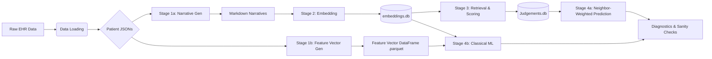
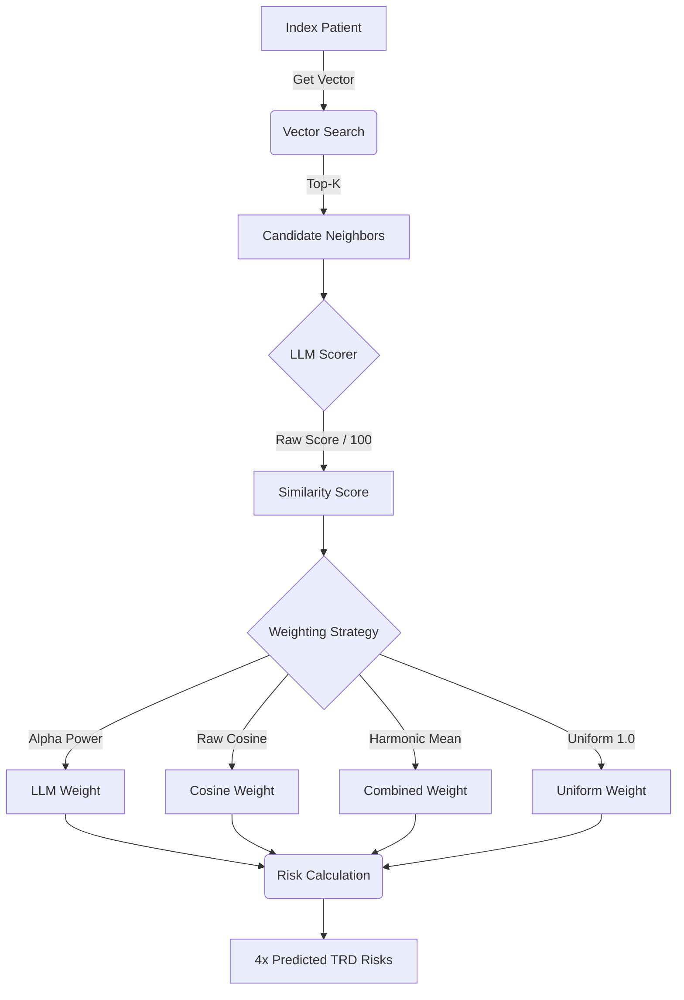

# TRD-EHR: Patient Representation & Treatment-Resistant Depression Prediction

> **AI assistants: read [`AI_INSTRUCTIONS.md`](./AI_INSTRUCTIONS.md) in full before doing
> anything.** It is the operating contract for this repository and it is model-agnostic —
> Claude, Codex, DeepSeek/open-code, Cursor, a local model, all the same. Nothing auto-loads
> it, so read it the moment you are pointed at this README.

This repository contains the pipeline for converting Electronic Health Record (EHR) data into vectorized patient representations---embedded and rule-based feature vectors of patient narratives capable of semantic search, cohort analysis, and clinical outcome prediction.

> **Companion documentation — read this first.** This README documents the *pipeline architecture*. The plain-language research narrative, manuscripts, planning docs, task list, and reference library live in the separate **`Research-Journey`** repo, which now sits in the home folder as a sibling of this repo (`~/Research-Journey`), no longer nested inside it. It is its own private git repo (on GitHub as `Pirate-Hunter-Zoro/Research-Journey`) and is now a **multi-project narrative hub** covering both this project and the sibling `PSYCH-ASR` project. Start there for "where are we / what's the story"; this project's live task list is `~/Research-Journey/planning/TRD-EHR_TODO.txt`.

The pipeline produces two independent patient vector representations (rule-based feature vectors and neural embedded vectors) and evaluates TRD risk prediction across an asymmetric evaluation matrix:

| Method | Feature Vectors | Embedded Vectors |
| --- | --- | --- |
| **Classical ML** | LR, RF, GB, XGBoost | Same classifiers on high-dimensional embedded vectors |
| **Neighbor-Weighted KNN** | *Not applicable — cosine distance is ill-defined on mixed categorical/numeric features* | KNN retrieval + LLM scoring on embedded vectors |

The pipeline is divided into **Data Loading**, **Stage 1 (Narrative & Vector Generation)**, **Stage 2 (Vector Embedding)**, **Stage 3 (Neighbor Retrieval)**, and **Stage 4 (Prediction & Classical ML)**.



---

## Evaluation Design

All evaluation pipelines share a single stratified 80/20 train/test split (`create_train_test_split.py`) to ensure fair comparison across the full evaluation matrix. The split preserves the natural class imbalance and persists test patient IDs to `test_patient_ids.txt` for reproducibility.

**Test Set Isolation**: In the neighbor-weighted pipeline, test patients are excluded from each other's neighbor pools at retrieval time. The `Retriever` filters out all test patient IDs from its in-memory search arrays during initialization, preventing data leakage while still allowing test patients to serve as query anchors. Narrative and pre-anchor history length lookups remain available for all patients via direct SQLite queries.

**Dual Vector Source (classical ML only)**: The `VectorSource` enum (`EMBEDDED`, `FEATURE`) parameterizes the classical ML pipeline, which runs the full classifier lineup against both vector representations. The neighbor-weighted KNN pipeline runs on `EMBEDDED` only — cosine similarity is not defined over mixed quantitative/categorical features, so `Retriever`, `TRDPredictor`, the neighborhood constructor, and the four neighbor-based analysis scripts accept only embedded vectors.

---

## Project Structure

### 1. Data Loading (`scripts/data_loading`)

The foundation. These scripts ingest raw EHR exports and structure them into usable patient objects.

* **`build_jsons.py`**: The initial ETL step. Converts raw CSVs into per-patient JSON files. **Cohort-scoped**: `load_all_patient_json` builds JSONs only for the study cohort, not the full source population. It ensures the cohort exists first — calling `create_cohort()` when `COHORT_PATH` is absent — then intersects `people_df.index` with the cohort ID set (`pandas.Index.intersection`, not `&`, which on pandas 2.x is elementwise-AND and raises), so the multiprocessing pool only ever writes cohort patients. This is a pure ordering change (filter first, then build): downstream behavior is identical, but the raw JSON dir shrinks ~4× (the cohort is ~25% of the source population), which is what keeps the build inside the storage quota after the data overhaul inflated per-patient JSON size. No downstream stage globs the full raw dir — `load_patient_data` reads raw JSONs by cohort `patient_id`, never by directory scan.
* **`create_cohort.py`**: Filters the total population down to the study cohort (e.g., MDD patients who are not schizophrenic or bipolar) via the set difference `MDD − (BD ∪ SCH)`. It does not itself determine MDD status — that labeling is done upstream by the R prep and consumed here as the three ID lists at `PREP_DATA_DIR/{MDD,BD,SCH}_IDs.csv`, which are headerless single-column files; `extract_ids` reads them with `header=None` so the first row is treated as data rather than silently consumed as a column name. Invoked eagerly by `build_jsons` (above) as well as by `load_patient_data`, so the cohort is materialized before any JSON is built.
* **`fit_to_anchor.py`**: Enforces both the `YEARS_BACK` pre-anchor chronological window and the `YEARS_AHEAD` post-anchor follow-up requirement. It truncates encounters, procedures, and medications that cross the backward boundary and purges ancient history entirely. Patients without sufficient post-anchor observation time (to reliably determine TRD outcome) are rejected. Rejection paths return a `{"reason": ...}` dict rather than a sliced record; the reason string is one of three module-level constants — `NO_MDD`, `PRE_ANCHOR`, or `POST_ANCHOR` — and is persisted to disk in the corresponding `.rejected` marker file by `load_patient_data.py`.
* **`load_patient_data.py`**: Orchestrates the timeline slicing and generates `.rejected` marker files for patients who fail the strict MDD, chronological, or follow-up prerequisites to prevent redundant processing. Each marker's body is a JSON object with a `reason` key naming the specific failure mode, surfacing the rejection reason for downstream cohort-attrition analysis (see `notebooks/cohort_investigation.ipynb` and `notebooks/figures/attrition_table.csv`) without requiring a pipeline rerun. When a patient that was previously sliced becomes rejected on a re-run (e.g., a cohort-definition change flips a borderline case), the stale sliced `.json` is deleted as the `.rejected` marker is written, so an accepted→rejected transition cannot leave an orphaned sliced record behind.
* **`deterministic_narrative.py`**: The logic that deterministically translates structured JSON features (labs, meds, diagnoses) into a human-readable Markdown narrative. Note that the generated narrative only summarizes the precise `YEARS_BACK` window, not the patient's entire lifetime. Two properties of the renderer are load-bearing and easy to break:
  * **Every flag list is emitted in sorted key order.** The comorbidity, prescribing-safety and prior-trial dictionaries are built by iterating `PSYCH_ARMS`, `MEDICAL_ARMS`, `SAFETY_ARMS` and `ALL_ARMS`, which are Python **sets**, so their insertion order — and, before the sort was added, the rendered order — varies between processes. Rendered text is therefore reproducible only because `render_narrative` sorts; remove a `sorted()` and two runs on identical input produce identically informative but differently ordered narratives, which changes every embedding, neighbour set and cached judgement keyed to that text. The narratives currently on disk predate the sort and cannot be reconstructed byte-for-byte by a re-render, which is why the parity analysis (Stage 5c) carries a re-render control arm.
  * **`NARRATIVE_INCLUDE_HISTORY_LENGTH` gates one field and defaults to off.** With it set, the cohort-and-index header also renders `pre_anchor_history_days`, closing the one asymmetry that favours the feature vector. It is off by default because turning it on changes the narrative text and so invalidates everything downstream of it; the parity analysis sets it and renders into its own directory. `pre_anchor_history_days` is present in the `cohort_index` bundle either way — no ablation spec targets that bundle, so carrying an unrendered field there is inert.
* **`feature_vector.py`**: Constructs a typed `pandas.Series` of features for each patient from the sliced JSON, with explicit dtypes that drive downstream preprocessing:
  * `float64` — quantitative features (counts, days, age, adequate-trial counts). The three within-patient mean vital columns (`bmi`, `bp_sys`, `bp_dias`) are present in the parquet but **dropped from the FEATURE classical-ML matrix at `load_data_set` time** unless `load_feature_matrix(..., include_vitals=True)` is passed, which keeps them and adds one boolean missingness indicator per vital block (`bmi_missing`, `bp_missing`, from `VITAL_MISSING_INDICATORS`). That path must be paired with `make_classifier(..., impute_numeric=True)`, which prepends a median `SimpleImputer` to the numeric branch: a numeric column carrying nulls cannot pass through the branch's `StandardScaler`, and putting the imputer inside the Pipeline is what keeps its median fitted on each grid-search fold's training rows rather than on the whole cohort. Both flags default to the published behaviour, and with `impute_numeric=False` the ColumnTransformer receives a bare `StandardScaler` exactly as before, so no published fit changes structurally. The three-tier diagnostic in `notebooks/cohort_investigation.ipynb` shows the cohort carries substantial BMI missingness that persists under the maximum legitimately usable time filter (all pre-anchor history), with a TRD-stratified missingness delta at every time filter — the MAR violation is structural, not an artifact of the YEARS_BACK window, and imputation is not defensible. EMBEDDED-side narratives encode the missingness independently via the deterministic narrative's `"Missing"` sentinel, so the FEATURE-side drop has no bearing on existing embeddings or embedded classifier fits.
  * `bool` — single-valued binary flags (`suicide_flag`, `augmentation_occured`, `mdd_within_window`) and multi-label set indicators (`psych_*`, `medical_*`, `safety_*`, `sud_*`, `sdoh_*`) where a patient can carry several members simultaneously.
  * `category` — single-valued nominal fields: `Sex`, `PreferredLanguage`, `MaritalStatus`, `Religion`, `SmokingStatus`, `Race_Ethnicity`, `mdd_recurrence`, `mdd_severity`. Each is a single column (not one-hot at the storage layer), compressed via standardized maps (ACS language/marital, BRFSS smoking, GSS religion) where applicable. `Sex` is a single binary category, not two redundant columns.
  Category levels are discovered in a one-shot cohort-wide JSON scan and cached to `categorical_levels.json`. Per-patient Series are assembled into a single cohort-wide parquet file keyed by `patient_id`.
* **`features.py`**: Extractors for specific clinical features.
* **Definitions**: `diagnoses_definitions.py` (includes `get_mdd_components()` for extracting MDD recurrence and severity as separate fields), `med_definitions.py`, etc., map codes to clinical text.

### 2a. Stage 1a: Narrative Generation (`scripts/embedder_investigation/narratives`)

Transforms the structured JSONs into textual narratives.

* **`generator.py`**: Iterates through the cohort, applies the `deterministic_narrative` logic, and saves `.md` files to the `NARRATIVES_DIR`. Reconciliation runs **before** generation, not after: once the cohort is established it deletes any top-level `.md` whose patient is no longer in the cohort (per-spec ablation subdirectories are reconciled separately, at embed time by `forge_embeddings` — see Stage 2), then writes the pre-anchor history-length CSV (`narrative_pre_anchor_history_days.csv` in `ARTIFACTS_DIR`) directly from the cohort's sliced JSONs — both steps complete before the multiprocessing pool writes a single narrative. Ordering it this way keeps the on-disk narrative set a subset of the cohort and the length CSV a full cover of the cohort at all times, so even an interrupted generation run cannot leave the downstream embedding pass an orphaned narrative or one missing its length row (the `KeyError` source in `patient_embedder.embed`). The pool loop now only drives `.md` generation and progress logging; the CSV no longer depends on its return values.
* **`runner.py`**: Orchestrates the generation job via Slurm.

### 2b. Stage 1b: Feature Vector Generation (`scripts/embedder_investigation/vectors`)

Constructs a typed, cohort-wide pandas DataFrame of features directly from the structured patient JSONs, bypassing the narrative/embedding pipeline entirely. This DataFrame serves as a classical ML baseline to compare against the high-dimensional embedded vectors.

* **`generator.py`**: First performs a single cohort-wide JSON scan to discover all categorical levels and cache them to `categorical_levels.json` (replaces the former `patient_attributes.json`). Then uses multiprocessing to iterate the cohort and call `generate_feature_vector` for each patient, collecting per-patient Series into a single DataFrame and persisting it to parquet. Produces a sanity check report sampling 10 random rows alongside their narratives and the column dtype schema.
* **`runner.py`**: Thin orchestrator that invokes the generator.

### 3. Stage 2: Vector Embedding (`scripts/embedder_investigation/embeddings`)

Converts text narratives into high-dimensional vectors using the `PatientEmbedder`.

* **`forge_embeddings.py`**: The main driver.

1. Reads `.md` files from the current `NARRATIVES_DIR` and reconciles them against the cohort: `PatientEmbedder` loads the per-cohort length map from `narrative_pre_anchor_history_days.csv` at construction, and `forge` deletes any `.md` whose stem is absent from that map, then embeds only the survivors. Because `NARRATIVES_DIR` is whatever the caller points it at, this cleans the baseline directory on a normal run and each `{spec_id}/` subdir on the ablation runs — the on-disk half the generator's top-level-only prune cannot reach, and the source of the `KeyError` in `patient_embedder.embed` when a stale ablation narrative outlived its cohort.
2. Reconciles `embeddings.db` against the surviving stems via `PatientEmbedder.purge_orphans` **before** embedding, deleting any row whose patient is no longer a current narrative and logging each purged ID. This closes the accepted→rejected orphan that `INSERT OR REPLACE` alone (with `SCRUB_EMBEDDINGS=0`) would otherwise preserve — the row that put a non-cohort patient into the qwen-8b neighbor pool. Runs unconditionally, including on an all-cached pass.
3. Batches the narratives.
4. Feeds them to the `PatientEmbedder` to generate embeddings.

* **`forge_ablated_embeddings.py`**: Per-spec embedding regen for the Semantic-Feature Ablation Study (see Planned Extensions). Invoked in `run_embedding_pipeline.sbatch` immediately after `forge_embeddings`. Captures the baseline `NARRATIVES_DIR` and `EMBEDDINGS_DIR` once, then iterates `ABLATIONS`: per spec it env-mutates both to per-spec subdirs (`{NARRATIVES_DIR,EMBEDDINGS_DIR}/{spec_id}/`) and fires `forge_embeddings` as a fresh subprocess. A new interpreter per spec is required because `PatientEmbedder.__init__` snapshots `EMBEDDINGS_DIR` at construction time; the resulting per-spec `embeddings.db` files are what `ablation_runner.py` consumes downstream in `ml_only.sbatch`. **Which specs get embedded** is decided by `select_specs()`, in three modes: `ABLATION_SPEC_IDS` (a comma-separated list of spec ids, returned in slate order and validated against the registry, so an unknown id fails immediately rather than silently embedding nothing), else `SLURM_ARRAY_TASK_ID` (the spec at that index, one full-cohort GPU pass per array task), else every spec in series. The id-based mode exists for backfills: appending a spec to a slate whose other members are already embedded should not mean re-embedding them, and naming the spec is safer than naming its position once the slate has grown.

* **Artifacts**: This stage populates the SQLite database `embeddings.db` (baseline) plus one `embeddings.db` per ablation spec under `EMBEDDINGS_DIR/{spec_id}/`.

* **`embedding_audit.py`**:
  * Validates the geometry of the embedding space before expensive scoring.
  * **Checks**:
    1. **Normalization**: Verifies if vector norms are uniform (1.0) or variable.
    2. **Metric Monotonicity**: Tests if Euclidean distance offers distinct ranking signals compared to Cosine similarity.
  * **Output**: `vector_norms.png`, `cos_vs_euclidean.png`.

### 4. Stage 3: Retrieval & Scoring (`scripts/embedder_investigation/neighbors`)

Finds and scores patient similarity on the embedded vectors.

* **`retriever.py`**:
  * Accepts an `exclude_ids` set at initialization. Embedded-only — cosine similarity is not defined over mixed categorical/numeric features, so the feature-vector retrieval path has been removed.
  * Loads patient IDs, embeddings, and pre-anchor history lengths from `embeddings.db`.
  * Asserts at load that every `embeddings.db` `patient_id` is a current narrative stem under `NARRATIVES_DIR`; a row with no live narrative raises `ValueError` naming the offender rather than being silently skipped — the analysis-boundary half of the orphan guard. The check runs over the full DB before the `exclude_ids` filter, so legitimately-excluded test patients do not trip it.
  * Patients in `exclude_ids` are filtered out of the in-memory search arrays during initialization, ensuring test patients never appear as neighbors.
  * Performs fast cosine similarity search to find candidates using four distinct retrieval modes:
    * **Nearest**: Finds the top-K closest vectors by cosine similarity.
    * **Farthest**: Finds the top-K most distant vectors by cosine similarity to establish a negative baseline.
    * **Random**: Blindly samples K neighbors.
    * **Subsampled**: Two-stage retrieval that pulls a large random pool (`SUBSAMPLE_POOL_SIZE`) and filters it down to the top-K by cosine similarity to force diversity and bypass geometric hubs.
  * Narrative lookups for LLM scoring query `embeddings.db`.

* **`scorer.py`**:
  * The LLM Judge. Takes candidate pairs and evaluates clinical similarity using a rigid JSON schema.
  * **Structured decoding**: the output schema is enforced server-side via vLLM guided JSON (the `guided_json` module constant, passed on every request), so the model emits exactly the required object — no chain-of-thought, no prose preamble, and no fence-stripping or bracket-repair on the client. Response length is capped by `MAX_TOKENS` (512); shrinking the emitted object and killing the discarded thinking is the dominant per-call cost lever.
  * **Async & fail-loud**: `judge_async` awaits the async vLLM client (`chat_async`) — a single call per uncached pair (no temperature-cycling retry). A small retry guards both `httpx.HTTPError` and `json.JSONDecodeError`, so a dropped connection or a truncated/malformed completion is retried rather than fatal; on repeated failure `judge_async` raises `RuntimeError`. That `RuntimeError` is now caught **per pair** by the async driver (`run_neighborhood_constructor`), which logs it and leaves that pair's `llm_sim` as `NaN` for a later resume to re-judge, instead of tearing down the whole run. The client carries a bounded request timeout so a stuck/dropped request raises `httpx.ReadTimeout` (an `HTTPError` subclass) into that retry instead of hanging forever — without it, a leaked semaphore slot per hang eventually deadlocks the whole run.
  * **Caching**: Stores expensive LLM outputs in a `llm_judgements` table to prevent redundant inference; the pair key is order-normalized, so the cache is symmetric and a re-run resumes from it almost for free. The DB file is **per-shard**: `Scorer.__init__` takes a `shard_id` and `_init_db` opens `judgements_{shard_id}.db` when it is an int, or the canonical `judgements.db` when it is `None`. Parallel pipeline array tasks therefore never write the same file (see `run_neighborhood_constructor` and `merge_judgements` below). Reads are **two-tier**: when `shard_id` is an int, `_init_db` also opens the canonical `judgements.db` **read-only** (`sqlite3.connect(..., uri=True)` with `mode=ro`, and only if it already exists — never creating it, so no shard can write the canonical), and `_get_cached_judgement` checks the shard first, then falls back to that canonical handle. So the shard is the per-run write buffer while the merged canonical serves as the durable cross-run cache: a fresh run (even one re-sharded to a different `NUM_VLLM_SERVERS`) reuses every judgement a prior run merged, instead of re-paying for it.
  * **Write path (single-writer, batched commits)**: judgement writes never touch SQLite on the asyncio event loop. `_cache_judge` pushes each `(id_a, id_b, score, json)` row onto a `queue.Queue`; a dedicated daemon writer thread (`_writer_loop`, started/stopped by `start_writer` / `stop_writer` around the driver's judging loop) owns the shard's write connection and commits in **batches** (`WRITE_BATCH_SIZE=200` rows, or every `WRITE_FLUSH_SECONDS=5` when idle). That connection sets `PRAGMA busy_timeout=30000` and the flush retries on `sqlite3.OperationalError`, so a transient lock — an external reader, or OneFS lock latency — **waits** rather than crashing. This replaced an earlier per-judgement synchronous `commit()` on the event loop, which serialized every in-flight request behind each network-FS fsync and made any lock contention fatal (`database is locked`). A killed run loses at most the last unflushed batch, and the order-normalized pair key makes any re-judged rows idempotent.
  * **Logic**: Checks cache -> Formats Prompt -> `await` guided-JSON completion -> `json.loads` (guaranteed parseable) -> enqueue for the writer thread.

* **`merge_judgements.py`**: The reduce that unions every per-shard `judgements_{i}.db` into the canonical `judgements.db`. Reads `NUM_VLLM_SERVERS` for the shard count, iterates the shards explicitly (never globs — a glob would re-absorb a stale higher-numbered shard from a prior larger run), and for each `ATTACH`es it and runs `INSERT OR IGNORE INTO llm_judgements SELECT ...`. Because shards hold disjoint anchors and the pair key is order-normalized, the union is conflict-free and the whole merge is idempotent (a re-run inserts 0). Run once by `merge_judgements.sbatch`, chained `afterok` on the prediction array and before the analysis job in both orchestrators, so the canonical DB is repopulated before `llm_similarity_audit` reads it. Shard files are left in place for same-config per-shard resume; the canonical DB is both a derived artifact (what `llm_similarity_audit` and downstream read) and the read-only cross-run cache the `Scorer` falls back to (see the two-tier read under `scorer.py` above).

* **`llm_similarity_audit.py`**:
  * Extracts concrete examples of the LLM's scoring logic for manual review.
  * **Cross-Database Extraction**: Bridges the `judgements.db` (for scores and raw JSON responses) and `embeddings.db` (for the original patient narratives).
  * **Extremes Sampling**: Queries the top 5 highest and bottom 5 lowest similarity scores to isolate and demonstrate the model's behavior at the margins.
  * **Reporting**: Generates isolated `.txt` files (one per pair, `judgement_{id_a}_{id_b}.txt`) containing both compared narratives alongside the formatted JSON output, written to `${RESULTS_DIR}/llm_audit/`, for readable human analysis. Feeds the manuscript Supplement S1.4 worked examples.

* **`narrative_audit.py`**:
  * Dumps a small, reproducible, non-cherry-picked sample of the deterministic patient narratives (the EMBEDDED input) for manual review / a supplement example — the first `N_PER_CLASS` TRD-positive and `N_PER_CLASS` TRD-negative patients by sorted de-identified hash.
  * Reads narrative text straight from `embeddings.db` (narratives are deterministic and identical across encoders) and labels each by TRD status; writes one `narrative_{status}_{patient_id}.txt` per patient to `${RESULTS_DIR}/narrative_audit/`. No LLM/vLLM involved. Feeds the manuscript Supplement S6.
  * Both audits are run as standalone CPU-only jobs via `slurm_jobs/quick_runs/{llm_similarity_audit,narrative_audit}.sbatch`, each of which `rsync`s its output into the local `results/{embedder}/{judge}/` mirror.

### 5. Stage 4: Prediction & Evaluation (`scripts/embedder_investigation/predictions`)

#### 5a. Neighbor-Weighted KNN Prediction



* **`create_train_test_split.py`**:
  * Creates a stratified 80/20 train/test split of the full cohort, preserving natural class imbalance.
  * Persists test patient IDs to `test_patient_ids.txt` in `ANALYSIS_DIR` for reproducibility.
  * Both the classical ML pipeline and the neighbor-weighted pipeline use the same test set.
  * Stratification labels come from membership in the shared `load_trd_set()`; the split no longer instantiates `TRDPredictor`, so building it constructs no `Retriever` or LLM `Scorer` — which also makes the function importable and callable inside `causal_forest_env`.

* **`trd_predictor.py`**:
  * Holds the shared retrieval/scoring substrate for the neighbor-weighted arm: a `Retriever` (accepts `exclude_ids`), an LLM `Scorer` (instantiated only when `COMPUTE_LLM_SIMILARITY` is on), and the TRD-positive set. Exposes `get_trd_status` for neighbor labeling.
  * Neighborhood construction itself now lives in the async driver below, which reads these members directly (`predictor.retriever`, `predictor.scorer`, `predictor.get_trd_status`). The former synchronous per-patient `construct_neighborhood_data` orchestrator was retired with the move to async.

* **`run_neighborhood_constructor.py`**:
  * Per-task `asyncio` driver that constructs neighborhoods for the test patients on the embedded vectors, replacing the former `multiprocessing` pool.
  * Chunks the sorted test set across Slurm array tasks by `SLURM_ARRAY_TASK_ID` / `SLURM_ARRAY_TASK_COUNT`. The array width is set at submit time by the orchestrator to `NUM_VLLM_SERVERS`, so each task owns a disjoint slice of anchors and drives its own dedicated vLLM server (task *i* → server *i*, via the endpoint file). At `NUM_VLLM_SERVERS=1` this collapses to a single `--array=0-0` task. The per-pair cache key is order-normalized and the shards hold disjoint anchors, so shards never contend on the same logical row. Each task also writes to its **own** `judgements_{shard_id}.db` (the `shard_id` is threaded from this driver into `TRDPredictor` and on into the `Scorer`), so there is no shared-file lock contention at all — the earlier single-`judgements.db` design crashed with `database is locked` when two array tasks committed to one file on network storage. Within a shard, writes are additionally funneled through one dedicated writer thread that commits in batches off the event loop (see `scorer.py` → *Write path*), which removed the per-row event-loop commits whose lock contention and OneFS fsync latency could stall or crash even a single-writer shard. The per-shard DBs are unioned into the canonical `judgements.db` by the `merge_judgements` reduce (`afterok` on the array, before analysis).
  * Skips all LLM work when `COMPUTE_LLM_SIMILARITY=0`: the scorer is built without a client, and the driver writes the pre-built neighbor records straight to CSV with `llm_sim` left as `NaN` rather than calling `judge_async`.
  * Builds one `TRDPredictor` (test set as `exclude_ids`), flattens every (anchor, neighbor, scheme) pair into a work list synchronously (fast cosine retrieval + narrative lookups), then drives all LLM judgements through `asyncio.as_completed`, throttled by an `asyncio.Semaphore(LLM_MAX_CONCURRENCY)` so at most `LLM_MAX_CONCURRENCY` requests are in flight against the vLLM server at once. Draining via `as_completed` rather than a bare `asyncio.gather` lets the driver log throughput as each judgement lands — a flushed progress line every `LOG_EVERY` completions (`{done}/{total}`) — so an otherwise-silent multi-hour run reports progress to the Slurm log. Results accumulate in completion order (no longer input order) and the CSV is written once at the end; durable per-pair progress is independent of the CSV, since each judgement is handed to the shard's single writer thread and committed to `judgements_{shard_id}.db` in batches (see `scorer.py` → *Write path*), so a killed run loses at most the last unflushed batch and resumes from the cache almost for free.
  * **Output**: CSV files (`neighbor_results_{task_id}.csv`).

* **`trd_prediction_computation.py`**:
  * Loads neighborhood CSV data (embedding source only) and computes weighted TRD risk predictions.
  * **Neighbor-Weighted Matcher Logic**:
      1. Groups neighbors by anchor patient.
      2. Scores neighbors via the weighting strategies in `RELEVANT_WEIGHTING_STRATS` (Uniform, Cosine, and — only when `COMPUTE_LLM_SIMILARITY=1` — LLM and Combined (Harmonic Mean of Cosine and LLM)).
      3. Computes weighted probability of TRD risk ($P(TRD)=\frac{w\bullet f}{\sum_w w_i}$).
  * **Multi-Stream Evaluation**: Processes across the retrieval schemes in `RELEVANT_NEIGHBOR_SCHEMES` (**Nearest** and **Random** always; **Farthest** and **Subsampled** gated by `NEIGHBOR_FARTHEST` / `NEIGHBOR_SUBSAMPLE`) to isolate the true predictive lift of the vector space against varied baselines.
  * **Analysis & Metrics**:
    * **Discrimination**: ROC AUC (with bootstrapped 95% CI bands; numeric CI bounds emitted as `roc_score_ci_low` / `roc_score_ci_high` alongside the point estimate in `knn_results.json` and `summary.csv`), AUPRC.
    * **Calibration**: Brier Score, **Weighted ECE**, **Calibration Slope & Intercept**.
    * **Confidence**: Effective Sample Size (ESS) and **Risk Extremity Index** (fraction of predictions <0.1 or >0.9).
    * **Optimal Confusion Matrix**: Identifies peak threshold via Youden's J-statistic and calculates Sensitivity, Specificity, F-Score, PLR, and NLR.
  * **Output**: Mode-prefixed output plots (e.g., `NEAREST_COSINE_roc_curve.png`), `summary.csv` (Metrics), and `summary_predictions.csv` (Row-level logs).

* **`trd_ranking_analysis.py`**:
  * **Ranking & Homophily Analysis.** Investigates whether the LLM retrieves neighbors that are clinically more congruent with the anchor than Cosine alone ("Label Homophily").
  * **Agreement Curves**: Computes and plots the "Agreement Score" (homophily) for Top-$k$ neighbors ($k \in \{5, 10, 25, 50\}$) comparing **Cosine Strategy** vs. **LLM Strategy**.
  * **Diagnostics**:
    * **Spearman Correlation**: Quantifies the correlation between Cosine Similarity and LLM Similarity to check for signal redundancy.
    * **Separation AUC**: (Proxy) Evaluates the LLM's ability to distinguish between "Close" neighbors (Rank $\le 5$) and "Far" neighbors (Rank $\ge 45$).
  * **Density**: Computes **kNN Radius** and **LLM Effective Sample Size (ESS=$\frac{(\sum_{i=1}^kw_i)^2}{\sum_{i=1}^k(w_i^2)}$)** to profile the density of patient neighborhoods.
  * **Output**: `agreement_curve_{scheme}.png`, `agreement_summary_{scheme}.csv`, and `correlation_results_cos_vs_llm_{scheme}.json`.

* **`trd_sanity_checks.py`**:
  * **Deep Diagnostics & Validity.**
  * **Embedding Validity**: Validates that retrieved neighbors are statistically distinct from random noise. Computes the $N \times N$ similarity matrix of the anchor cohort to generate a "Random Pair" distribution and overlays it against the "Neighbor" distribution.
  * **Chronology Confounding**: Tests if the model is cheating by using "Data Richness" as a proxy for risk. Merges prediction errors with patient pre-anchor history lengths ($L_i$) and calculates the **Spearman Correlation** ($\rho$) for each weighting strategy.
  * **Output**: `cosine_score_random_vs_neighbor.png`, `chronology_check.csv`, and per-strategy scatter plots.

* **`trd_binning_analysis.py`**:
  * **Environmental Diagnostics (Density & Chronology).** Investigates how the structural environment of the vector space and data richness impact model reliability.
  * **Density Stratification**: Bins patients into quintiles based on their **kNN Radius** (mean distance of top-$k$ neighbors, i.e. $1 - \text{mean}(\text{cos\_sims})$) to evaluate if sparse neighborhoods degrade model discrimination (AUC) or calibration (Brier Score).
  * **Chronology Confounding**: Bins patients into quintiles based on their **Pre-Anchor History Length** (days) to test if the model is inappropriately leveraging data volume as a proxy for clinical risk.
  * **Metrics**: Calculates AUC, Brier Score, and Patient Count per bin across all weighting strategies (Uniform, Cosine, LLM, Combined). Computes Spearman Rank Correlation ($\rho$) and p-values to evaluate the statistical significance of monotonic performance trends across bins.
  * **Output**: Dual-axis performance plots (`scores_by_{bin_type}_{scheme}_{strategy}.png`) with statistical correlation metrics embedded in the titles.

* **`analyze_trd_prediction.py`**: Top-level orchestrator that invokes `run_trd_prediction_computation`, `run_trd_ranking_analysis`, `run_trd_bin_analysis`, and `run_trd_sanity_checks` on the embedding-source neighborhood data.

#### 5b. Classical ML Prediction

* **`classical_ml.py`**:
  * Trains and evaluates standard classifiers on both feature and embedded vector representations.
  * **Pipeline**: Each classifier is wrapped in a `sklearn.pipeline.Pipeline` with a dtype-routed `ColumnTransformer`:
    * Numeric branch: `StandardScaler` over the vital-free numeric block. `VITAL_COLUMNS` (`bmi`, `bp_sys`, `bp_dias`) are stripped at `load_data_set` time on the FEATURE side — no NaN cells reach the transformer, no imputation anywhere.
    * Category branch (`make_column_selector(dtype_include='category')`): `OneHotEncoder(drop='if_binary', handle_unknown='ignore')`.
    * Bool branch (`make_column_selector(dtype_include='bool')`): passthrough, cast to `int8`.
  * Embedded vectors are a single all-numeric block and flow straight through the numeric branch; the categorical and bool branches are active only on the feature vector DataFrame.
  * **Classifiers** (4 total):
    * Logistic Regression (`max_iter=1000`)
    * Random Forest
    * Gradient Boosting (`GradientBoostingClassifier`)
    * XGBoost (`eval_metric='logloss'`)
  * **Hyperparameter Tuning**: Every classifier is wrapped in `GridSearchCV(pipeline, param_grid, scoring='roc_auc', cv=5, n_jobs=-1)` before fitting; `predict_proba` delegates to the refit best estimator. Parameter grids are declared at module level in `HYPERPARAMETERS`.
    * **Logistic Regression** uses a list-of-dicts `param_grid` partitioned by `penalty` to respect solver compatibility: a pure `l2` sub-grid spanning all five solvers, an `l1` sub-grid restricted to `liblinear` and `saga`, an `elasticnet` sub-grid pinned to `saga` with a pruned `model__l1_ratio` sweep (`[0.25, 0.5, 0.75]`) and `max_iter=5000`, and a `None` sub-grid spanning `lbfgs`/`newton-cg`/`sag`/`saga` (with `C` omitted since regularization is disabled).
    * **Random Forest, Gradient Boosting, XGBoost** use flat single-dict grids over their standard hyperparameters.
    * Per-classifier `best_params_` and `best_score_` are persisted to `grid_search_ml_results_{source}.json` in `RESULTS_DIR` (one file per `VectorSource`).
  * **Dual-Source Evaluation**: `main()` runs an EMBEDDED pass followed by a FEATURE pass — each pass is a single load over the four classifiers, no strategy axis. 8 total fits per run (4 EMBEDDED + 4 FEATURE). All ROC, Precision-Recall, Calibration, Decision Curve Analysis, and Optimal Confusion Matrix plots carry source-prefixed filenames — full parity with the KNN diagnostic suite except for the Effective Sample Size distribution (KNN-exclusive; no neighbor-weight analogue exists for a fitted classifier).
  * **Fitted-Model Caching**: After each `GridSearchCV.fit`, the entire fitted searcher is `joblib.dump`-ed to `RESULTS_DIR/trained_models/{model_name}_{source.name}.joblib`. On subsequent runs, if the cache file exists and `SCRUB_TRAINED_MODELS != 1`, the searcher is loaded from disk and the grid search is skipped — `predict_proba`, `best_params_`, `best_score_`, and `cv_results_` all come back intact. This makes the analysis pipeline robust to mid-`ml_only.sbatch` crashes: re-runs skip past the cached classifiers and resume at whatever blew up. `feature_importance.py::refit_best_model` consumes the same cache (returns `joblib.load(cache_path).best_estimator_`) and falls back to its original rebuild-and-refit path on cache miss for standalone runs. The PCA-K sweep in `plot_pca_k_vs_roc` caches each `(model_name, K)` pipeline to a sibling directory `RESULTS_DIR/trained_models_pca/` under the same `SCRUB_TRAINED_MODELS` flag (EMBEDDED-only).
  * **Metrics Reporting**: For each `(classifier, VectorSource)` pair, the shared `compute_metrics` from `trd_prediction_computation.py` is invoked on the held-out test labels and `predict_proba` output. The resulting eight metric values per classifier are accumulated into a structured dict and `json.dump`-ed to `classical_ml_results_{source.name}.json` in `RESULTS_DIR` — one file per `VectorSource`, top-level keyed by lowercase classifier name (matching `evaluate_models`' internal naming), values are eight-key inner dicts. Eight keys per inner dict: `roc_score`, `roc_score_ci_low`, `roc_score_ci_high`, `auprc`, `brier_score`, `weighted_calibration_error`, `calibration_slope`, `calibration_intercept`. The CI bounds (2.5 / 97.5 percentiles of the per-bootstrap-sample AUC distribution, derived in the same bootstrap pass that draws the ROC band) ALSO appear in the KNN JSON — they are not exclusive to classical ML. The KNN JSON (`knn_results.json`) is a strict **superset** of the classical-ML inner dict: it carries the same eight metric keys plus a ninth `mean_ess` (lowercase) key — the mean effective sample size of the LLM-weighted neighborhood. The earlier convention of treating `calibration_slope` / `calibration_intercept` as classical-ML-exclusive was an artifact of the retired text-report writer's hand-curated key list, not a measurement-side constraint: both calibration diagnostics are well-defined for any `(y_true, y_prob)` pair, including KNN weighted-risk predictions. Including them in the KNN JSON is an enrichment, not a schema error. **Architectural note (2026-05-14)**: the prior convention of appending a free-form text block to a shared `results.txt` was retired across the pipeline. The text format required regex-based re-parsing downstream (in the ablation summary emitter) — silly when the writer owns the dict it just stringified. Switching to per-pipeline JSON eliminates the parse step and dissolves the prior ordering coupling between KNN and classical ML (which previously required KNN to run first because `results.txt` was opened `'w'`+`'a'` across two writers).
  * **Per-Patient Prediction Persistence**: Alongside the metrics JSON, `write_test_predictions()` writes `RESULTS_DIR/test_predictions_{source.name}.parquet` — one row per held-out patient, columns `patient_id`, `true_label`, and one `predict_proba` column per lowercase classifier name. The metrics JSON carries summary statistics only, which is enough to tabulate a model and not enough to *compare* two of them: any paired test needs both score vectors on the same patients in the same order. That ordering property is what makes the file useful rather than merely redundant. Row order is `sorted(test_ids)`, which is the order `load_data_set` already imposes on **both** `VectorSource`s — the embedded path through the sqlite `ORDER BY patient_id`, the feature path through `load_feature_matrix`'s `.loc[sorted(...)]` — so row *i* is the same patient in the EMBEDDED and FEATURE files and the two can be compared row-for-row with no join. `plot_discrimination_forest.py` is the current consumer and re-checks the alignment rather than trusting it. These tables are cheap to regenerate from the joblib model cache without refitting, but they are not regenerated implicitly: a results tree written before this addition will make the paired panel fail loud on the missing file.
  * **Data Loading**: `load_data_set()` accepts `(patient_ids, source)`. Feature mode delegates to the shared `load_feature_matrix()` (loads the cohort parquet at `FEATURE_DATAFRAME_PATH`, slices rows by train/test ID, and strips `VITAL_COLUMNS` at parquet-load time). Labels (`y`) come from membership in the shared `load_trd_set()` rather than a `TRDPredictor` instance, so no `Retriever`/neighbor machinery is constructed merely to read TRD flags. Embedded mode queries `embeddings.db` with a batched `SELECT ... WHERE patient_id IN (...)` query, ordered by patient ID to maintain alignment with labels, returning a DataFrame whose columns are all `float64`.
  * **Feature Importance**: Scoped to sibling module `feature_importance.py` covering both sources; runs after `classical_ml.py` inside `ml_only.sbatch` and consumes the same cache. Single FEATURE pass over the four classifiers — no strategy axis. Outputs land in `RESULTS_DIR/feature_importance/`: 4 `feature_importance_{classifier}.png` bar charts on the FEATURE side and a consolidated `feature_importance_summary.json`. EMBEDDED side emits cumulative correlation + cumulative importance overlays, the PCA-K sweep, and the sparsity diagnostic. **Panel sizing** in `plot_feature_importance` is set by the *display* geometry, not by taste, and it has to satisfy two constraints at once: label size after downscaling, and panel HEIGHT on the page. The first pass optimised only the first — the figure was kept near its 6in display width (7.5in) so the downscale was a mild ~0.8x — which produced legible labels on a panel 5.44in tall, too tall for two to share a 9in text column. Revised 2026-08-21: the figure is 10in wide with rows paced at 0.255in, which lands near 3.7in on the page (two per page), and the label point size is raised from 12 to 16 to pay for the deeper 0.6x downscale, so labels arrive where they did before. See the `plots.py` panel-geometry note below for why height is the scarce resource. Titles are split across two lines because the colour key overruns the figure width on one line and gets clipped. See the Planned Extensions section below.

* **`plot_cross_embedder.py`**: Standalone manuscript-figure generator for Figure 6, the cross-embedder robustness panel, with a thin Slurm wrapper at `slurm_jobs/quick_runs/plot_cross_embedder.sbatch` (a small `c3_short`, CPU-only one-off). It is deliberately **not** wired into either orchestrator's DAG — run it once **after all four embedders have been backfilled through `ml_only.sbatch`**, submitted by hand from the repo root, or with an `afterok` dependency on the two producing jobs (the 8B analysis and the bge-small short-pipeline mirror) so it fires itself once both land. It reads each encoder's results directly from the live `ARTIFACTS_DIR/{embedder}/{VLLM_MODEL_NAME}/` tree (NOT the rsync'd repo `results/` mirror), iterating the four dash-sanitized encoder dir names verbatim and failing loud with `FileNotFoundError` if any encoder's `classical_ml_results_EMBEDDED.json` or `ablation_summary.csv` is absent. Both panels are fixed on logistic regression and drawn as horizontal point-plus-interval `errorbar`s with the four encoders stacked down the y-axis (reading top-to-bottom via an inverted y-axis): **(A) Discrimination** plots each encoder's embedded-LR `roc_score` with an asymmetric CI from `roc_score_ci_low` / `roc_score_ci_high` (vertical chance reference at 0.5); **(B) Semantic-feature ablation** plots `delta_roc_score` for `permute_psych_history` and `permute_med_burden` per encoder, the two ablations offset vertically around each encoder's row, with the paired-bootstrap CI read straight from the `delta_roc_score_ci_low` / `delta_roc_score_ci_high` columns of `ablation_summary.csv` (vertical zero reference line) — no bootstrap is recomputed in the plotter. Saves to `ARTIFACTS_DIR/cross_embedder_robustness_EMBEDDED.png`; the sbatch's final rsync step copies it into the top-level repo `results/` so the `../results/cross_embedder_robustness_EMBEDDED.png` manuscript link resolves.

* **`plots.py` raster resolution**: every figure this module writes is saved at the module-level `FIGURE_DPI` rather than matplotlib's 100 dpi default. The default produces a 640x480 PNG, which lands at roughly 107 dpi once placed at the manuscript's 6in text width — legible, but visibly soft for line art at publication size. Setting dpi at the `savefig` boundary rather than adjusting `figsize` is deliberate: dpi scales the raster only, so every figure's text metrics stay exactly where they were relative to the axes and no existing layout shifts. Figures already on disk keep their old resolution until the producing stage is re-run.

* **`plots.py` panel geometry (`PANEL_FIGSIZE`)**: every panel this module writes is drawn **wide and short**, and the reason is the target page rather than aesthetics. The manuscript places one panel per row at the 6in text width of a US Letter page with 1in top/bottom margins, leaving a 9in text column, and Word cannot flow text past an image. So a panel taller than about half that column cannot share a page with the panel below it: the remainder of the page is left blank and the next panel starts overleaf. Height on the page, not width, is the scarce resource. At 6in a 10x5.4in panel is 3.24in tall, so two panels, their bold labels, and the shared caption all fit one page. Because font sizes are absolute points, widening the figure without raising them would shrink type on the page (10in placed at 6in is a 0.6x downscale), so the module sets base font rcParams alongside the figure size, chosen to land near 8-10pt after that downscale — where the previous 6.4x4.8in panels already sat. **Do not fix a page gap by setting a width below 6in in the manuscript source**; change the aspect ratio here instead. The confusion matrix carries the one structural consequence: its sensitivity/specificity block sits in a second axes *beside* the matrix rather than hanging off the bottom via `figtext`, which under `bbox_inches='tight'` used to grow the canvas downwards and made it the tallest raster in the manuscript at 6.21in.

* **`plot_time_zero_timeline.py`**: Manuscript-figure generator for the one-panel study timeline — the lookback window, time zero, and the outcome ascertainment window on a single day axis, with the first documented depression diagnosis marked at or before the anchor. Pure presentation and no data dependency beyond two env vars and one parquet column: the window widths come from `YEARS_BACK` and `YEARS_AHEAD` and the annotated median recorded history length is read from `pre_anchor_history_days`, so no number in the figure is typed and none can drift from the pipeline. Laid out against fixed y-lane constants rather than by centring each caption on the feature it describes, because the outcome window is 365 days against a ~2,400-day axis and a label centred inside it collides with its neighbour. Wired into `slurm_jobs/quick_runs/plot_manuscript_figures.sbatch` only; it is not part of any analysis chain.
* **`plot_discrimination_forest.py`**: Manuscript-figure generator for the two-panel discrimination figure. **Panel A** is the forest plot — all eight representation-by-classifier combinations as one dot-and-whisker panel, EMBEDDED grouped above FEATURE, each row an AUC point estimate with its *marginal* bootstrap percentile interval. **Panel B** is the head-to-head test panel A structurally cannot supply: the **paired** difference in AUC, EMBEDDED minus FEATURE, one row per contrast against a solid zero line. Pure presentation layer: it refits nothing and trains nothing. Panel A reads `roc_score` / `roc_score_ci_low` / `roc_score_ci_high` straight out of `RESULTS_DIR/classical_ml_results_{EMBEDDED,FEATURE}.json`, so it cannot drift from the discrimination table in the manuscript, which is populated from those same two files; panel B reads the per-patient held-out probabilities from `RESULTS_DIR/test_predictions_{EMBEDDED,FEATURE}.parquet`, written by `classical_ml.py` in the same pass that writes the metrics JSON. It fails loud with `FileNotFoundError` if any of the four inputs is absent and `KeyError` if one is present but missing a classifier — it never silently plots a partial grid or drops a panel.

  **Why panel B exists.** The two representations score the *same* held-out patients, so their AUCs are positively correlated by construction and asking whether their marginal intervals overlap discards that correlation. `paired_auc_delta` instead draws one index matrix and applies it to both score vectors through the shared `bootstrap_roc_band`, taking percentiles of the resulting delta distribution — the same machinery and the same argument as `fusion_analysis.paired_delta_ci`. Empirically the paired interval on this contrast is about a third the width of the marginal ones, so the two panels are not two views of one number: they are a weak test and a strong one. `build_delta_rows` guards the pairing at its only real failure point, raising `ValueError` if the two parquets disagree on `patient_id` order or on `true_label`, because misaligned rows would produce a confident and entirely meaningless interval.

  Five contrasts, in two families that must not be conflated. The four **classifier-matched** contrasts hold the learner fixed and vary only the representation — the clean test of the representation itself. The single **best-versus-best** contrast (each side's own `argmax` of `roc_score`, drawn as a star after a blank row) is the number a reader takes away, but its two endpoints were selected post hoc on the same test set, so it is ordered last and labelled as descriptive. One index matrix is reused across all five so the rows are mutually comparable, not just individually interpretable.

  Structural choices that are load-bearing. (1) **Classifier order is fixed** (`MODEL_ORDER`: logistic regression, random forest, gradient boosting, XGBoost) and identical in both groups rather than sorted by AUC within each group: the figure exists so the two representations can be read row-for-row, and sorting each group independently destroys that alignment. Panel B reuses the same order. (2) **Whiskers are asymmetric** in both panels. These are bootstrap *percentile* intervals, not point-plus-minus-a-halfwidth, so the whisker arrays are `(2, n_rows)` of separate below/above lengths; collapsing that to one symmetric halfwidth per row would render subtly wrong intervals that no visual inspection would catch. (3) **Delta point estimates are the full-sample difference**, not the mean of the bootstrap deltas, so panel B agrees exactly with subtracting two panel-A values. (4) **Panel B's x-limits are symmetric about zero**, computed from the widest interval, because an asymmetric window makes a null-centred interval look displaced. (5) **There is no legend.** Panel A identifies its groups through the bold colour-matched EMBEDDED/FEATURE headers in the left margin; an earlier version placed a legend below the axes, which the second panel leaves no room for. The previous dashed "best rule-based model" reference line was **removed** in the same revision: it existed only to support the eyeball overlap test that panel B now performs properly. Per-row point-and-interval annotations in both panels are pinned outside the axes through `ax.get_yaxis_transform()` (x in axes coords, y in data coords), and negatives are formatted with a typographic minus by the `signed` helper so they match the axis tick labels beneath them. Saves the figure to `RESULTS_DIR/discrimination_forest_EMBEDDED_vs_FEATURE.png` and, because the paired numbers are cited in the manuscript rather than only read off the figure, the same values to `RESULTS_DIR/discrimination_paired_deltas.json`. Wired into `run_trd_prediction_analysis.sbatch`, `ml_only.sbatch`, and `run_classical_ml_short.sbatch` immediately after `feature_importance`, and also runnable standalone via `slurm_jobs/quick_runs/plot_manuscript_figures.sbatch` (which mirrors both outputs into the repo-local `results/` tree).

* **`redraw_feature_importance.py`**: Styling-refresh path for the four FEATURE-side feature-importance panels. `feature_importance.py` produces them by refitting each best-parameter classifier, which needs the feature matrix and the model cache; when only figure styling changes there is no reason to pay that cost, because the top-K importances, their direction signs, and the feature names were already persisted to `RESULTS_DIR/feature_importance/feature_importance_summary.json`. This module reads that summary and calls the *same* `plot_feature_importance` helper the pipeline uses, so a redraw matches what a full run would emit. It is deliberately not a second source of truth: on a missing summary it raises `FileNotFoundError` and points the caller at the real module rather than recomputing anything. It is therefore **not** wired into the pipeline sbatches — a full run already draws these panels fresh, so redrawing there would be pure duplicated work; it lives only in `slurm_jobs/quick_runs/plot_manuscript_figures.sbatch`. **The trap it exists to document:** `importance` and `sign` in that summary are *not* redundant and must never be multiplied together. `importance` is the raw model attribution — a signed coefficient for logistic regression, an unsigned impurity/gain score for the tree models — whereas `sign` is derived separately from the univariate Spearman correlation with the risk score. Re-applying `sign` to an already-signed logistic coefficient flips every genuinely negative predictor back to positive and colours it as risk-raising. Importances are passed through verbatim and the sign array is handed over separately as `direction_signs`.

* **`redraw_manuscript_panels.py`**: Styling-refresh path for the ROC, precision-recall, calibration and confusion-matrix panels, on both the classical and the neighbor-weighted arms. Same argument as `redraw_feature_importance.py` and the same discipline: every one of those figures is a function of a label column and a probability column, and the pipeline already persists both — `test_predictions_{EMBEDDED,FEATURE}.parquet` for the classical arm, `summary_predictions.csv` for the neighbor-weighted arm — so picking up a geometry change costs nothing and refitting to get it would be absurd. It calls the pipeline's own helpers with the same `mode` strings, so the files land at the paths a full run would write. **What makes it safe to re-run against published numbers**: every recomputed ROC AUC is checked against the value the pipeline recorded in `classical_ml_results_{source}.json` / `knn_results.json`, and a mismatch raises rather than warns — a restyle must never become a re-estimate. The check is tiered, because the two arms round-trip differently: the classical arm's predictions come back through parquet, which is lossless, so its scores must match to the bit (`EXACT_TOLERANCE`), while the neighbor-weighted arm's come back through CSV, whose decimal text moves an AUC in the sixth place (`CSV_ROUNDTRIP_TOLERANCE`). The bootstrap interval is reported alongside as a second, non-fatal signal: the point AUC is order-invariant and so only proves the right column was read, whereas the band is drawn from a resample matrix indexed positionally, so a reproduced band additionally proves the saved predictions are in the row order the pipeline drew them in. Lives only in `slurm_jobs/quick_runs/plot_manuscript_figures.sbatch`, alongside the other two redraw paths; a full run draws these panels fresh, so wiring it into the pipeline sbatches would be duplicated work.

### 5c. Review-Round Analyses (`scripts/pipeline/review`)

Analyses added in response to senior-author review, kept structurally separate from the
pipeline stages above. Every one of them runs against the frozen published artifacts and
writes under `ARTIFACTS_DIR/review/<name>/`, mirrored to `results/review/<name>/` by the
sbatch jobs in `slurm_jobs/review/`. None of them may write into `RESULTS_DIR`, and that
is the point of the separation rather than a convention: these are re-analyses of published
numbers, so a run that could overwrite one would make the comparison unfalsifiable.

* **`paths.py`**: `review_output_dir(name)` — the single place the review output root is
  constructed.
* **`holdout_representativeness.py`**: Emits a Table-1-style comparison of the held-out
  partition against the training partition — every column and level with its
  standardized mean difference, plus a curated markdown table matching the manuscript's
  cohort table row for row. Reads the frozen split from `create_train_test_split`, refits
  nothing, and keeps the vital-sign columns (unlike `load_feature_matrix`) because the
  question is whether the two halves of the cohort look alike, not what the classifiers
  were fed. Driven by `slurm_jobs/review/holdout_representativeness.sbatch` — it is a
  minutes-long job that could run in-process, but the mirror into `results/` is part of
  the analysis and an artifact copied by hand is one nobody can reproduce.
* **`judge_prompt/`**: `core.py` plus `run_comparison.py`. Draws a seed-reproducible
  uniform sample of already-cached pairs from `judgements.db`, re-judges them under the
  phenotype-free rubric with one vLLM instance, and reports the agreement between cached
  and new `overall_similarity` — both raw and transformed into the neighbour weight
  `(score/100) ** WEIGHTING_EXPONENT`, which is the quantity the KNN arm consumes. New
  judgements go to `judgements_no_phenotype.db` with its own table, so the canonical
  1.71M-row cache is never opened for writing. Resumable: pairs already in the new table
  are skipped. Driven by `slurm_jobs/review/judge_prompt_comparison.sbatch`, which starts
  its own server in the background rather than depending on the pipeline's 7-day server
  array, and kills it on exit through a shell trap.
* **`parity/`**: `core.py`, `render_narratives.py`, `run_feature_arm.py`,
  `run_embedded_arm.py`, `summarize.py`. The representation-parity comparison, in three
  arms: `feature_vitals` (the feature matrix with the vitals restored plus a boolean
  missingness indicator per vital block), `narrative_control` (the narrative re-rendered
  with no content change), and `narrative_parity` (the narrative re-rendered with
  `pre_anchor_history_days` added). Two classifiers, one encoder, cosine and uniform
  neighbour weighting, no LLM judging, no ablation re-score — scoped as a decision
  procedure for whether a full pipeline pass is warranted, not as a second analysis.
  Every comparison against a published arm goes through `paired_auc_delta` from
  `plot_discrimination_forest`, since the two score vectors rank the same held-out
  patients. `render_narratives.py` deliberately does not reuse
  `narratives/forge_narratives.py`: that driver also writes the six ablated narratives per
  patient, which are out of scope here.
* **`subgroups/`**: `core.py` plus `run_subgroups.py`, driven by
  `slurm_jobs/review/subgroup_performance.sbatch`. Partitions the persisted per-patient
  held-out probabilities (`test_predictions_{EMBEDDED,FEATURE}.parquet`) by stratum and
  recomputes discrimination and calibration inside each group. **Nothing is refit**, which
  is the design and not an economy: the question is how the published models behave on
  subpopulations of the patients they were already scored on.
  * **`STRATUM_FAMILIES`** is the registry the whole analysis iterates: six
    sociodemographic families (sex, race, age band, marital status, smoking status,
    religion) and two clinical ones (MDD severity, MDD recurrence). Preferred language is
    deliberately absent — 98.9% of the cohort prefers English, so only one level is
    estimable and a one-level family admits no contrast. Sex and race keep hand-written
    masks rather than generated ones, both because their numbers are published and
    because a majority/minority collapse is not something a level enumeration produces.
  * **Two contrast forms.** Two-arm families are contrasted directly, arm A minus arm B.
    Multi-level families are contrasted level against the union of the rest, because a
    best-versus-worst contrast over five levels selects the comparison on the same data
    that estimates it and is biased away from zero by construction.
  * **Unpaired intervals, and Benjamini-Hochberg across the whole set.** Two subgroups are
    disjoint patient sets, so each is resampled independently and the difference
    recomputed — the paired machinery used for the representation contrasts does not
    apply. Each contrast also carries a two-sided bootstrap p-value taken from the same
    draws, BH-adjusted across every contrast reported, since the multiplicity that matters
    is the number of comparisons a reader is shown.
  * **Calibration slope** is the coefficient of a logistic regression of the outcome on
    the logit of predicted risk, not `compute_metrics`' binned fit, which at a few thousand
    rows describes the bin grid more than the model.
  * **Estimability** is a floor of `MIN_EVENTS` (20) on *both* classes; a group under it
    is emitted as not estimable rather than as a number nobody should read.
  * CPU only, but not free: roughly 200 contrasts and 250 group-model cells, each drawing
    `N_BOOTSTRAP` resamples and scoring an AUC per draw. `SUBGROUP_JOBS` fans both loops
    over cores with joblib; every unit re-seeds from `SEED`, so results do not depend on
    how the work was split.

### 6. Models (`scripts/models`)

Interfaces for the neural networks.

* **`patient_embedder.py`**:
* Wraps `SentenceTransformer` (e.g., Qwen).
* **Storage**: Manages a SQLite connection to `embeddings.db`.
* **Logic**: Checks the DB for existing IDs. If missing, computes the embedding and inserts it as a binary BLOB.
* **Scrubbing**: Respects `SCRUB_EMBEDDINGS` env var to force re-computation.
* **Orphan purge**: `purge_orphans(valid_ids)` deletes every `embeddings.db` row whose `patient_id` is absent from the supplied valid-ID set (the current narrative stems), commits, and returns the deleted IDs. Called by `forge_embeddings` before each embedding pass so a patient embedded under an older cohort and later rejected cannot survive as a stale row — the source-side half of the orphan guard.
* **`vllm_client.py`**: Async client (`httpx.AsyncClient`, connection-pooled to `LLM_MAX_CONCURRENCY`, no request timeout) for the vLLM inference server. `chat_async` posts OpenAI-compatible chat completions with an optional `guided_json` structured-decoding constraint.

### 7. Shared Utilities (`scripts/shared`)

* **`utils.py`**: Core helpers including `VectorSource` enum (`EMBEDDED`, `FEATURE`) consumed by the classical ML pipeline, `VITAL_COLUMNS` (the three vital column names stripped at `load_data_set` time on the FEATURE side), `cast_to_int8` (used as the `bool__` branch's `FunctionTransformer` in the classical-ML `ColumnTransformer`), `load_neighborhood_data()` for loading neighborhood CSVs (embedded source only), `load_trd_set()` (reads `TRD_LIST_PATH` and returns the TRD-positive patient-ID set — the single source of truth for the binary TRD label, consumed by `TRDPredictor`, `create_train_test_split`, `classical_ml`, and the causal notebook), and `load_feature_matrix(patient_ids)` (loads the FEATURE parquet, casts object columns to category, slices by sorted IDs, and drops `VITAL_COLUMNS` — the neighbor-free FEATURE loader shared by `classical_ml.load_data_set` and the causal notebook). The latter two were extracted so the FEATURE-loading and TRD-labeling logic can be reused outside the prediction pipeline — notably in `causal_forest_env`, where importing the neighbor/vLLM stack is impossible — without instantiating a `Retriever` just to read a label. `get_AD_mappings()` also lives here (promoted 2026-08-18 out of `scripts/pipeline/causal/core.py`, where it had been the causal package's private helper): it reads the med-date CSV at `MDD_MED_DATE_CSV_PATH`, keeps each patient's earliest `MedStartInstant` row, and maps that row's `MedName` through `get_med_arm` to return a `dict` of patient ID → antidepressant class at the index anchor. It spans the full source population (~125.8k patients), not the cohort, and yields `None` for any med `get_med_arm` does not recognize (~17.3k), so every consumer must select arms by positive membership rather than by negation. Both the causal package and the counterfactual package read this one implementation.
* **`treatment_registry.py`**: The ordered, append-only list of pairwise active-comparator contrasts, `TREATMENT_REGISTRY`. Moved here 2026-08-18 from `scripts/pipeline/causal/`; it is pure data whose only dependency is the arm constants in `med_definitions`, so it imports cleanly under both `embedder_pipeline` and `causal_forest_env`, and living in `scripts/shared/` is what lets the causal and counterfactual packages share one definition instead of forking it. Each spec carries `key`, `display_name`, `reference_arm`, and `comparison_arm`. **Ordering is frozen** — the Slurm array indexes into the list by position, so specs may only be appended, never reordered or deleted. Package-specific per-contrast configuration does **not** belong here: it goes in the consuming package as a separate structure keyed by the contrast `key` and joined at read time, which is what keeps a future field from pressuring someone into copying the file back.
* **`plots.py`**: Wraps `matplotlib` and `sklearn` to generate diagnostic visualizations. Computes and saves ROC curves (with bootstrapped error bands), Precision-Recall curves, Calibration curves, Decision Curve Analyses (DCA), Effective Sample Size distributions, and Optimal Confusion Matrices.
* **`prompts.py`**: Strict loader for the LLM system and user prompt templates located in the `./prompts` directory. Formats and injects patient narratives into the structured evaluation prompts for the vLLM server. Four templates, in two pairs. `judge_system.txt` / `judge_user.txt` are the rubric the published 1.71M-judgement cache was produced under, and they are **not edited**: the cache is only interpretable against the exact prompt that generated it, so a correction here would silently orphan every cached score. `judge_system_no_phenotype.txt` / `judge_user_no_phenotype.txt` are the candidate correction, loaded by `get_judge_system_no_phenotype` and `render_judge_user_no_phenotype` and consumed only by the review analysis in Stage 5c. They differ from the published pair in exactly one respect — the rubric's first dimension, headed "Baseline symptom phenotype (PHQ-9 subitems)", is removed and the surviving five rescaled from 20/20/20/10/5 to 27/27/27/13/6, with the `phenotype` field dropped from the response schema — because a single-change diff is what makes the old-versus-new judgement correlation attributable. The response schema for the variant lives beside the analysis (`review/judge_prompt/core.py:guided_json_no_phenotype`) rather than in `scorer.py`, so the scorer's own contract is untouched.
* **`feature_display_names.py`**: Display-name mapper consumed at the matplotlib boundary of `feature_importance.py::plot_feature_importance`. Exports `RAW_TO_DISPLAY` (a single source-of-truth dict keyed on post-`ColumnTransformer.get_feature_names_out()` strings with the `num__` / `cat__` / `bool__` branch prefix stripped) and `humanize_feature_names(raw_names)` which prefix-strips and dict-looks-up each entry, falling back to the stripped raw name on miss. One rule sits between the lookup and that fallback: a one-hot **"Missing" level**, which the encoder emits as `<field>_nan` and which therefore has no `RAW_TO_DISPLAY` row of its own, is rendered as `<field display name>: Missing` using the `CATEGORICAL_FIELD_DISPLAY` map of the eight one-hot-encoded categorical fields. This is a rule rather than eight more table rows so that a field which becomes newly missing renders sensibly without anyone remembering to add a matching `_nan` entry, and so no figure label can leak a raw `_nan` token; an unrecognised field still degrades gracefully to `<raw field>: Missing`. The display values are clean human-readable labels with no inline type tag; each entry's `numeric` / `boolean` / `one-hot` branch is recorded as a trailing source comment beside it for maintainers, not surfaced in the rendered figure. Lives in the shared package so ablation summary plots and future manuscript figures can reuse the same labels without duplicating the table.

### 8. Tests (`tests/`)

Unit tests for the data loading layer, run via `pytest`.

* **`conftest.py`**: Provides a `MockPatientBuilder` fixture---a fluent builder that constructs synthetic patient JSON dicts with chainable methods (`add_active_med`, `add_diagnosis`, `add_procedure`, `add_explicit_encounter`). Encounters are auto-created when a diagnosis or procedure is added at a date with no existing encounter.

* **`test_features.py`**: Validates clinical feature extractors from `scripts/data_loading/features.py`:
  * **Adequate Trials**: Boundary tests for the 42-day (6-week) minimum medication duration threshold, including ongoing prescriptions.
  * **Benzodiazepine Days**: Overlap merging logic (no double-counting of concurrent prescriptions).
  * **Augmentation Flag**: 14-day minimum overlap between antidepressants and lithium/antipsychotics.
  * **Polypharmacy**: Distinct ingredient counting (same drug at different strengths counts once).
  * **Suicidality Flag**: One-year recency window enforcement.
  * **Psychiatric Utilization**: Inpatient day summation and emergency encounter counting.
  * **NSAID Burden**: Duration-based filtering across multiple NSAIDs.
  * **Psychiatric Comorbidity**: ICD code to comorbidity category mapping (PTSD, Anxiety, MDD).

* **`test_diagnoses.py`**: Validates diagnosis code parsing from `scripts/data_loading/diagnoses_definitions.py`:
  * **Diagnosis Arm Classification**: Regex matching for MDD, SUD, Dysthymia, Suicide Attempt, and Suicide Ideation across both ICD-10-CM and ICD-9 code formats.
  * **SUD Substance Extraction**: Correct substance identification (Alcohol, Cannabis) from SUD codes.
  * **MDD Component Parsing**: Recurrence (Single Episode vs. Recurrent) and severity (Mild, Moderate, Severe, Psychotic, Remission, Unspecified) extraction from MDD codes across both ICD versions.

* **`test_ablation_registry.py`**: Guards the semantic-feature ablation slate. These are invariant tests rather than behaviour tests: each one exists because breaking it would silently corrupt an already-published number rather than raise.
  * **Append-only**: every spec whose delta and interval are already published must still hold its published position, in order — the guarded list is `PUBLISHED_PREFIX` in the test file, and it grows by one each time a spec's numbers reach a manuscript. A spec's *position* feeds both the SLURM array index and the per-spec bootstrap seed, so an insertion moves the intervals of everything after it.
  * **Unique ids**: ids name output directories, so a duplicate would put two specs in one.
  * **Real target bundle**, and **the renderer reaches it**: a spec aimed at a bundle `render_narrative` ignores would emit a perturbed narrative byte-identical to the baseline, and so a delta of exactly zero that reads as a null result instead of as broken plumbing.
  * **Strategy/key agreement**: `permute_field` needs a `key`, `permute_section` must not carry one.
  * **Swap isolation**: the donor's value lands in the target and nothing else moves, including that the anchor bundle dict is not mutated in place — the runner reuses one anchor across every spec, so an in-place swap would leak into later specs.
  * **Pairings are seeded on the spec id, not on position**, which is what makes a backfill safe; and two specs must not share a permutation, or two ablations would perturb every patient with the same donor.
  * **`test_features.py`** also fixes two windowing/coverage expectations in place, both worth knowing before adding an assertion to either test. `suicidality_flag` applies no lookback of its own — it reads whatever encounters it is handed, and callers pass the sliced JSON that `fit_to_anchor` has restricted to `YEARS_BACK` (2) years before the anchor, which is why the narrative labels the field `SUICIDE FLAG (2y)`. So the window belongs to the slicer and there is nothing about it to assert at the feature level; the test covers code recognition, which is the only check that `R45.851` resolves into `SUICIDE_ARMS`. `psych_comorbidity` returns one key per arm in `PSYCH_ARMS`, which excludes MDD: an MDD diagnosis is a cohort inclusion criterion, so the flag would be constant across every patient, and MDD reaches the predictor set through the "MDD in history" flag and the recurrence/severity categoricals instead. The test's PTSD and ANXIETY clauses are the only coverage of the diagnosis-to-category mapping behind the psychiatric-comorbidity block.

```bash
# Run tests
pytest tests/
```

---

## Planned Extensions

Work outside the current pipeline surface, tracked in `TODO.txt`:

* **Feature Importance** — Sibling module `scripts/embedder_investigation/predictions/feature_importance.py`, consumed by `classical_ml.py` (or runnable standalone against persisted fits). The module loops over both `VectorSource` values but answers a different question per source. The two paths share `load_best_params` / `refit_best_model` plumbing and a shared univariate-correlation helper, but produce different outputs because feature-level interpretability does not exist on the embedded side. **Status:** all primitives, `main()` orchestrator, and sbatch integration (both `run_trd_prediction_analysis.sbatch` and `ml_only.sbatch`) landed. Module runs after `classical_ml.py` and reads `grid_search_ml_results_{source}.json`. The EMBEDDED LR sparsity diagnostic is emitted as `feature_importance_sparsity.json` (keys: `nonzero_coefficients`, `total_coefficients`); the predictions package is fully JSON-only, no `results.txt` writers remain. The cumulative-overlay helper `plot_cumulative_magnitude_overlay` takes any per-dim magnitude array paired with caller-supplied xlabel/ylabel/title/filename. EMBEDDED pass emits two cumulative-overlay PNGs: `feature_correlation_cumulative_EMBEDDED.png` (5 curves: model-agnostic baseline ranking dims by `|ρ(dim, y_true)|` plus four per-classifier curves ranking dims by `|ρ(dim, risk_score)|`) and `feature_importance_cumulative_EMBEDDED.png` (4 curves: per-classifier built-in importance, populated from an `importances_by_label` dict built during the classifier loop — LR via `coef_[0]`, tree models via `feature_importances_`). FEATURE pass runs a single loop over the four classifiers — no strategy axis. Outputs: 4 `feature_importance_{classifier}.png` and a single `feature_importance_summary.json`.
  * **FEATURE — per-feature interpretability.** Each fitted classifier emits a feature-importance ranking aligned to the post-`ColumnTransformer` feature names (`ColumnTransformer.get_feature_names_out()`). Magnitude comes from the model's native attribute: tree models (Random Forest, Gradient Boosting, XGBoost) use `feature_importances_`; Logistic Regression uses *signed* `coef_[0]` (sign preserved so direction is recoverable). Direction-of-effect for tree models is recovered separately via univariate Spearman correlation between each post-encode feature column and the outcome `y` — sign of the correlation = direction. SHAP is no longer required and is treated as an optional gold-standard pass; the correlation overlay sidesteps the `shap` env-availability question entirely. Caveat: univariate correlation is interaction-blind, but the model's native importance still drives magnitude — correlation only informs sign. Output: top-K horizontal bar chart at `feature_importance/feature_importance_{classifier}.png` in `RESULTS_DIR`, color-coded by direction (steelblue = raises TRD, firebrick = lowers TRD), plus a consolidated `feature_importance_summary.json`.
  * **EMBEDDED — effective-rank interpretability.** Per-dim importance on 4096 unnamed latents is uninterpretable (no clinical meaning attaches to a single latent dim), so the module instead estimates *how many* dims carry predictive signal: (a) **L1 sparsity count** — nonzero coefficient count from the best elasticnet/L1 LR fit (free; falls out of the existing grid search); (b1) **cumulative correlation curve** — overlay of five cumulative |Spearman ρ| curves: one model-agnostic baseline (dims ranked by `|ρ(dim, y_true)|`) plus one per fitted classifier (dims ranked by `|ρ(dim, risk_score)|`). Each curve plots cumulative fraction of total |ρ| mass vs rank, with K₈₀ / K₉₀ knees reported in the legend. The baseline answers "how much intrinsic signal does the embedding carry per dim?"; the per-classifier curves answer "what dims does each trained classifier read?"; divergence between baseline and any classifier exposes that the classifier is redistributing weight via regularization or interactions the univariate ranking can't see (caveat: interaction-blind, undercounts dims that contribute purely through interactions); (b2) **cumulative built-in importance curve** — overlay of four cumulative |importance| curves, one per fitted classifier, ranked by each model's native attribute (`|coef_[0]|` for Logistic Regression, `feature_importances_` for tree models). Plots cumulative fraction of total |importance| mass vs rank, with K₈₀ / K₉₀ knees reported in the legend. No model-agnostic baseline exists for this variant — built-in importance is by definition a model-specific quantity. Answers "what dims does each trained classifier weigh by its own internal accounting?"; cross-checking against (b1) flags dims the classifier weighs heavily but that lack standalone univariate signal — a regularization/interaction redistribution flag; (c) **PCA-K-vs-ROC sweep** — classifier retrained on K ∈ {1, 2, 4, 8, 16, 32, 64, 128, 256, 512, 1024} truncated principal components, plotting ROC AUC vs K to locate the geometric plateau. Sign of the correlation is meaningless on unnamed latents — only `|correlation|` is used here. Output: `feature_correlation_cumulative_EMBEDDED.png` (overlay of 5 correlation curves), `feature_importance_cumulative_EMBEDDED.png` (overlay of 4 built-in-importance curves), `feature_importance_pca_sweep_EMBEDDED.png`, and `feature_importance_summary_EMBEDDED.json` (sparsity count, knee K, plateau K) in `RESULTS_DIR`.
  * **Concept-probe work** (correlating surviving embedded dims with named clinical features from the feature vector) is **out of scope** for this module — deferred to a sibling notebook if/when interest arises.
  * **Per-concept attribution on the EMBEDDED side** is answered by the Semantic-Feature Ablation Study below, *not* by `feature_importance.py`. The two answer different questions: this module asks "what does the trained classifier weigh"; the ablation study asks "what does the embedder encode".
  * The module lives outside `classical_ml.py` to keep training lean, avoid pulling `shap` into every training run, and allow standalone re-runs against cached fits.
* **Semantic-Feature Ablation Study** *(end-to-end orchestrator code complete 2026-05-14; frozen-baseline refactor landed 2026-05-17. Per-spec wall-clock collapses from ~16h (the prior retrain-per-spec implementation, which answered the wrong question) to <1min (predict-only against four pre-baked baseline GridSearchCV searchers loaded once above the spec loop). Inlined EMBEDDED-only inference pass and ablation_summary.csv emission live inside `ablation_runner.py`. Paired-bootstrap delta-AUC CI columns (`delta_roc_score_ci_low` / `delta_roc_score_ci_high`) and the four per-classifier ROC overlay PNGs were wired into the runner 2026-05-27; the `roc_score` grouped-bar chart's whiskers (since removed — the delta bars are now bars-only) had their source switched from the ablated-AUC CI columns to the paired-delta columns at the same time. Smoke test of `ml_only.sbatch` (which now bundles the baseline `classical_ml.py` + `feature_importance.py` + `ablation_runner.py` sequence into a single submission — the prior `ablation_only.sbatch` was merged in 2026-05-18) against the frozen-baseline pipeline pending.)* — Perturbs a named clinical concept in the deterministic narrative, re-embeds the cohort, and re-runs the EMBEDDED-only classical ML pipeline inlined inside `ablation_runner.py` to measure the ROC / AUPRC / Brier / calibration delta vs baseline. The ML pass is **inlined**, not shelled out to `classical_ml.py` via `subprocess.run`: a subprocess call would force `classical_ml.main()`'s full `for source in VectorSource` loop and re-fit the unchanged FEATURE branch once per spec, wasting five full GridSearchCV passes per ablation run. An `ABLATION_MODE` env-var gate on `classical_ml.py` was also rejected as polluting the baseline pipeline for one caller's edge case. Instead, `ablation_runner.py` imports a *narrower* slice of the EMBEDDED primitives (`load_data_set`, `compute_metrics`, plot helpers — explicitly NOT `evaluate_models`) and `joblib.load`s the four baseline `GridSearchCV` searchers from `baseline_results_dir/trained_models/{model}_EMBEDDED.joblib` once, above the spec loop — EMBEDDED-only by construction, no flag, no FEATURE waste, no retraining. **Frozen baseline, not retrained baseline**: per-spec retraining (the original implementation) lets the classifier discover compensating signal that routes around the perturbed concept and under-reports importance, answering the *wrong* question — "could the model route around the ablation?" The frozen baseline answers the input-perturbation attribution question the study actually asks: "does the embedder's encoding of concept X drive predictions?" Per-spec wall-clock collapses from ~16h (44 LR + 12 RF + 9 GB + 18 XGB GridSearchCV fits at 5-fold CV) to <1min (four `predict_proba` calls against pre-baked searchers). **Why ablation is EMBEDDED-only**: the perturbation surface is the deterministic narrative, and FEATURE vectors are built from the structured JSON (Stage 1b), so ablating a narrative field has zero effect on the FEATURE branch's parquet rows. KNN and LLM judging are also out of scope — they consume embedded vectors but neither has a natural metric-delta surface for per-concept attribution. This is the only path to *per-concept* attribution on the embedded side, since the embedding classifier sees 4096 entangled latents rather than named columns. **Architecture: registry-driven Python-level call; no env-var bridge.** `scripts/data_loading/ablation_registry.py` exports `ABLATIONS`, a Python list of bundle-domain spec dicts. Each spec carries a `bundle` slug (always), an optional `key` (field-level swaps only), an explicit `strategy`, and a filesystem-safe `id`. Field-level form: `{"id": "permute_race", "bundle": "sociodemographics", "key": "Race_Ethnicity", "strategy": "permute_field"}`. Section-level form: `{"id": "permute_psych_history", "bundle": "psych_history", "strategy": "permute_section"}`. **Narrative-generation pipeline.** `deterministic_narrative.py` is factored into three pure primitives plus a per-patient driver: `extract_fields(sliced_json)` returns a nine-key bundle dict (one per narrative section) holding raw field values; `render_narrative(bundles)` is the pure inverse that stamps a bundle into the markdown; `apply_ablation(anchor, donor, spec)` deep-copies anchor bundles and dispatches on `spec["strategy"]` — `permute_section` overwrites the inner dict at `spec["bundle"]`, `permute_field` overwrites `perturbed[bundle][key]`. The driver runs `extract_fields` once per patient, writes baseline to `NARRATIVES_DIR/{patient_id}.md`, then loops `ABLATIONS` and writes each ablation to `NARRATIVES_DIR/{spec_id}/{patient_id}.md` — no env var, no orchestrator subprocess fanout, no per-spec sbatch resubmission. Adding a 6th, 50th, 500th ablation = one new dict entry in `ABLATIONS` with **almost no chokepoint edits**; only inventing a brand-new strategy requires a new dispatch branch. The claim was originally written as *zero*, and adding the sixth spec on 2026-08-21 found the one exception: `display_ablated_roc_deltas` in `plots.py` had `ncols=5` hardcoded — one panel per spec, fixed at however many specs the slate happened to hold — so a sixth spec indexed past the end of `axes`. It is derived from the slate now, with `squeeze=False` so a single-spec slate still indexes. **The registry is APPEND-ONLY, and this is load-bearing rather than stylistic.** Two things key off a spec's *position*: the SLURM array index that selects which spec a GPU task embeds, and the per-spec bootstrap seed in `display_ablated_roc_deltas`, which is drawn from the enumeration index (`default_rng(seed=[i, SEED])`). Inserting or reordering a spec therefore moves the already-published confidence intervals of every spec after it. Donor pairings are immune, being seeded on the spec id — see below. `tests/test_ablation_registry.py` guards the invariant, along with every spec targeting a bundle the renderer actually emits (a spec aimed at an ignored bundle would yield a perturbed narrative identical to the baseline, and so a delta of exactly zero that reads as a finding rather than as broken plumbing). **Donor selection: cohort-wide pairing via plain random permutation.** Earlier per-anchor random draw allowed donor *repeats* across the cohort, which biased the marginal distribution of the perturbed field; replaced with `build_pairings(patient_ids)`, which iterates `ABLATIONS` and, per spec, seeds a `random.Random` instance on `(spec_id, SEED)` and calls `rng.shuffle` on a copy of the cohort ID list. The result is `{spec_id: {anchor_id: donor_id}}` — every patient appears as a donor exactly once per spec, so the multiset of donor-supplied values for the perturbed field across the cohort exactly equals the cohort's original multiset of that field, just permuted to different anchors. Self-pairs (one patient occasionally mapped to themselves) are accepted; Sattolo's no-fixed-point guarantee was dropped because the marginal-distribution benefit is negligible at cohort scale and the plain permutation is simpler. Earlier neutralization-with-placeholders (`"Missing"`, `"Absent"`, `"0"`) was rejected on mentor recommendation: writing `"Missing"` into a populated field is *false missing information*, planting a signal the embedder may have learned distinct semantics for and confounding the ablation delta with a missingness signal we did not intend to measure. Section-level permutation copies one donor's entire bundle for that section, preserving intra-section clinical coherence. Length and positional encoding stay stable because section headers and field labels are preserved; only values move. The remaining confound — co-correlation between clinically related features — is irreducible and requires multi-field ablations for joint concepts. **Module-level registration hooks.** `_DONOR_POOL: Dict[str, Dict[str, Dict]]` (patient_id → bundles) and `_PAIRINGS: Dict[str, Dict[str, str]]` (spec_id → {anchor_id → donor_id}) are module-level globals registered via `set_donor_pool(pool)` and `set_pairings(pairings)` in the narratives runner's parent process *before* the multiprocessing pool forks — workers inherit both globals via copy-on-write, zero pickle cost. Cold workers fail loud on missing registration; partial-rerun caching means failures bite only on cold patients. **Backfilling a spec added after the cohort was embedded.** Adding an entry to the slate does not invalidate anything already on disk, and the pipeline is built so that a backfill costs one spec's work rather than the slate's: the narrative driver skips any per-spec `.md` that already exists (under `SCRUB_NARRATIVES=0`), donor pairings are seeded per spec id so the existing specs are not re-shuffled, and `ablation_runner` scores against frozen classifiers so nothing is refit. Two chained jobs do it — `slurm_jobs/quick_runs/ablation_backfill_embed.sbatch` (GPU: `forge_narratives`, then `forge_ablated_embeddings` scoped by `ABLATION_SPEC_IDS`, one full-cohort pass at roughly 3h) then `ablation_backfill_score.sbatch` (CPU: `ablation_runner`, then an rsync of the rewritten summary and figures into the repo-local `results/` tree). Submit with an `afterok` dependency; both preflight their inputs and refuse to start rather than run against a half-built baseline — the embed job checks for the baseline `embeddings.db`, the scoring job checks for all four cached searchers and for an `embeddings.db` under every spec on the slate. The scoring job necessarily **rescores the whole slate**, because the summary table and the delta figures are written whole; that is deterministic and reproduces the previously published rows exactly, which is the practical reason the registry is append-only. Snapshot `ablation_summary.csv` before submitting if the existing rows are already in a manuscript, and diff them afterwards.

  **Run order.** Three stages, split across two sbatches. (1) Narrative regen: `forge_narratives` runs the single pool fan-out that writes baseline + every ablation under `NARRATIVES_DIR/{spec_id}/{patient_id}.md`. (2) Per-spec embedding regen: `forge_ablated_embeddings.py` (invoked in `run_embedding_pipeline.sbatch` immediately after the baseline `forge_embeddings`) captures the baseline `NARRATIVES_DIR` and `EMBEDDINGS_DIR` once, then iterates `ABLATIONS` and env-mutates both to per-spec subdirs before firing `forge_embeddings` as a subprocess per spec (fresh interpreter required because `PatientEmbedder.__init__` snapshots `EMBEDDINGS_DIR` on instantiation), producing one `embeddings.db` per spec under `EMBEDDINGS_DIR/{spec_id}/`. (3) Frozen-baseline scoring: `ablation_runner.main()` (invoked in `ml_only.sbatch` after baseline `classical_ml.py` + `feature_importance.py`) first captures both the baseline `EMBEDDINGS_DIR` and `RESULTS_DIR` Paths *before* any env mutation, then `joblib.load`s the four baseline searchers from `baseline_results_dir/trained_models/{model}_EMBEDDED.joblib` into a `baseline_searchers` dict keyed by lowercase classifier name. Capturing the Paths before env mutation is load-bearing — reading `os.environ` later would resolve to the per-spec subdir and load the wrong (or absent) artifacts. Then iterates the spec list: per spec it env-mutates `EMBEDDINGS_DIR` / `RESULTS_DIR` to per-spec subdirs (no subprocess and no `NARRATIVES_DIR` mutation — embedding regen already happened in stage 2) and runs the frozen-baseline inference pass (`load_data_set(test_ids, source=EMBEDDED)` against the ablated `EMBEDDINGS_DIR` → `searcher.predict_proba(X=test_X)[:, 1]` per frozen searcher → `compute_metrics` → ROC / PR / calibration / DCA / optimal-CM plots → `classical_ml_results_EMBEDDED.json` emit) directly in the same process. **Prerequisites**: (a) baseline `trained_models/{logistic_regression, random_forest, gradient_boosting, xgboost}_EMBEDDED.joblib` + `classical_ml_results_EMBEDDED.json` must exist in baseline `RESULTS_DIR` before `ablation_runner.py` is invoked — they are produced by a one-shot baseline `classical_ml.py` run inside `ml_only.sbatch` against the unablated embeddings (without these artifacts the `joblib.load` block above the spec loop fails fast with `FileNotFoundError`); (b) per-spec `embeddings.db` files must exist under `EMBEDDINGS_DIR/{spec_id}/` from stage 2 — without them the per-spec `load_data_set` call comes up empty and the inference pass crashes on a `KeyError`/empty-frame downstream. Output: `ablation_summary.csv` tabulating metric deltas vs baseline per classifier per ablation, plus six grouped-bar delta PNGs (`ablation_delta_{roc_score, auprc, brier_score, weighted_calibration_error, calibration_slope, calibration_intercept}.png`) emitted by `plot_ablation_deltas`, called from `emit_ablation_summary` after the CSV write so both artifacts share the same in-memory `rows` list (no CSV re-parse). Layout per PNG: x-axis = one tick per ablation spec on the slate, hue = 4 classifiers, y-axis centered at 0 via a dashed `axhline`; all six are bars-only. (The `roc_score` PNG previously carried asymmetric Δ-AUC whiskers; these were removed deliberately. The `delta_roc_score_ci_low` / `delta_roc_score_ci_high` columns are still written to `ablation_summary.csv`, and the paired bootstrap that produces them still feeds the ROC overlay band below — only the delta-bar whisker rendering was dropped.) Alongside the six grouped-bar PNGs, the ablation runner emits four per-classifier ROC overlay PNGs (`ROC_ablated_vs_baseline_{classifier}_EMBEDDED.png` at the baseline `RESULTS_DIR` root, one per classifier: logistic_regression, random_forest, gradient_boosting, xgboost). Each is a grid of one panel per ablation spec — column count derived from the slate, not hardcoded — showing the baseline ROC curve, the ablated ROC curve, and a paired delta-TPR(FPR) CI band on a twin axis. A complementary absolute-performance figure, `ablation_roc_ci_EMBEDDED.png`, presents each run's raw ROC AUC as a horizontal confidence-interval band rather than a delta: one row per run (the unablated baseline on top, then every ablation spec on the slate ordered by descending logistic-regression AUC drop, with that ordering reused across every panel), one panel per classifier, on a shared absolute-AUC axis with a light reference line at the baseline AUC. Unlike the delta figures, this view requires no paired bootstrap — each band is drawn directly from the per-run `roc_score` / `roc_score_ci_low` / `roc_score_ci_high` columns already present in `ablation_summary.csv` (the baseline band is sourced from `classical_ml_results_EMBEDDED.json`). It is additive to and does not replace the delta grouped-bar PNGs or the ROC overlay grids. The CI band and the `delta_roc_score_ci_*` columns share a single bootstrap loop: per draw, one shared `sample_indices` array is applied to both baseline and ablated `predict_proba` vectors, yielding paired delta_TPR(FPR) and delta_AUC distributions; 2.5 / 97.5 percentiles of each give the band and the column values respectively. Paired (not independent) bootstrap is mandatory because the same patients are scored by both models — the AUCs are positively correlated, and independent-CI propagation inflates the delta interval. Bootstrap math factors through a pure helper in `scripts/shared/plots.py` (module-level constants `N_BOOTSTRAP=1000`, `FPR_GRID=np.linspace(0,1,100)`) consumed by both `plot_receiving_operator_characteristic` (single-curve case) and the new ablation overlay function (paired case). **Slate (6 ablations; reshaped 2026-05-13, `permute_treatment_exposure` appended 2026-08-21):** `permute_race` (sociodemographics / Race_Ethnicity / permute_field), `permute_psych_history` (psych_history / permute_section), `permute_med_burden` (medication_burden / permute_section), `permute_treatment_contraindications` (treatment_contraindications / permute_section), `permute_sdoh` (sociodemographics / SDOH / permute_field), `permute_treatment_exposure` (treatment_exposure / permute_section). SDOH no longer needs special-case handling — it lives as a regular list-valued key inside the `sociodemographics` bundle and the renderer joins with `' | '`. `permute_treatment_exposure` targets the `### TREATMENT EXPOSURE` section, which an earlier revision of this README claimed could not be permuted because it overlaps the outcome label. It does not: the label is built from post-anchor treatments, no predictor reads post-anchor data, and `prior_adequate_trials` truncates any ongoing medication at the anchor (`min(0, end)`), so the section is pre-anchor exposure only and permuting it leaks nothing. Its numbers are published like the rest of the slate's, so its position is load-bearing — see the append-only invariant above. `suicide_flag` not ablated standalone — already covered under `permute_psych_history`. Note: the `treatment_contraindications` bundle renders under the heading `### SAFETY` in the deterministic narrative — the rendered string was kept stable to preserve embedding cache validity; only the Python-side bundle key was renamed for clinical accuracy (EPILEPSY + UNCONTROLLED_HTN are prescribing constraints, not safety in the suicide-risk sense). Lives outside `feature_importance.py` because ablation is pipeline orchestration (re-run upstream stages, diff downstream metrics), not classifier introspection.
* **Causal Random Forest — Treatment-Effect Supplement to TRD Prediction (Paper 2 track)** — An optional causal companion to the prediction pipeline, now living in the `scripts/pipeline/causal/` package with outputs under `results/causal_pipeline/`. (Its exploratory origin, a standalone `notebooks/causal_random_forest.ipynb`, was **removed 2026-07-31** as fully superseded by this package.) Where the classification pipeline asks *who will become TRD?*, this asks the causal question over the **same TRD outcome**: *which treatment choices causally change a patient's probability of becoming TRD, and for whom?* It estimates conditional average treatment effects (CATE) via `CausalForestDML`. The treatment is the antidepressant **class started at the first-AD (index) anchor**, run as active-comparator **pairwise** contrasts over the three dense pairs of the SSRI/SNRI/bupropion index classes (`snri_vs_ssri`, `bupropion_vs_ssri`, `bupropion_vs_snri`, keyed comparison-arm-first so a positive CATE means the first-named arm raises P(TRD); reference arm = the more common class in each pair). Each contrast is screened against an overlap/positivity band before estimation. Evaluation surface (treatment-agnostic, shared across contrasts): doubly-robust CATE calibration R² (`DRTester`), the BLP heterogeneity test (`evaluate_blp`), Qini/TOC uplift curves, ATE with 95% CI, a CATE-vs-DR Spearman check, SHAP moderator ranking, and per-moderator subgroup-ATE tables. the shared `scripts/shared/treatment_registry.py` holds the three contrasts (moved out of this package 2026-08-18 so the counterfactual package reads the same list); `core.py`/`run_one.py` fit and evaluate one contrast per Slurm array task; `build_leaderboard.py` BH-corrects the BLP p-values across contrasts and ranks survivors by out-of-sample calibration R²; a standalone `validate.py` runs a sign-flip antisymmetry + transitivity sanity suite last and emits the cross-contrast CATE overlays. SLURM wiring mirrors the prediction orchestrator (`causal_forest_orchestrator.sbatch` → `causal_forest_sweep.sbatch` array → `causal_leaderboard.sbatch` → `causal_validate.sbatch`, chained `afterok`; submit from the repo root). Runs under a dedicated `causal_forest_env` (econml + scikit-learn 1.6.1, isolated because econml caps scikit-learn below 1.7). **This is a hypothesis-generating scan, not a confirmatory result. Decided 2026-08-13: it does NOT join Paper 1 as a causal supplement — Paper 1's Discussion names this modelling as future work and explicitly declines to pursue it. These outputs instead serve Paper 2 as its triangulating estimator against the T-learner counterfactual pipeline.** See `~/Research-Journey/planning/TRD-EHR_TODO.txt` and the methodological review (`~/Research-Journey/planning/CRF_AnalysesConsiderations_07.08.2026.docx`) for status.

* **Counterfactual Treatment-Selection Pipeline (Paper 2)** *(design locked 2026-08-13 from `~/Research-Journey/paper2-counterfactual/counterfactual_project_notes_2026-08-13.pdf`; **build started 2026-08-18**; **runnable end to end as of 2026-08-27** — the package at `scripts/pipeline/counterfactual/` now carries eligibility construction, the two-arm T-learner fit with counterfactual scoring, the gradeable-metrics half, the propensity column with its overlap flag, the effect estimates, both per-patient histograms, the full-pipeline bootstrap, and `run_one.py` with its Slurm array. **Population accounting and the arm-coloured positivity figure landed 2026-09-01**, along with `balance_frame`, the persisted input the covariate-balance tables are computed from. What remains before any number is reportable is the rest of the falsification battery — the SMD tables, the formal e(x) quality metrics, the E-value, and the negative control; the overlap/positivity screen itself has been built and verified since 2026-08-19)* — A second, independent pipeline that reuses the Paper-1 substrate to answer a different question: not *will this patient become TRD*, but *for this patient, which of two antidepressant classes at the index anchor carries the lower predicted TRD risk, and can that comparison be defended against confounding by indication*. It shares the cohort, the anchor/slicing logic, the FEATURE parquet, the TRD label, and the train/test split with the prediction pipeline, and consumes **feature vectors only** — narratives, embeddings, and the neighbor/LLM stack are entirely out of scope, so nothing here imports `Retriever`, `Scorer`, or `PatientEmbedder`.

  * **Relationship to the causal-forest package.** `scripts/pipeline/causal/` and this pipeline share a design (treatment = antidepressant class at the index anchor, active-comparator pairwise, outcome = the TRD label) but differ in estimator and deliverable. The causal package fits `CausalForestDML` to ask *is there heterogeneity and what is the average effect*, under `causal_forest_env`. This pipeline fits a **T-learner** — one ordinary outcome model per arm — to produce a per-patient pair of risks and a defended average, and runs under the main `embedder_pipeline` env with no econml dependency. The two are triangulating estimators on the same estimand, not duplicates.

  * **Eligibility and the treatment registry** *(implemented and verified)*. Per contrast, the eligible population is every cohort patient whose index antidepressant class is one of the two arms; all other patients are excluded, so overlap is assessed *within* the compared pair rather than against the whole cohort. The contrast list is not mirrored but **shared**: both packages import `TREATMENT_REGISTRY` from `scripts/shared/treatment_registry.py` (the same three dense pairs of `{SSRI, SNRI, BUPROPION}`, keyed comparison-arm-first — `snri_vs_ssri`, `bupropion_vs_ssri`, `bupropion_vs_snri` — with the more common class as the reference arm), so a contrast key cannot drift apart between them. Arm identity comes from the `med_definitions` class constants, never from a bare string, and the patient→index-class map is the shared `get_AD_mappings` in `scripts/shared/utils.py`.

    `core.py` holds both halves. `EligiblePopulations` is a `dataclass` record of seven fields — the reference-arm training matrix and labels, the comparison-arm training matrix and labels, the eligible test matrix and labels, and `test_comparison_flag`, a 0/1 array marking which test rows received the comparison arm. `build_eligible_populations(spec_dict)` builds it: it reuses the Paper-1 split via `create_train_test_split` (never re-splitting), loads both feature matrices through `load_feature_matrix`, calls `get_AD_mappings` **once** for both, maps each frame's index through it, and selects arms with `pandas.Series.isin` over the two arm values — positive membership specifically, so the ~17.3k patients whose med `get_med_arm` does not recognize fall out instead of being swept in by a negation. Frames stay raw and typed; no `pd.get_dummies` here, unlike `causal/core.py`'s `load_encoded_data` — each arm model carries its own `ColumnTransformer` inside a `Pipeline` and encodes at fit time, which is what keeps a model column-aligned when it scores the *other* arm's rows. `core.py` is a library: it takes `spec_dict` as an argument, imports nothing from the registry, and defines no `main` — `run_one.py` owns the array-index → contrast selection, exactly as in the causal package.

    **Why the test set is not split by arm.** The train/test asymmetry is deliberate. Fitting is per-arm (that is the T-learner), but *scoring* runs both models over every eligible test patient, so a pre-split test frame would be immediately reconstituted. The whole frame keeps `risk_ref`, `risk_comp`, the labels, and the flag row-aligned on one index — which is what the per-patient contrast, the propensity trim (which cuts across both arms), the ATE average, and the patient-resampling bootstrap all require. The gradeable subsets are recovered downstream with a boolean mask on `test_comparison_flag`, a derivation that is cheap and order-safe in a way that re-concatenating two pre-split halves is not.

  * **The T-learner protocol, and the gradeable/ungradeable split.** For a contrast between arms A and B, two outcome models are fit: `model_A` trains on the **training** patients whose index class is A, `model_B` on the training patients whose index class is B. Each model is then used twice on the test set, and the two uses have completely different epistemic status:
    * **Gradeable (factual).** `model_A` scored on the *test* patients whose index class is A. These patients actually received A, so their observed TRD label exists and the prediction can be graded — ROC AUC, AUPRC, Brier, calibration slope/intercept, via the shared `compute_metrics` from `trd_prediction_computation.py`. This is the only performance evidence the pipeline will ever have.
    * **Ungradeable (counterfactual).** `model_A` applied to the *test* patients whose index class is B. These patients never received A, no ground truth exists, and no metric can ever be computed on this column. Its credibility rests entirely on (i) the gradeable performance of that same model on its own arm, and (ii) the falsification battery below.

    Every test patient in the eligible pair therefore ends up with both `risk_A` and `risk_B`, exactly one of which is factual. The per-patient contrast is their difference; the reported effect is the mean of that difference over the surviving test patients, with a bootstrap confidence interval resampling patients.

    *(implemented and verified 2026-08-19)* `score_counterfactual_risks(populations)` is the fit-and-score half. It builds two pipelines by calling `classical_ml.make_classifier` twice — reusing Paper 1's `ColumnTransformer` wiring rather than forking it — each around its **own freshly constructed** `LogisticRegression` (a single shared instance would let the second `fit` overwrite the first). It fits one per arm on that arm's training matrix and labels, then calls `predict_proba` for **both** models over the *entire* `eligible_test_matrix` — the whole frame twice, never an arm-masked slice — and keeps column index 1 as P(TRD), which is the positive class because the 0/1 integer labels leave sklearn's `classes_` sorted. The return value is a `pandas.DataFrame` on the test index carrying `risk_ref`, `risk_comp`, `trd_label`, and `is_comparison`; it deliberately computes no average, because the overlap trim decides which rows are entitled to enter one.

    Logistic regression is a deliberate choice over a tree ensemble here, and the reason is specific to the ungradeable column: each arm model must extrapolate onto rows drawn from the *other* arm's covariate distribution, where a linear-in-logit model degrades smoothly while a forest returns whatever leaf its nearest training rows happened to occupy. Feeding the models the **raw typed** frame (never a pre-encoded one) is what makes that cross-arm scoring safe — each pipeline's own encoder re-encodes under the column layout it was fit with, and `OneHotEncoder`'s `handle_unknown='ignore'` turns a category level that appears only in the other arm into an all-zero encoding rather than an exception. Gradient boosting belongs in a later sensitivity check, not the headline.

    A per-arm model depends on the **arm, not the contrast** it is embedded in, so the three registry pairs are served by only three distinct arm models between them; an arm appearing as comparison in one contrast and reference in another must reproduce its gradeable metrics exactly. That identity is a free cross-contrast consistency check and is worth asserting if the sweep ever grows.

  * **Calibration diagnostics, and why this package computes its own.** `grade_arm_models(risk_frame)` *(implemented and verified 2026-08-19)* derives both gradeable subsets from a single boolean mask on `is_comparison` — flag 0 pairs with `risk_ref`, flag 1 with `risk_comp`, and crossing them grades each model on the arm it never trained on, producing something that looks like a metric and means nothing. It returns a two-key dict (`reference`, `comparison`), each holding the shared `compute_metrics` output plus the gradeable row count and event count, because the comparison arm is a small fraction of the reference arm in every contrast and a bare `roc_score` carries no hint of its own denominator.

    The shared `compute_metrics` fits its calibration line over **unweighted bin means** across ten fixed-width bins, so a bin holding a handful of patients pulls exactly as hard on the slope as a bin holding hundreds. On the smaller arms, whose predictions carry a long thin right tail, that yields a slope describing the bin grid rather than the model — while the `weighted_calibration_error` from the same function, which *is* count-weighted, stays sane. `compute_metrics` is **not** edited to fix this: it is Paper 1's published measurement surface, and re-binning it would silently move manuscript numbers. Instead this package emits its own diagnostics and keeps the shared unweighted slope alongside them for comparability. Two additions do it: a bin table (`bin_low`, `bin_high`, `n`, `mean_predicted`, `observed_fraction`, populated bins only, reproducing `compute_metrics`' binning exactly — `numpy.linspace` edges, `numpy.digitize` **minus one** for 0-based indices, and the overflow reassignment that keeps a predicted 1.0 inside the last bin), attached per arm so no slope is ever read without the counts that produced it; and `count_weighted_slope(bin_table)`, which refits the same `LinearRegression` over `mean_predicted` against `observed_fraction` with the `n` column passed as `sample_weight`. That one argument is the whole fix — it makes the line describe the patient population instead of the bin grid. The weighted slope is the primary reported figure; note that it is not uniformly kinder than the unweighted one, which is the point. Every count reaching either dict must be cast to a plain Python `int`: `numpy.float64` subclasses `float` and serializes, `numpy.int64` does not subclass `int` and will fail `json.dump` downstream in `run_one.py` rather than here.

  * **Sign convention (must be pinned before any number is reported).** Following the existing registry convention, a contrast keyed comparison-arm-first reports `risk(comparison arm) − risk(reference arm)`, so a **positive** value means the first-named arm *raises* P(TRD) and the reference arm is the better choice. Note that the worked example in `Counterfactual Project.pdf` (risk if SNRI 0.55, risk if SSRI 0.40, effect 0.15, annotated "suggest SNRI better") is inconsistent with that reading — under the convention above a +0.15 favours SSRI. The convention, not the annotation, is authoritative; the annotation is a slip to be corrected in the notes.

  * **Falsification battery.** Four checks, all of which must be emitted alongside any effect estimate. The estimate is not reportable without them.
    1. **Covariate balance (SMD).** Per feature, the standardized mean difference between the two arm populations — the difference in arm means over the pooled standard deviation, with the pooled term computed by combining both arms' samples. Answers "were the A patients simply healthier to begin with"; conventionally |SMD| < 0.1 is the comfort threshold. The notes flag additional balance measures (variance ratios, distributional distances) as an open question.
    2. **Overlap / positivity** *(implemented and verified)*. A propensity model estimating e(x) = P(index class is the **comparison** arm | covariates X) — oriented to the comparison arm deliberately, so a high propensity and an `is_comparison` of 1 point the same direction — **fit on the training patients and evaluated on the test patients** like every other model here. Patients whose e(x) falls outside the trim band do not contribute to the average effect, because no comparable patient in the other arm exists to support their counterfactual. The band is the same 0.10/0.90 floor/ceiling already locked for the causal package. The count and share of trimmed patients is a reported quantity per contrast, never a silent truncation, and is **broken out by arm**: trimming heavily from one arm and barely from the other localizes where overlap fails, which a pooled count hides. The **retained** counts and shares ride beside the trimmed ones in `population_report.json` — `*_trimmed_*` names the patients REMOVED, and nothing else in the artifacts states the analysis population, so a reader who takes the trimmed count for the survivors misreads it severalfold. The reference-to-comparison **arm ratio is reported either side of the band** for the same reason: a fixed band over unequal arms cuts the larger arm harder, so the trim re-weights the population as well as shrinking it.

       **Two counts are not a distribution**, which is what `plot_propensity_by_arm` is for: the propensity column drawn as two overlaid histograms on a shared unit-interval bin grid, one colour per arm, with the `PROB_FLOOR` / `PROB_CEILING` edges as vertical lines and the trimmed margins shaded, so removed mass is visible rather than inferred. Drawn on the **test side only**, because that is the side e(x) is scored on; whether a train-side panel joins it is an open decision, since a train/test shape mismatch would itself be diagnostic. Still owed on this rung are the formal single-number diagnostics of the propensity model — its calibration, its arm-discrimination c-statistic (where a HIGH value is the bad one, meaning the arms are separable and overlap has failed), the overlap coefficient between the two arm-conditional densities, and the Kish effective sample size under the overlap weights.

       The propensity model's training set has to be *assembled* from `EligiblePopulations` rather than read off it: concatenate the reference-arm and comparison-arm training matrices with `pandas.concat`, and build the arm target as zeros of the reference frame's length followed by ones of the comparison frame's length. Neither `_labels` field is the target — those are TRD labels, the wrong variable entirely — and the target's block order must match the frame concat order or every patient's arm is inverted and the band cuts the wrong tail.

       **Trimmed rows are not deleted.** `attach_propensity` lands the propensity on the risk frame as a `propensity` column beside a boolean `in_prob_interval` (the band itself is the module-level `PROB_FLOOR` / `PROB_CEILING` pair, holding the same 0.10/0.90 values as the causal package's `OVERLAP_FLOOR` / `OVERLAP_CEILING`), and the averaging step masks; one frame, one index, every subset derived downstream — the same discipline that keeps the test set from being pre-split by arm. Retaining the rows is also what makes the per-patient risk table auditable, since a reader can see each excluded patient's e(x) rather than inferring a gap.

       **Reported twice, hard and soft.** The headline average is the hard-trimmed one, whose estimand is nameable in a sentence ("patients whose propensity fell inside the band") and whose band matches the causal package's, keeping the two triangulating estimators comparable. A second, sensitivity estimate re-averages the same per-patient contrasts under **overlap weights**, e(x)·(1 − e(x)) (Li, Morgan & Zaslavsky 2018) — the smooth analogue of the same idea, peaking where both treatments are equally plausible and tapering to zero at either extreme, with no cliff at 0.10 and no patient going from worthless to full-strength across it. Its estimand is a weighted pseudo-population and therefore harder to describe clinically, which is why it is the sensitivity rather than the headline. Agreement between the two is the evidence that the effect does not hinge on where the cutoff was drawn; both read from the one `propensity` column, so the second costs a weighted mean and nothing else.
    3. **E-value (unmeasured confounding).** The minimum strength of association, on the risk-ratio scale, that an unmeasured confounder U would need with *both* the treatment and the outcome to explain the observed effect away entirely. Computed from RR = P(TRD | arm A) / P(TRD | arm B) — inverted to 1/RR when below 1 — as RR + √(RR·(RR − 1)). The E-value alone is uninterpretable, so it is **benchmarked against the measured features**: for each feature, its own two risk ratios (feature→treatment and feature→outcome) are computed and compared to the E-value. The verdict rule is explicit — *worried* if any measured feature carries both arrows at or above the E-value (if something you measured is that strong, something you did not measure plausibly is too); *not worried* if every feature has at least one arrow below it.

       **Report it twice.** The E-value is computed on the point estimate *and* on the confidence limit nearest the null, and both are reported — this is the convention in VanderWeele & Ding 2017 (`~/Research-Journey/paper2-counterfactual/references/11_VanderWeeleDing2017_Evalue_AnnInternMed.pdf`) and it is what `CAUSAL_IDENTIFICATION.md` §5B and the `PAPER2_OUTLINE.md` robustness-ladder table already specify. The point-estimate E-value asks how strong a confounder would have to be to move the effect to null; the CI-limit E-value asks how strong it would have to be to make the effect statistically indistinguishable from null, which is the weaker and more honest bar. Reporting only the first overstates robustness. Note the interaction with this project's expected result: because the ATEs are already near null, RR sits near 1 and the E-value near its floor, so the interesting reading here is rarely "the effect survives" — it is whether the design was sensitive enough that a real effect would not have been missed.
    4. **Negative control outcome.** The identical pipeline re-run with the TRD label swapped for an outcome antidepressant choice cannot plausibly cause. A materially non-zero effect on that outcome indicts the design: it means a hidden common cause is driving both the treatment assignment and the outcome, and the same mechanism is presumably contaminating the real estimate. The notes work this with a fracture/bone-spur outcome and frailty as the latent U.

  * **The interval covers model-estimation uncertainty, and that is the whole point of the 2026-08-27 refactor.** The first bootstrap resampled patients while the two arm models and the propensity model stayed fitted once, outside the draw loop — so it measured only the sampling variability of the mean of a frozen vector of predicted contrasts, and every CI came out about ±0.002 against per-patient effects spreading over roughly ±0.10. Both risk columns *are* predictions from fitted logistic regressions, so the dominant variance term was missing entirely. `bootstrap_effect` now redraws and refits the **whole** pipeline per replicate — both arm models and the propensity model, then rescore, re-trim, re-average — and both averages come out of the *same* replicate, which is what keeps "do the hard-trimmed and overlap-weighted answers agree" a question about the averaging rule rather than a comparison of two independent noise draws. Draws are farmed over `joblib` with a seed spawned per draw from `SEED`, so the result does not depend on the worker count. A useful canary: the old interval was instantaneous to compute, so **if this ever finishes in seconds again, the refit is not happening.**

  * **Two bootstrap schemes, reported side by side rather than chosen between.** They are nested, not rival, so `bootstrap_effect` runs twice per contrast and every interval key carries its scheme as a suffix. `estimation` resamples the training rows and holds the test frame fixed, isolating the term that used to be absent; `total` resamples training *and* test rows, adding test-set sampling variability. The paper names which one it reports; the artifact carries both, so that choice is not baked into the run.

  * **Three histograms, three different observations — and the distinction is the one readers get wrong.** All three plot an effect on P(TRD) on the x-axis, which makes them easy to confuse, so what a single bar counts is worth stating per figure.

    | figure | one observation is | population drawn | split by scheme | split by estimand |
    |---|---|---|---|---|
    | `effect_histogram.png` | one **patient**, from the single full-data fit | in-band | no | no |
    | `bootstrap_effect_histogram_<scheme>.png` | one **patient-draw** — every in-band patient from every surviving replicate | in-band | yes | no |
    | `ate_sampling_distribution_<estimand>_<scheme>.png` | one **draw's average** | per estimand | yes | yes |

    The first two show *heterogeneity across patients*; the third shows *uncertainty in the average*, and it is the only one whose shaded span is the reported confidence interval. The pooled per-patient figure is wider than the interval by roughly the square root of the sample size, and its orange span is the central 95% of patient-draw contrasts — a spread over patients, not a CI. Reading that span as the interval is the specific mistake `plot_ate_sampling_distribution` was added to remove.

    Two asymmetries in that table are deliberate and worth knowing. The per-patient figures are **not** split by estimand because `risk_comp - risk_ref` is the same number under both — trimming and overlap weighting are aggregation rules, not effect definitions, so there is no second set of values to plot. And both per-patient figures are drawn from `in_band_effects`, i.e. they are the *hard-trimmed* population unweighted, which leaves `ate_overlap_weighted` with no figure showing the population it averages over. A weighted counterpart (all patients, bars weighted by e(x)·(1 − e(x))) is drawable but unwritten; it would require the propensity column to be carried alongside the pooled contrasts, since the weights cannot be reconstructed after the fact.

    One further caveat on the pooled figure: it is unweighted in the sense that no `weights` argument is passed, but patients are **not** equally represented in it. Trimming is recomputed per draw, so a patient near the middle of the band survives nearly every replicate while one near the floor survives only some; under the `total` scheme a patient can also appear zero or several times within a single draw. The figure therefore carries an implicit, unrecorded weighting by how often a patient survives resampling — qualitatively in the same direction as overlap weighting, but not equal to it. Read it for width against `effect_histogram.png`, which is what it is for, and not as the effect distribution of a nameable population.

  * **Module layout** (mirroring the causal package so the two read alike). The registry is *not* a member of this package — it is the shared `scripts/shared/treatment_registry.py`. In `core.py`: eligibility construction (`EligiblePopulations`, `build_eligible_populations`), the T-learner fit and counterfactual scoring (`score_counterfactual_risks`), the gradeable-metrics half (`grade_arm_models`, `count_weighted_slope`), the pooled training frame the refit draws from (`pooled_training_frame`), the propensity column and its overlap flag (`attach_propensity`), the point estimates and trim report (`summarize_effect`), the in-band per-patient effects (`in_band_effects`), the split-wide population accounting (`split_arm_census`, `population_report` and its two private helpers `_side_accounting` and `_trim_accounting`), the assembled input to the covariate-balance tables (`balance_frame`), one replicate's resample and refit (`resample_populations`, `estimate_once`), the bootstrap itself (`bootstrap_effect`), the positivity figure (`plot_propensity_by_arm`), and the three histogram renderers (`plot_effect_distribution` for the point estimate, `plot_bootstrap_effect_distribution` for the per-patient effects pooled over every draw, `plot_ate_sampling_distribution` for the sampling distribution of the average itself). `core.py` remains a **library** throughout — it takes `spec_dict` as an argument, imports nothing from the registry, and defines no `main`. `run_one.py` owns the array-index → contrast selection exactly as in the causal package, and writes per contrast: `effect_results.json` (point estimates, trim report, the sixteen CI keys — eight per scheme — and the per-scheme failure counts), `model_grades.json`, `population_report.json`, `per_patient_risks.csv`, `balance_frame.csv`, `bootstrap_draws.csv`, `effect_histogram.png`, `propensity_by_arm.png`, `bootstrap_effect_histogram_<scheme>.png`, and `ate_sampling_distribution_<estimand>_<scheme>.png`. The population report, the balance frame and the positivity figure are written **before** the bootstrap: none of the three depends on it, and a re-run wanting only the accounting should not wait on 2 × `N_BOOTSTRAP` refits for an interval it already has.

    **`population_report.json`** answers *who was this estimated on*, on **both** sides of the split — the test side defines the estimand, the train side bounds how well the three models can be known at all, and without both a reader cannot separate a small-arm precision problem from a trim problem. Per side it carries the split total, the per-arm count, share of split, TRD events and TRD rate, and the role each arm plays in this contrast (`reference`, `comparison`, or `excluded`). Every arm present is listed, not only the contrast's two: the third and fourth index classes are `excluded` for a different reason than the patients whose index prescription maps to no class at all (`UNMAPPED_ARM`), and collapsing the two makes the per-arm shares stop summing to the split. `split_arm_census` builds the per-patient frame those counts reduce from the split id lists and `get_AD_mappings` directly rather than from the feature parquet, since `create_train_test_split` reads that file's index to produce the ids in the first place.

    **`balance_frame.csv`** is the single object every version of the covariate-balance table is computed from: the eligible test matrix with `is_comparison`, `in_prob_interval` and `overlap_weight` (e(x)(1−e(x))) appended, so the raw, hard-trimmed and overlap-weighted tables cannot silently disagree about which patient sat in which arm. Categorical columns keep their native dtype and are deliberately **not** expanded there — how a multi-level nominal field becomes a set of balance rows is a reporting decision, not plumbing.

    `bootstrap_draws.csv` is the per-draw record the intervals are cut from: one column per (bootstrapped field, scheme) for `ate_trimmed`, `ate_overlap_weighted` and the two trimmed shares, one row per draw. It exists so that re-cutting an interval or adding a figure over the bootstrap output costs a CSV read rather than a second `2 x N_BOOTSTRAP` refit. Columns may differ in length between schemes when one loses draws to degenerate replicates, which is why it is assembled from a dict of `Series` rather than a 2-D array.

  * **Planned: population accounting as a first-class artifact** *(specified 2026-08-28, not built)*. `effect_results.json` records the eligible **test** population only — `reference_arm_n`, `comparison_arm_n` and the two trimmed counts are all test-side, and they sum to `n_eligible`. Nothing anywhere records the training population: not its size, not its per-arm split, not whether the arm proportions it was fitted on match the ones being averaged over. That is the input half of every model in the package and it is currently invisible, which makes a reader unable to tell a small-arm precision problem from a trim problem. The spec is a `population_report.json` per contrast (plus a cross-contrast CSV when the reduce exists) carrying, for the train and test sides separately: total rows, per-arm count, per-arm share of the split, per-arm TRD event count and rate, and the count of cohort patients whose index class `get_AD_mappings` does not recognise. It must also carry the per-arm **retained** count — the in-band survivors — explicitly, not only the trimmed count. `reference_trimmed_count` and `reference_trimmed_share` are the patients *removed*, and a reader who takes them for the survivors misreads the analysis population by a factor of three or more in the SSRI-referenced contrasts. Both sides of that subtraction belong in the artifact, since the retained figure is the population `ate_trimmed` averages over and the one both per-patient histograms draw.

    That column also records something the trimmed counts alone obscure: the trim does not merely shrink the population, it **shifts its composition**, because the floor cuts the larger arm harder. Arm ratios therefore need reporting before *and* after trimming, not just once. Both sides matter and for different reasons — the test side defines the estimand, the train side bounds how well any of the three models can be known. The train/test arm shares belong beside each other explicitly rather than being left for a reader to compute, because a drift between them is a silent threat to the whole design and nothing at present would surface it.

  * **Planned: the propensity distribution as a figure, coloured by arm** *(specified 2026-08-28, not built)*. The trim report gives *counts* outside the band and no *shape*, so the overlap screen is currently reported as two numbers standing in for a distribution. The spec is a histogram of the `propensity` column with the two arms drawn in distinguishable colours — reference and comparison overlaid with transparency, or stacked, but in either case identifiable — with the `PROB_FLOOR` / `PROB_CEILING` band edges marked as vertical lines so the trimmed mass is visible rather than inferred. This is the standard positivity diagnostic and its absence is the most conspicuous hole in the falsification surface.

    It is also the figure that explains the **trim asymmetry** the reported shares already show. Because e(x) is oriented to the comparison arm and the arms are heavily imbalanced in the SSRI-referenced contrasts, the propensity distribution is centred well below 0.5, so a symmetric band cuts deep into the reference arm at the floor while barely touching the comparison arm at the ceiling. The band was inherited from the causal package unchanged so that the two triangulating estimators stay comparable. **Open decision, deliberately not pre-empted:** whether to keep the symmetric band and report the asymmetry as a finding, or to switch to a rule that adapts to the arm prevalence. Keeping it preserves comparability with the causal package; changing it changes the estimand. The figure should be built first either way, because the decision should be made against the observed shape rather than against the counts alone.

  * **Planned: 5-fold cross-validation over the whole pipeline** *(specified 2026-08-28, not built)*. Every number the package emits currently rests on **one** 80/20 partition — the frozen `create_train_test_split` shared with the classical-ML and neighbour pipelines. Two consequences: the estimand is the fifth of the cohort that landed in the test split, and nothing distinguishes a real effect from a lucky partition. The spec is to wrap the existing per-contrast chain in a 5-fold loop, so that every eligible patient serves in exactly one test fold and the union of the folds is the whole eligible population rather than 20% of it. Folds must be **stratified on index arm and TRD label jointly**, since the estimator's behaviour depends on both the arm balance and the event rate, and the existing single split happens to be well balanced on both — a property the folds must reproduce rather than inherit by luck.

    Cost is not the obstacle: the whole three-contrast run is minutes, so five folds is still well inside the existing wall. Two questions do need answering before it is built, and both are recorded as open rather than resolved:

    - **Does CV replace the shared split here, or sit beside it?** The frozen split is what makes this pipeline's gradeable metrics comparable to Paper 1's. Replacing it breaks that comparison; adding it means every quantity is reported twice. The likely answer is that the shared split stays the headline for the gradeable half and CV becomes the robustness layer for the effect estimates, but that is a decision, not a default.
    - **How do fold results combine?** Averaging the point estimates across folds is straightforward. The interval is not: pooling all fold-by-draw averages into one percentile cut conflates two different sources of variation, since between-fold spread measures sensitivity to the partition while the bootstrap measures sampling and estimation uncertainty. Reporting the fold-averaged point estimate, the bootstrap interval, and the between-fold spread as three separate quantities keeps them legible and is the recommended shape.

    Note the interaction with trimming: band membership is recomputed per fold as well as per draw, so the trimmed share becomes a per-fold quantity too and belongs in the population report above rather than only in `effect_results.json`.

  * **Slurm wiring.** `slurm_jobs/pipeline/counterfactual/counterfactual_effects.sbatch`, submitted from the repo root: an array of `0-2` indexing `TREATMENT_REGISTRY` by position, 24 cores and 64G per task on partition `c3`, a 4h wall that is slack rather than an estimate. It runs under `embedder_pipeline` and **not** `causal_forest_env` — this package imports `classical_ml.make_classifier` to reuse Paper 1's `ColumnTransformer`, and that import fails under the causal env. BLAS threading is pinned to one thread per process because the parallelism is joblib-over-draws; leaving BLAS threaded on top oversubscribes the allocation *and* makes the intervals depend on the core count.

    `summarize_effect` consumes the frame `estimate_once` returns and emits one flat dict: the trim report (eligible count, per-arm N, per-arm trimmed count and share, and the observed propensity min/max over the **whole** column, so the reported extremes describe how far the model reached rather than where the band was drawn), then both averages under the `ate_trimmed` / `ate_overlap_weighted` keys. It is the **estimator and nothing else** — no draws, no intervals, no randomness — which is what lets it be called once on the full data for the point estimates and once per replicate inside the bootstrap without a second implementation drifting away from the first. `bootstrap_effect` owns everything stochastic and returns three things: the interval keys, the pooled per-patient contrasts, and the per-draw values of every bootstrapped field. Both averages come out of the same replicate, so "do hard and soft agree" stays a question about the averaging rule rather than a comparison of two independent noise draws. `N_BOOTSTRAP` is imported from `scripts/shared/plots.py` rather than redefined, so this package's intervals are drawn at the same depth as every published one.

    *(Superseded design, kept because the naming still appears in older planning notes: `estimate_effect` was a single function that took one fixed prediction vector and resampled it via a seeded `(N_BOOTSTRAP, n)` index matrix. That is the frozen-vector bootstrap the 2026-08-27 refactor removed; the estimator/bootstrap split above replaced it.)*

    `plot_effect_distribution` renders the marginal distribution of the per-patient contrasts, restricted to the in-band patients because that trimmed subset is the headline estimand — drawing the trimmed patients too would show a spread no reported number describes. It deliberately mirrors `causal/core.py`'s `plot_cate_distribution` (same 1st/99th percentile x-clip, same dashed zero and mean lines, same on-axes mean callout) so the two triangulating estimators can be read side by side, but it is a **sibling implementation rather than an import**: `causal/core.py` pulls in `econml` at module scope, and importing it here would drag that dependency into `embedder_pipeline`, where it is deliberately absent.

    Still to write: a `falsification.py` for the remaining checks (SMD, E-value, negative control); and a summary/leaderboard reduce across contrasts, which this package does not have at all — `run_one.py` is its only entry point, so there is nothing that reads the three contrasts together the way `causal/build_leaderboard.py` does. The bin table is presently assembled inline inside `grade_arm_models` and wants extracting into its own function returning the frame, since `run_one.py` needs to persist it per arm as a reported artifact rather than discard it as a local. Outputs land one folder per contrast under `RESULTS_DIR`, carrying the per-patient risk table, the effect and its CI, the gradeable metrics for both arm models, the per-arm calibration bin table, the SMD table, the overlap/trim report, the E-value with its feature benchmark table, and the negative-control result.

  * **Known dependency not yet started: the negative-control outcome.** Check 4 needs an outcome antidepressant choice cannot plausibly cause, and **no such label exists anywhere in the codebase** — nothing fracture- or bone-spur-related in `diagnoses_definitions.py` or elsewhere. It is a data-loading job against the raw diagnosis tables that produces a second binary label the whole pipeline can be re-run against, not a function inside `falsification.py`, and it is the largest unstarted item on this list.

* **Nearest+Farthest Fusion Predictor** *(manuscript Future Directions #1; standalone, exploratory — complete 2026-08-07)* — A post-hoc analysis, **not** a wired pipeline stage: the file `scripts/pipeline/predictions/fusion_analysis.py` reads the primary encoder's `summary_predictions.csv` (the only run carrying farthest-scheme scores) and tests whether fusing each anchor's **nearest**-neighborhood predicted risk (`p_near`) with its **farthest**-neighborhood predicted risk (`p_far`) beats nearest alone. It imports `compute_metrics` (from `trd_prediction_computation.py`) and `plot_receiving_operator_characteristic` (from `scripts/shared/plots.py`) **read-only** and edits no existing module — a queued analysis job that imports those modules at interpreter start is therefore never corrupted by this file. Operates on the **UNIFORM** weighting scheme, where `predicted_risk` is the raw TRD base rate of the geometrically-selected neighbors — the only unbiased choice, so the retrieval geometry under study is the sole driver of the score. LLM weighting was rejected here because on the FARTHEST scheme it re-weights a deliberately dissimilar neighbor set back toward similarity, corrupting the `1 - p_far` term (the other three weighting strategies remain in the CSV but a multi-strategy sweep was considered and declined — UNIFORM is the headline and the analysis is closed; were one ever run, the rule is that whatever strategy fuses `p_near`/`p_far`, the nearest-alone baseline must use the same one). Three fusion variants are compared head-to-head against nearest-alone: **(a)** parameter-free `0.5·(p_near + (1 − p_far))` plus the affine-equivalent ranking score `p_near − p_far` (identical ROC — `p_fused = 0.5·rank_score + 0.5` — so `p_fused` is kept as the bounded [0,1] form for Brier/calibration); **(b)** a `StratifiedKFold`-tuned convex blend over α; **(c)** a `LogisticRegression` stack on raw `[p_near, p_far]` scored out-of-fold via `cross_val_predict`. **Two-object design for the tuned variants (b) and (c)**: each emits a *reported* score and a *deployable* parameter set, and these come from different fits. The reported score is out-of-fold — within each fold the parameter is estimated on the training folds alone and applied only to the held-out fold, so no patient's score is produced by a parameter that saw that patient, and the metrics are computed once over the pooled held-out column. The deployable parameter set is a separate fit over every row, because a single fixed parameter is what scoring a *new* patient requires and the fold loop produces no such artifact. Scoring a tuned parameter on the same rows used to select it is optimistically biased (Varma & Simon 2006, `paper1-trd-prediction/references/20_*`), which is why the two must not be conflated; the out-of-fold figure is the estimate *of* the full-set fit, not a substitute for it. Variant (c) already had this shape via `cross_val_predict` plus a separate inspection fit; variant (b) was brought into line by factoring α selection into `select_best_alpha` and calling it twice — once per training fold, once over all rows. Because `p_near` and `1 − p_far` are positively correlated by construction (same geometry, same cohort), a **null is the expected and reportable outcome** — the win is not forced. **Success test:** a *paired* bootstrap on Δ AUC (anchors resampled jointly, the same paired-delta machinery `ablation_runner.py` uses for `delta_roc_score_ci`) whose 95% CI excludes zero — a stronger bar than merely clearing nearest-alone's marginal CI. The scoring harness is `score_column`, which stitches the point metrics from `compute_metrics` together with the bootstrapped AUC CI bounds from `plot_receiving_operator_characteristic` into one 10-key dict matching the key names already used in `knn_results.json` (its `mode` argument must carry a distinct `fusion_` prefix, since that plotting call also writes `roc_curves/roc_curve_{mode}.png` into the live results tree). The verdict machinery is `paired_delta_ci`, which draws a single bootstrap index matrix and passes **the same** matrix to both `bootstrap_roc_band` calls — that sharing is what makes the delta paired rather than independent, and independent draws would re-inflate the interval back to the weak marginal-overlap test. `bootstrap_roc_band` and `N_BOOTSTRAP` are imported read-only from `scripts/shared/plots.py` alongside the ROC plotter, so this file still edits nothing. **Build status: complete.** `load_predictions`, `filter_df`, `pivot_df`, `fuse_df` (variant a), `select_best_alpha`, `blend_oof` (variant b), `stack_oof` (variant c), `score_column`, `paired_delta_ci`, `build_comparison_table`, `plot_fusion_roc_overlay`, and a `main()` driver are all implemented and verified against the live primary-encoder CSV. `select_best_alpha` is the pure α-selection primitive shared by both of `blend_oof`'s call sites: it takes the nearest risks, the **already-inverted** farthest risks, and the labels for whatever population it is handed, broadcasts the module-level `ALPHA_GRID` against them to score every candidate at once, converts rank sums to AUC by the Mann-Whitney identity, and returns the argmax (ties broken at the middle of the tied run). It performs no splitting of its own — the caller decides whether it sees a training fold or the whole set, which is what lets one function serve both the out-of-fold loop and the deployment fit. `blend_oof` and `stack_oof` both mutate-and-return the working frame and share identical `StratifiedKFold` settings, so `main()` **chains** them (feeding one's frame into the other) to end up with both columns on one frame and both variants judged on the same partition; `stack_oof`'s second `LogisticRegression` fit is the deployment/inspection fit exposing the learned coefficients **and intercept**, and never scores anything. Returning `intercept_` alongside `coef_` is load-bearing rather than cosmetic: the coefficients alone fix only the ranking, so a consumer handed them without the intercept could reproduce variant (c)'s discrimination but none of its predicted probabilities, and it is the intercept that sets the level those calibration metrics measure. Both fits are pure additions to the reporting surface — neither touches a scored column, so widening their returns cannot move a metric. Two module-level constants drive the reporting: `FUSION_SCORE_COLUMNS` (the four scored columns, baseline first — `rank_score` is deliberately excluded, since `brier_score_loss` rejects its negative values) and `ORDERED_RESULT_COLUMNS` (the 14 table columns in reading order). `build_comparison_table` emits a 4x14 frame to `fusion_comparison.csv`, carrying each row's identity in a `score` column rather than the index, since the CSV is written with `index=False`; `plot_fusion_roc_overlay` consumes that table for its legend rather than recomputing any bootstrap, and prints AUCs to four decimals because the variants differ only in the third. `main()` additionally emits `fusion_fit_parameters.json`, carrying four keys: `per_fold_alphas` (the five out-of-fold selections, a stability diagnostic — a tight spread means the choice is identified, a scattered one would mean α is not), `used_alpha` (the deployable blend weight from the all-rows fit), and `lr_coefs` / `lr_intercept` (the deployable stack parameters; `lr_coefs` is nested one level from sklearn's `(1, 2)` `coef_`, `lr_intercept` is flattened to a scalar). Full run is ~35s on one CPU. Numbers and findings live in the manuscript and its supplement, never here — see Supplement S7, whose S7.1 carries the design and the reported-versus-deployable rationale. The analysis is closed and no longer tracked in `~/Research-Journey/planning/TRD-EHR_TODO.txt`.

  **Slurm:** a standalone wrapper at `slurm_jobs/quick_runs/fusion_analysis.sbatch` (c3_short, CPU-only), modeled on `plot_cross_embedder.sbatch` and, like it, deliberately **outside** both orchestrator DAGs — submit by hand from the repo root. It is not wired into any pipeline stage for two reasons: the short pipeline sets `NEIGHBOR_FARTHEST=0` in `short_overrides.env`, so there are no FARTHEST rows and `fuse_df` would die on a missing `p_far` and (under `set -e`) break the `afterok` chain the cross-embedder backfill depends on; and the analysis is single-config and already answered, so re-deriving it every run buys nothing. Its rsync mirrors `${RESULTS_DIR}/` (**not** `ARTIFACTS_DIR`, which is the multi-encoder root) into `results/${EMBEDDER_MODEL_NAME}/${VLLM_MODEL_NAME}/`, with the trailing slash on the source that keeps the copy from nesting a directory deep.

---

## The Vault: Databases

### Embedding Storage (`embeddings.db`)

Located at `EMBEDDINGS_DIR/embeddings.db`.

**Table: `embeddings`**
Stores the raw embeddings and associated patient data.

| Column | Type | Description |
| --- | --- | --- |
| `patient_id` | `TEXT (PK)` | Patient ID of the corresponding narrative. |
| `embedding` | `BLOB` | The numpy array (`float32`) serialized to bytes. |
| `text` | `TEXT` | The raw narrative text (for audit/retrieval). |
| `chronological_length` | `INTEGER` | Pre-anchor history length in days. |

### Judgement Storage (`judgements.db`)

Located at `JUDGEMENTS_DIR`. Written as per-shard `judgements_{i}.db` files by the pipeline array tasks (one writer each) and unioned into the canonical `judgements.db` by `merge_judgements`; the schema below is identical across the shard files and the merged canonical DB.

**Table: `llm_judgements`**
Caches the expensive qualitative evaluations from the LLM.

| Column | Type | Description |
| --- | --- | --- |
| `patient_id_a` | `TEXT (PK)` | First Patient ID. |
| `patient_id_b` | `TEXT (PK)` | Second Patient ID. |
| `overall_score` | `INTEGER` | Numeric Similarity Score |
| `full_response` | `TEXT` | Full Response from LLM Including Justification |

---

## Configuration

The pipeline requires a `.env` file. Below are the standard configurations:

### General & Reproducibility

* `SEED`: 42 (Random seed for reproducibility).
* `YEARS_BACK`: 2 (Defines the strict historical window prior to the anchor date. Patients with less history are discarded).
* `YEARS_AHEAD`: 1 (Minimum post-anchor follow-up in years. Patients without sufficient observation time to determine TRD outcome are discarded).
* `SCRUB_PATIENT_JSON`: 0 (Flag to force recreation of patient JSONs).
* `SCRUB_NARRATIVES`: 0 (Flag to force recreation of narratives).
* `SCRUB_FEATURE_VECTORS`: 0 (Flag to force recreation of the feature vector DataFrame and `categorical_levels.json`).
* `SCRUB_EMBEDDINGS`: 0 (Flag to force re-computation of embedded vectors).
* `SCRUB_TRAINED_MODELS`: 0 (Flag to force retraining of the classical-ML grid searches and PCA-K sweep pipelines. When `0`, cached fitted estimators under `RESULTS_DIR/trained_models/` and `RESULTS_DIR/trained_models_pca/` are reused; when `1`, they are ignored and overwritten on the next fit. Makes `ml_only.sbatch` re-runs cheap when an unrelated bug downstream of training kills the job).
* `NARRATIVE_INCLUDE_HISTORY_LENGTH`: unset, read as 0 (When `1`, `render_narrative` also emits `pre_anchor_history_days` in the cohort-and-index header. Off by default because the narrative text is the input to every embedding, neighbour set and cached judgement, so flipping it invalidates all three; the parity analysis in Stage 5c sets it and renders into its own `NARRATIVES_DIR`. It is the only env var in this repo that changes what a narrative *says* rather than whether one is rebuilt, so treat a set value the same way you would treat a different cohort).

### Neighbor-Weighted Pipeline Scope

These three `0`/`1` flags scope what the neighbor-weighted KNN pipeline computes. All three read with the `int(os.environ[...]) == 1` idiom; any value other than the on-value means off. They are independent of the classical-ML pipeline, which never touches retrieval schemes or LLM judgement.

* `COMPUTE_LLM_SIMILARITY`: 0 (Gate for the expensive LLM neighbor judgement. When `1`, the vLLM server is launched, each neighbor pair is scored by the LLM judge, and the **LLM** and **Combined** weighting strategies plus the ranking/homophily analysis (`trd_ranking_analysis`) are computed. When `0`, no vLLM server is started — `trd_prediction_orchestrator.sbatch` skips the server submission, both reachability loops, and the kill stub, and `run_trd_prediction_analysis.sbatch` skips `llm_similarity_audit` — neighbors are retained with a placeholder LLM similarity, and only the **Uniform** and **Cosine** strategies are evaluated. The single source of truth for the strategy trim is `RELEVANT_WEIGHTING_STRATS` in `weighting_strategy.py`).
* `NEIGHBOR_FARTHEST`: 0 (When `0`, the **Farthest** retrieval scheme is dropped from neighborhood construction (`run_neighborhood_constructor.py`) and every downstream analysis).
* `NEIGHBOR_SUBSAMPLE`: 0 (When `0`, the **Subsampled** retrieval scheme is dropped from neighborhood construction and every downstream analysis. The single source of truth for the scheme trim is `RELEVANT_NEIGHBOR_SCHEMES` in `neighbor_scheme.py`, consumed by the constructor and every downstream analysis script).

### Data Paths

* `PREP_DATA_DIR`: Raw data directory (e.g., `/media/studies/ehr_study/data-EHR-prepped/DV250901v1-PV251208v1/PrepData`).
* `OUTPUT_DATA_DIR`: Directory for output lists (`/media/studies/ehr_study/data-EHR-prepped/DV250901v1-PV251208v1/OutputData`).
* `ANALYSIS_DIR`: Root directory for analysis outputs (`/media/studies/ehr_study/analysis/mferguson`).
* `PROCEDURE_CSV_PATH`, `MEDICATION_CSV_PATH`, `DIAGNOSIS_CSV_PATH`, `ENCOUNTER_CSV_PATH`, `VITALS_CSV_PATH`, `PERSON_CSV_PATH`: Paths to respective raw data tables.
* `TRD_LIST_PATH`: Path to the text file containing IDs of TRD-positive patients.
* `MDD_MED_DATE_CSV_PATH`: Path to the anchor dates CSV.
* `PATIENT_JSON_DIR`: Directory for raw patient JSONs.
* `SLICED_PATIENT_JSON_DIR`: Directory for timeline-sliced patient JSONs.
* `COHORT_PATH`: Path to the filtered study cohort CSV.

### Models & Inference

#### Embedding Model

* `HF_HOME`: HuggingFace cache directory.
* `EMBEDDER_MODEL_NAME`: `Qwen-Qwen3-Embedding-8B` (set per pipeline run; four embedders are under evaluation in this project: `bge-en-icl`, `bge-small-en-v1.5`, `Qwen-Qwen3-Embedding-4B`, `Qwen-Qwen3-Embedding-8B`. Update this variable between sequential `ml_only.sbatch` runs to backfill each — do not parallelize, the orchestrator log paths are shared).
* `EMBEDDER_MODEL_PATH`: Local path to the embedder model.
* `EMBEDDER_DEVICE`: `cuda` (Use `cpu` for large strings to prevent OOM).
* `EMBEDDER_BATCH_SIZE`: 32

#### Generative Model (vLLM)

* `VLLM_MODEL_NAME`: `google_medgemma-27b-text-it`
* `VLLM_MODEL_PATH`: Local path to the vLLM model.
* `VLLM_URL`: **Resolved at runtime, not from this static value.** Each vLLM server publishes its own `http://<node>:<port>` to an index-keyed endpoint file under `ENDPOINTS_DIR`, and each prediction-pipeline array task reads the file matching its `SLURM_ARRAY_TASK_ID` and exports it. The line still present in `.env` is only a fallback for ad-hoc single-server runs.
* `MAX_MODEL_LEN`: 32768
* `MAX_TOKENS`: 512 (Response cap; small because the judge emits a compact guided-JSON object with no chain-of-thought. This is the dominant per-call latency lever.)
* `LLM_MAX_CONCURRENCY`: 32 (Max in-flight judgement requests against a single vLLM server; sizes the async driver's `Semaphore`, the `httpx` connection pool, **and** the server's `--max-num-seqs`. Set to the real KV-cache ceiling: on a TP=2 MedGemma-27B server across two A40s, the 27B weights leave only ~10 GiB/GPU for KV cache, so vLLM reports "maximum concurrency for 32768 tokens per request: 1.33x" and never runs more than ~29-30 sequences. Overshooting this — the earlier value was 200 — does not add throughput; the excess just queues in vLLM's pending list and, past the KV limit, triggers RECOMPUTE-preemption thrashing.)
* `NUM_VLLM_SERVERS`: 2 (How many vLLM servers the orchestrator launches, and the matching pipeline array width — task *i* talks to server *i*. The single tunable for scaling: `2` uses all four A40s as two independent TP=2 servers for ~2x aggregate throughput; drop to `1` to free two GPUs for other users, with no code change.)

**Multi-server topology.** `start_vllm_server.sbatch` is a Slurm array (`--array=0-(N-1)`), each task a TP=2 server on its own GPU pair, on a per-task port (`8000 + index`), publishing its URL to `ENDPOINTS_DIR/endpoint_<index>.url`. The server also runs with `--enable-prefix-caching` (each anchor's index narrative is a shared prompt prefix reused across its neighbors), `--enable-chunked-prefill`, and `--max-num-seqs` pinned to `LLM_MAX_CONCURRENCY`. The vLLM `httpx` client uses a bounded timeout so a dropped request surfaces as a retryable `httpx.HTTPError` instead of hanging a semaphore slot forever (an earlier `timeout=None` deadlocked the whole run once enough slots leaked).

### Storage & Artifacts

* `ARTIFACTS_DIR`: Root directory for computed artifacts.
* `NARRATIVES_DIR`: Storage for generated Markdown narratives.
* `FEATURE_DATAFRAME_PATH`: Path to the cohort-wide feature vector DataFrame (parquet).
* `EMBEDDINGS_DIR`: Storage for embedded vectors and `embeddings.db`.
* `JUDGEMENTS_DIR`: Storage for LLM judgements.
* `RESULTS_DIR`: Storage for analysis results and logs.
* `ENDPOINTS_DIR`: Directory where each vLLM server publishes its `endpoint_<index>.url` file and each pipeline task reads its server URL. The orchestrator wipes stale files here before every run. (Relative path — resolved against the job's working directory, which is always the repo root / `SLURM_SUBMIT_DIR`.)

### Hyperparameters & Concurrency

* `NUM_WORKERS_NON_LLM_TASK`: 16
* `NUM_WORKERS_LLM_TASK`: 16 (Legacy — the LLM judging arm is now async and throttled by `LLM_MAX_CONCURRENCY`, not a multiprocessing pool, so this no longer governs the neighborhood constructor.)
* `NUM_NEIGHBOR_PATIENTS`: 50 (Total number of neighbors evaluated for density analysis).
* `SUBSAMPLE_POOL_SIZE`: 500 (Size of the initial random net cast during the two-stage subsampled retrieval mode).
* `HIGH_SIM_THRESHOLD`: 0.95
* `WEIGHTING_EXPONENT`: 5.0 (Alpha value for weighting similarity scores).
* `LOW_CONFIDENCE_ESS_THRESHOLD`: 20
* `NUM_PAIRS_SANITY_CHECK`: 1000

## Environment Setup

The pipeline runs in two **separate** conda environments, both built from scratch by the `setup_envs.sh` script (run it once from the repository root on an allocated compute node; it creates the env prefixes under `/media/studies/ehr_study/analysis/mferguson/venvs/`, installs into each prefix, and ends with an import smoke check so a green run proves the env works):

* **`embedder_pipeline`** — the main pipeline environment. Hard-pinned to **scikit-learn 1.7.1** (the version the cached `trained_models/*.joblib` transformers were pickled under) and carrying the heavy stack: torch, vLLM, transformers, sentence-transformers, xgboost, pandas, pyarrow, and the rest. Every Slurm job and the `cohort_investigation` notebook run under this env.
* **`causal_forest_env`** — a lean, separate environment for the causal random forest work (`econml` with **scikit-learn 1.6.1**, plus shap, lightgbm, statsmodels). It is isolated on purpose: econml hard-caps scikit-learn below 1.7, which is incompatible with the main env's 1.7.1, and forcing them into one env corrupts the joblib caches. No torch/vLLM here.

The two environments cannot share one interpreter — keep them distinct.

## Usage

**To Launch the Full Pipeline:**

```bash
sbatch slurm_jobs/pipeline/trd_prediction/trd_prediction_orchestrator.sbatch
```

The orchestrator sequentially submits: JSON loading, embedding pipeline (narratives + feature vector DataFrame + embedded vectors), the vLLM server array (`NUM_VLLM_SERVERS` servers), neighborhood construction (Slurm array on embedded vectors, one task per server), and analysis (neighbor-weighted evaluation + classical ML on both sources). Before launching servers it wipes `ENDPOINTS_DIR`, and it blocks until **every** server has published its endpoint file and answered `/health` before releasing the prediction array. A dependent kill stub `scancel`s the whole server array once prediction finishes. All results are rsynced to `results/` upon completion.

**To Re-run Only the Post-Embedding Stages:**

```bash
sbatch slurm_jobs/pipeline/trd_prediction/trd_prediction_orchestrator_post_embedding.sbatch
```

Identical from the vLLM stage onward, but skips JSON loading and embedding (assumes `embeddings.db`, the feature parquet, and narratives are already on disk). Use it when the upstream artifacts are current and you only want to re-judge / re-evaluate — it avoids the ~1 hour the cache-skipping JSON+embedding stages still cost. It writes its own `cancel_pipeline_post_embedding.sh` so it will not clobber a full run's cancel list.

**To Launch the Short (c3_short, no-judging) Pipeline:**

```bash
sbatch slurm_jobs/short_pipeline/trd_prediction_orchestrator_short.sbatch
```

This is the **main pipeline run on `c3_short`** (9-hour wall) rather than `c3_accel`, for when `c3_accel`'s GPUs are occupied by the neighbor-judging run. It is the same work on the same real `artifacts/` tree — the only substantive difference is that LLM judging is off (it cannot clear a 9-hour wall), so it produces the classical-ML and nearest-neighbor (cosine/uniform) results without the LLM-weighted scheme. Its chain is a baseline embedding job (narratives + feature vectors + baseline embeddings) that fans out to two parallel branches — prediction (array `0-0`, CPU) and, when `RUN_ABLATIONS=1`, a per-spec ablation-embedding array (`--array=0-N%1`, one ablation spec per task, serialized on a single GPU via the `%1` throttle) — with the downstream analysis **split into two independent arms that run in parallel** — a light **neighbor-analysis** job (`run_trd_prediction_analysis_short.sbatch`: `embedding_audit` + `analyze_trd_prediction`, `afterok` on prediction only) and a dedicated **classical-ML** job on the `c3` partition (2-day wall) (`run_classical_ml_short.sbatch`: `classical_ml` GridSearchCV + `feature_importance` + `ablation_runner`, `afterok` on the baseline embed and the ablation array) — then a terminal **mirror** job (`run_results_mirror_short.sbatch`) that runs the single results rsync `afterok` on both arms. The classical-ML sweep got its own job (2026-07-22) because the EMBEDDED grid search alone (~2.5h for logistic regression on the 2560-dim embeddings) blew the old shared 8-hour analysis wall, and was then moved off `c3_short` to the `c3` partition (2-day wall, 2026-07-23) because gradient_boosting alone breached even the 9-hour c3_short ceiling; its fitted searchers are joblib-cached (`SCRUB_TRAINED_MODELS=0`) so a re-run resumes past any classifier that already finished; the JSON build is skipped because the sliced patient JSONs are model-independent and already on disk (rebuilding them is what previously hit the Isilon quota). It never edits the real `.env`: each job sources `.env` and then `slurm_jobs/short_pipeline/short_overrides.env` with `set -a`, so those exports win in the shell and, because every `load_dotenv()` here uses `override=False`, survive into Python. The overrides force `COMPUTE_LLM_SIMILARITY`, `NEIGHBOR_FARTHEST`, and `NEIGHBOR_SUBSAMPLE` to `0` and set the encoder under test. Outputs land in the **same** `artifacts/` locations as a normal run and mirror to the normal `results/<encoder>/<judge>/` path; separation from the live run comes from the **encoder name** — `embeddings.db` and results are keyed by `EMBEDDER_MODEL_NAME`, so a run on a different encoder (e.g. `Qwen-Qwen3-Embedding-4B` alongside the live `-8B`) never collides — while the model-independent narratives and `feature_vectors.parquet` are shared (deterministic, identical content; `forge_vectors` does rewrite the parquet, so avoid running this against the same encoder while the main analysis reads it). Resource asks respect c3_short's `MaxMemPerCPU=12000 MB` (the prediction job uses 32 CPUs for its 256 GB, since the main pipeline's 2-CPU/256 GB ask would be rejected). `RUN_ABLATIONS` in the overrides controls the semantic-feature ablation (embedding one permuted narrative set per spec on the slate and enabling `ablation_runner`); because re-embedding the whole cohort once per spec cannot fit a single c3_short wall, the ablation embeds are split into the per-spec array job above (one full-cohort pass per task), each of which clears the wall on its own — the array width is derived from `ablation_registry.ABLATIONS`, so adding or removing a spec needs no orchestrator edit. To evaluate a different encoder, set `EMBEDDER_MODEL_NAME` / `EMBEDDER_MODEL_PATH` in `short_overrides.env`; the model-keyed paths follow automatically. It writes its own `cancel_short_pipeline.sh`. LLM judging is intentionally unsupported here.

## Cohort Investigation Notebook

`notebooks/cohort_investigation.ipynb` is the population-characterization surface backing the TRIPOD-AI reporting checklist; its outputs feed Table 1 and the supporting tables/figures at manuscript time. A roadmap table at the top of the notebook maps each TRIPOD-AI item to the cell that produces it. All artifacts land in `notebooks/figures/`:

* **Participant flow (20a)** — `attrition_table.csv`: raw population down to the final analysis set, one row per filter stage. Underwrites every denominator below.
* **Data span & follow-up (5b)** — anchor-date range and the post-anchor follow-up-length distribution. The TRD outcome itself is a pre-defined external label consumed as-is; the formal outcome definition (8a) is deferred to manuscript prose, not built here.
* **Vitals missingness diagnostic (7, 11)** — three-tier check (in-window / all pre-anchor history / any date) establishing the structural MAR violation that justifies dropping `VITAL_COLUMNS` at `load_data_set` time.
* **By-dtype descriptive summary** — `numeric_summary.csv` (per-group `describe()`), `boolean_summary.csv` (True-rate + TRD delta), `categorical_summary.csv` (per-level share + TRD delta). Exploratory companion to Table 1.
* **Table 1 (20b)** — `table_one.csv`: median (IQR) for continuous, n (%) for boolean / multi-label / categorical levels, with standardized mean differences (SMD) across TRD strata. Age band is derived from the float `AgeInYears` column.
* **Subgroup outcome prevalence (3c, 14)** — `subgroup_trd_prevalence.csv`: TRD rate by Sex / Race_Ethnicity / PreferredLanguage / age band / each SDOH indicator, with cells of n < 20 flagged as the small-cell ceiling on the eventual subgroup performance analysis (23a).
* **Subgroup missingness audit (7)** — `subgroup_missingness.csv`: per-subgroup missingness for any column still carrying NaNs after the vital-dropped load. The block is **not** fully clean: `Religion` carries substantial missingness with a steep age gradient (a MAR pattern) that reaches the FEATURE `OneHotEncoder` as an implicit "Missing" level, while `MaritalStatus` and `SmokingStatus` are effectively clean. The pending missing-indicator / drop decision for `Religion` is tracked in `TODO.txt`.
* **Train/test comparability (20c, 21)** — `train_test_smd.csv`: split sizes and TRD-positive counts plus a per-predictor SMD across train vs test, sourced from `create_train_test_split()` so it matches the classical-ML and KNN pipelines.
* **Events-per-variable (10)** — training TRD-positive count divided by the post-`ColumnTransformer` feature count, computed for both vector sources from the cached `{model}_{EMBEDDED,FEATURE}.joblib` transformers (no refit) and reported against the >= 10 threshold. The shared TRD-positive numerator is divided by each source's expanded feature width, so the high-dimensional EMBEDDED block fails the threshold while the much narrower FEATURE block is reported on its own terms.
* **TRD-stratified density figures** — `density_{mdd_to_anchor_days,num_encounters,pre_anchor_history_days}.png` (truncated at a per-column percentile bound for low-value resolution; presentation only) plus `density_correlation.csv` (Pearson + Spearman vs the TRD label, on the full untruncated data). `mdd_to_anchor_days` is a near point-mass at 0–1 days (the index AD prescription nearly always coincides with the most recent pre-anchor MDD diagnosis), so its continuous density histogram is mostly empty whitespace and uninformative; it therefore additionally gets a same-day-vs-delayed recode bar chart, `trd_rate_by_delayed_mdd_to_anchor_days.png`, plotting per-group TRD rate against a cohort-base-rate reference line. The continuous histogram is still emitted alongside it.

Feature and categorical-level labels in every table and figure are routed through `humanize_feature_names` from `scripts/shared/feature_display_names.py`, so the notebook, ablation summary plots, and `feature_importance.py` share one display-name source of truth.

## Running the Notebooks on a Compute Node

The analysis notebooks (e.g. `notebooks/cohort_investigation.ipynb`) sweep the full cohort and read the per-patient JSONs directly, so they crawl when the kernel runs on a shared login node. Run the kernel on an allocated compute node instead — the speed-up comes almost entirely from that node's dedicated, uncontended filesystem, which dominates these file-heavy passes (the sweeps are single-threaded, so the extra cores are incidental).

Per-session process (VS Code / Cursor Remote):

1. From a shell on an allocated compute node — request an interactive Slurm allocation first if you are not already on one — activate the main pipeline environment (`embedder_pipeline`, by its prefix path under `/media/studies/ehr_study/analysis/mferguson/venvs/`).
2. Start a Jupyter server from that shell and leave the terminal open. It prints a URL containing an access token.
3. In the notebook's kernel picker, choose *Select Another Kernel -> Existing Jupyter Server* and paste that URL, token included. When the VS Code remote session is attached to the same node, the printed loopback URL connects as-is; if the editor is attached to a different host, substitute the node's name for the loopback host (or forward the port).
4. Select the **Python (embedder_pipeline)** kernel.

One-time setup: the **Python (embedder_pipeline)** kernel has to be registered once as a user-level Jupyter kernelspec pinned to `embedder_pipeline`'s interpreter (via its `ipykernel` module); it persists across sessions afterward. This matters because the `jupyter` binary on the default PATH can resolve to a system install running a different Python — the registered kernelspec is what guarantees cells execute under `embedder_pipeline` (Python 3.11) regardless of which server process is serving the notebook.

Closing the server's terminal or losing the allocation tears down the server and every kernel under it, so keep that session alive for the duration of your work.

## Downloading Models

```bash
conda activate /media/studies/ehr_study/analysis/mferguson/venvs/embedder_pipeline
export HF_HOME=/media/studies/ehr_study/analysis/mferguson/models/hf_cache
cd /media/studies/ehr_study/analysis/mferguson/models/
hf download BAAI/bge-en-icl --local-dir bge-en-icl
```

## The live board

Lessons are not read in the terminal. The assistant runs `board start` from this repository and
tells you which address to open. This machine gets a `127.0.0.1` one; the iPad, which is not on
the institute network, reaches the same board over **Tailscale**. All of them show the same page
at the same time.

On the iPad, open it once in Safari and use Share → **Add to Home Screen**. After that it is an
app with its own icon, no browser chrome, and a long-press shortcut straight to the slate.

Everything the assistant teaches appears there as typeset mathematics the moment it is written:
real LaTeX, real subgroup lattices and commutative diagrams, no refresh and no compile step. You
answer in the terminal, in the box at the bottom of the board, or by hand: the ✎ button opens a
slate you write on with the Apple Pencil. Tap send and the assistant opens the page and reads
your handwriting — no exporting, no airdropping, no retyping a proof you already wrote. Turn on
*live* and it sees each page as you pause. Photos and PDFs dropped anywhere on the board work
too.

With the board on the iPad and the slate for your working, a whole session can happen without
touching the keyboard.

You never run a board command. The tool is `~/Tutor-Board`; its README explains the rest.
